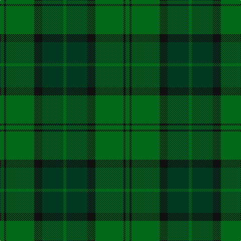

In pattern [GGKGKG](/stripes/ggkgkg/).

This was sourced from register-of-tartans.  It is a [6 stripe tartan](/stripes/stripes6/).

Original link https://www.tartanregister.gov.uk/tartanDetails.aspx?ref=1017

## Also known as

This cloth is also recorded under:

- Dunbar Hunting

## Attestations

This cloth appears in 2 source records; the oldest owns this page.

- 01/01/1986 — Dunbar Hunting (register-of-tartans, [record](https://www.tartanregister.gov.uk/tartanDetails.aspx?ref=1017))
- 1986 — Dunbar Htg (Clan) (tartans-authority, [record](http://www.tartansauthority.com/tartan-ferret/display/4744/))

## Register references

External register numbers recorded for this tartan.

- Scottish Register of Tartans: [1017](https://www.tartanregister.gov.uk/tartanDetails.aspx?ref=1017)
- Scottish Tartans Authority (ITI): 4744

## Thread count
G/8 K4 G56 K16 DG42 G/6

## Palette
Each colour and the base-6 reference it is a variant of.

| Colour | Shade | Base |
|---|---|---|
| DG | <code style="background-color:#003820;">#003820</code> `oklch(30.0% 0.070 158.3)` <small>#003820</small> | G <code style="background-color:#006100;">#006100</code> |
| G | <code style="background-color:#006818;">#006818</code> `oklch(45.0% 0.142 145.0)` <small>#006818</small> | G <code style="background-color:#006100;">#006100</code> |
| K | <code style="background-color:#101010;">#101010</code> `oklch(17.3% 0.000 89.9)` <small>#101010</small> | K <code style="background-color:#000000;">#000000</code> |

# Sample pattern

## Nearest tartans

The nearest existing variants by ΔTartan distance, with this tartan at the top so the swatches line up against it.

ΔTartan

Tartan

Sett

—

<a href="/ttd/edit/#slug=g4k2g28k8dg21g3~x2">Dunbar Hunting</a> <a class="nn-out" href="/setts/s6/g4k2g28k8dg21g3~x2/" title="open its dictionary page">↗</a>

0.89

<a href="/ttd/edit/#slug=dg30dg13dg7dg30dg2ly4~x2">MacSporran Rejected design</a> <a class="nn-out" href="/setts/s6/dg30dg13dg7dg30dg2ly4~x2/" title="open its dictionary page">↗</a>

1.45

<a href="/ttd/edit/#slug=g5k2g28k10dy26db4g4~x2">John Telfar Dunbar/Hunting Tartan Tartan Number: 776. Earliest known date: pre 2003 Check this entry... See products available Copyright © Blair Urquhart, Comrie, 2015</a> <a class="nn-out" href="/setts/s7/g5k2g28k10dy26db4g4~x2/" title="open its dictionary page">↗</a>

1.57

<a href="/ttd/edit/#slug=k2dg19g2dg2g19dg2k2~x2">Hunting Kenmore Trade Com. Tartan Tartan Number: 2234. Earliest known date: 1995 Designed by Polly Wittering of House of Edgar for a range of gifts produced for Macnaughtons of Pitlochry See products available Copyright © Blair Urquhart, Comrie, 2015</a> <a class="nn-out" href="/setts/s7/k2dg19g2dg2g19dg2k2~x2/" title="open its dictionary page">↗</a>

1.58

<a href="/ttd/edit/#slug=g22k3g3g16g6k4~x2">Campbell Simpson (Dalgliesh)</a> <a class="nn-out" href="/setts/s6/g22k3g3g16g6k4~x2/" title="open its dictionary page">↗</a>

1.64

<a href="/ttd/edit/#slug=y24r2y2dg40y25dg2y2r2y2dg20~x2">Donachie of Brockloch Htg (Clan)</a> <a class="nn-out" href="/setts/s10/y24r2y2dg40y25dg2y2r2y2dg20~x2/" title="open its dictionary page">↗</a>

1.65

<a href="/ttd/edit/#slug=g37o9g3dr9o3~x2">Glen Boig</a> <a class="nn-out" href="/setts/s5/g37o9g3dr9o3~x2/" title="open its dictionary page">↗</a>

1.73

<a href="/ttd/edit/#slug=g27g14dt2g2ly2~x4">Irving of Bonshaw</a> <a class="nn-out" href="/setts/s5/g27g14dt2g2ly2~x4/" title="open its dictionary page">↗</a>

1.77

<a href="/ttd/edit/#slug=db3dy7g2y2g14dy2g2db3~x2">Daks (Loden)</a> <a class="nn-out" href="/setts/s8/db3dy7g2y2g14dy2g2db3~x2/" title="open its dictionary page">↗</a>

1.80

<a href="/ttd/edit/#slug=r4dg3dg39dg40r2lo4~x2">McGeorge (Personal)</a> <a class="nn-out" href="/setts/s6/r4dg3dg39dg40r2lo4~x2/" title="open its dictionary page">↗</a>

1.84

<a href="/ttd/edit/#slug=dt17g5dt5g17dt4g17k2dy2k2g5~x2">Hueg (Hunting) (Personal)</a> <a class="nn-out" href="/setts/s10/dt17g5dt5g17dt4g17k2dy2k2g5~x2/" title="open its dictionary page">↗</a>

## Neighbour map

Every grey dot is one of 14299 variants placed by the first two principal components of the ΔTartan feature space (44% of its variance). Red is this tartan; blue dots are its nearest — click one to open its page.

<svg viewBox="0 0 640 380" role="img" style="max-width:100%;height:auto;border:1px solid #e0e0e0;border-radius:4px;display:block" xmlns="http://www.w3.org/2000/svg"><image href="/nn/cloud.v1.png" width="640" height="380"/><a href="/setts/s6/dg30dg13dg7dg30dg2ly4~x2/"><circle cx="396.2" cy="272.6" r="4" fill="#3465a4"><title>MacSporran Rejected design</title></circle></a><a href="/setts/s7/g5k2g28k10dy26db4g4~x2/"><circle cx="333.4" cy="234.2" r="4" fill="#3465a4"><title>John Telfar Dunbar/Hunting Tartan Tartan Number: 776. Earliest known date: pre 2003 Check this entry... See products available Copyright © Blair Urquhart, Comrie, 2015</title></circle></a><a href="/setts/s7/k2dg19g2dg2g19dg2k2~x2/"><circle cx="351.1" cy="237.2" r="4" fill="#3465a4"><title>Hunting Kenmore Trade Com. Tartan Tartan Number: 2234. Earliest known date: 1995 Designed by Polly Wittering of House of Edgar for a range of gifts produced for Macnaughtons of Pitlochry See products available Copyright © Blair Urquhart, Comrie, 2015</title></circle></a><a href="/setts/s6/g22k3g3g16g6k4~x2/"><circle cx="373.9" cy="285.5" r="4" fill="#3465a4"><title>Campbell Simpson (Dalgliesh)</title></circle></a><a href="/setts/s10/y24r2y2dg40y25dg2y2r2y2dg20~x2/"><circle cx="446.0" cy="223.6" r="4" fill="#3465a4"><title>Donachie of Brockloch Htg (Clan)</title></circle></a><a href="/setts/s5/g37o9g3dr9o3~x2/"><circle cx="492.7" cy="271.4" r="4" fill="#3465a4"><title>Glen Boig</title></circle></a><a href="/setts/s5/g27g14dt2g2ly2~x4/"><circle cx="424.7" cy="250.5" r="4" fill="#3465a4"><title>Irving of Bonshaw</title></circle></a><a href="/setts/s8/db3dy7g2y2g14dy2g2db3~x2/"><circle cx="329.4" cy="256.1" r="4" fill="#3465a4"><title>Daks (Loden)</title></circle></a><a href="/setts/s6/r4dg3dg39dg40r2lo4~x2/"><circle cx="367.8" cy="210.3" r="4" fill="#3465a4"><title>McGeorge (Personal)</title></circle></a><a href="/setts/s10/dt17g5dt5g17dt4g17k2dy2k2g5~x2/"><circle cx="380.7" cy="256.0" r="4" fill="#3465a4"><title>Hueg (Hunting) (Personal)</title></circle></a><circle cx="402.0" cy="270.8" r="5" fill="#c00000"/></svg>

ID: /setts/s6/g4k2g28k8dg21g3~x2/
