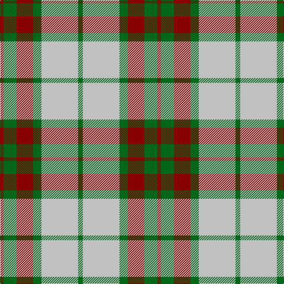

**Bands:** [GWGRGR](/stripes/gwgrgr/) · **Stripes:** [G LB G R G R](/stripes/stripes6/) G LB G R G R

This was sourced from register-of-tartans.  It is a [6 band tartan](/bands/bands6/).

Original link https://www.tartanregister.gov.uk/tartanDetails.aspx?ref=1413

## Attestations

This cloth appears in 2 source records; the oldest owns this page.

- 01/01/2002 — Gleneagles USA (Dalgleish) (register-of-tartans, [record](https://www.tartanregister.gov.uk/tartanDetails.aspx?ref=1413))
- pre 2002 — Gleneagles USA (Corporate) (tartans-authority, [record](http://www.tartansauthority.com/tartan-ferret/display/5032/))

## Register references

External register numbers recorded for this tartan.

- Scottish Register of Tartans: [1413](https://www.tartanregister.gov.uk/tartanDetails.aspx?ref=1413)
- Scottish Tartans Authority (ITI): 5032

## Thread count
DR/6 G22 DR28 G14 N62 G/8

## Palette
Each colour and its ΔE from the base-6 reference it is a variant of.

| Colour | Shade | Base | ΔE (OKLab) |
|---|---|---|---|
| DR | <code style="background-color:#880000;">#880000</code> `#880000` | R <code style="background-color:#CC0000;">#CC0000</code> | 0.15 |
| G | <code style="background-color:#006818;">#006818</code> `#006818` | G <code style="background-color:#006100;">#006100</code> | 0.02 |
| N | <code style="background-color:#C0C0C0;">#C0C0C0</code> `#C0C0C0` | W <code style="background-color:#F7F7F7;">#F7F7F7</code> | 0.17 |

# Sample pattern

## Nearest tartans

The nearest existing variants by ΔTartan distance.

1. [Snaefell (District)](/setts/s8/y22dy2y2dy2y2dy14w16dy3~x2/) — ΔT 1.04
1. [Turnberry Manx Snaefell Family Tartan Tartan Number: 1749. Earliest known date: 1981 A coincidence. See products available Copyright © Blair Urquhart, Comrie, 2015](/setts/s8/lo22do2lo2do2lo2do15w17do3~x2/) — ΔT 1.08
1. [Baillie Dress](/setts/s8/lo24dy3lo3dy3lo3dy20w22dy4~x2/) — ΔT 1.11
1. [Thomson Camel](/setts/s6/r4lo30k6w13k13w3~x2/) — ΔT 1.20
1. [Kildonan Brown (Fashion)](/setts/s9/dy22do3dy3do3dy3do9lb28do3lb6~x2/) — ΔT 1.24
1. [Thomson, Camel (Fashion)](/setts/s6/r4ly30k6w13k13w3~x2/) — ΔT 1.25
1. [O'Neill Pipe Band 1970 (Corporate)](/setts/s8/g1lb4dy12lb3dy6lb12g1lb1~x4/) — ΔT 1.26
1. [Grey Watch, Dress](/setts/s8/y9do1y1do1y1do7w7do2~x4/) — ΔT 1.26
1. [Thompson Camel Clan Tartan Tartan Number: 2421. Earliest known date: 1967 Designed by Scotty Thompson. It it a simple colour variation on the usual blue Thompson, but is often confused with the Burberry Check. See products available Copyright © Blair Urquhart, Comrie, 2015](/setts/s6/r2lo20k5w10k10w2~x2/) — ΔT 1.30
1. [Un-named (D C Dalgliesh) #3](/setts/s6/g3lr24k15o3g25k3~x2/) — ΔT 1.33

## Neighbour map

Every grey dot is one of 14313 variants placed by the first two principal components of the ΔTartan feature space (44% of its variance). Red is this tartan; blue dots are its nearest — click one to open its page.

<svg viewBox="0 0 640 380" role="img" style="max-width:100%;height:auto;border:1px solid #e0e0e0;border-radius:4px;display:block" xmlns="http://www.w3.org/2000/svg"><image href="/nn/cloud.v1.png" width="640" height="380"/><a href="/setts/s8/y22dy2y2dy2y2dy14w16dy3~x2/"><circle cx="248.0" cy="189.8" r="4" fill="#3465a4"><title>Snaefell (District)</title></circle></a><a href="/setts/s8/lo22do2lo2do2lo2do15w17do3~x2/"><circle cx="222.9" cy="175.2" r="4" fill="#3465a4"><title>Turnberry Manx Snaefell Family Tartan Tartan Number: 1749. Earliest known date: 1981 A coincidence. See products available Copyright © Blair Urquhart, Comrie, 2015</title></circle></a><a href="/setts/s8/lo24dy3lo3dy3lo3dy20w22dy4~x2/"><circle cx="212.1" cy="201.4" r="4" fill="#3465a4"><title>Baillie Dress</title></circle></a><a href="/setts/s6/r4lo30k6w13k13w3~x2/"><circle cx="190.7" cy="187.0" r="4" fill="#3465a4"><title>Thomson Camel</title></circle></a><a href="/setts/s9/dy22do3dy3do3dy3do9lb28do3lb6~x2/"><circle cx="236.1" cy="179.8" r="4" fill="#3465a4"><title>Kildonan Brown (Fashion)</title></circle></a><a href="/setts/s6/r4ly30k6w13k13w3~x2/"><circle cx="186.1" cy="183.5" r="4" fill="#3465a4"><title>Thomson, Camel (Fashion)</title></circle></a><a href="/setts/s8/g1lb4dy12lb3dy6lb12g1lb1~x4/"><circle cx="304.6" cy="191.6" r="4" fill="#3465a4"><title>O'Neill Pipe Band 1970 (Corporate)</title></circle></a><a href="/setts/s8/y9do1y1do1y1do7w7do2~x4/"><circle cx="216.3" cy="201.8" r="4" fill="#3465a4"><title>Grey Watch, Dress</title></circle></a><a href="/setts/s6/r2lo20k5w10k10w2~x2/"><circle cx="176.6" cy="190.1" r="4" fill="#3465a4"><title>Thompson Camel Clan Tartan Tartan Number: 2421. Earliest known date: 1967 Designed by Scotty Thompson. It it a simple colour variation on the usual blue Thompson, but is often confused with the Burberry Check. See products available Copyright © Blair Urquhart, Comrie, 2015</title></circle></a><a href="/setts/s6/g3lr24k15o3g25k3~x2/"><circle cx="180.2" cy="206.0" r="4" fill="#3465a4"><title>Un-named (D C Dalgliesh) #3</title></circle></a><circle cx="240.5" cy="210.4" r="5" fill="#c00000"/></svg>

ID: /setts/s6/g4lb31g7r14g11r3~x2/
