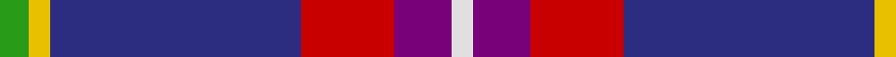
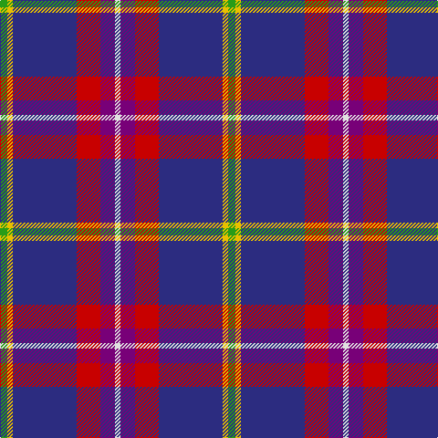

**Bands:** [GYBRBW](/stripes/gybrbw/) · **Stripes:** [G LY DB R DP W](/stripes/stripes6/) G LY DB R DP W

This was sourced from tartans-authority.  It is a [6 band tartan](/bands/bands6/).

Original link http://www.tartansauthority.com/tartan-ferret/display/4073/

## Thread count
G/8 Y6 DB70 R26 P16 LN/6

## Palette
Each colour and its ΔE from the base-6 reference it is a variant of.

| Colour | Shade | Base | ΔE (OKLab) |
|---|---|---|---|
| DB | <code style="background-color:#2C2C80;">#2C2C80</code> `#2C2C80` | B <code style="background-color:#2A418A;">#2A418A</code> | 0.06 |
| G | <code style="background-color:#289C18;">#289C18</code> `#289C18` | G <code style="background-color:#006100;">#006100</code> | 0.19 |
| LN | <code style="background-color:#E0E0E0;">#E0E0E0</code> `#E0E0E0` | W <code style="background-color:#F7F7F7;">#F7F7F7</code> | 0.07 |
| P | <code style="background-color:#780078;">#780078</code> `#780078` | B <code style="background-color:#2A418A;">#2A418A</code> | 0.17 |
| R | <code style="background-color:#C80000;">#C80000</code> `#C80000` | R <code style="background-color:#CC0000;">#CC0000</code> | 0.01 |
| Y | <code style="background-color:#E8C000;">#E8C000</code> `#E8C000` | Y <code style="background-color:#F2BF00;">#F2BF00</code> | 0.02 |

# Sample pattern

## Nearest tartans

The nearest existing variants by ΔTartan distance.

1. [Ferster, James Carney](/setts/s6/t12dp35lr4w3k11k5~x2/) — ΔT 1.19
1. [Kilsyth](/setts/s10/g4ly3db35r13dp8w3~x2/) — ΔT 1.19
1. [Widows Sons Scotland Dress](/setts/s6/lb12g12k12g24dp75ly4/) — ΔT 1.25
1. [Glenn](/setts/s8/dg4t2db18r2k4r6t1w1~x4/) — ΔT 1.29
1. [Widows Sons Scotland Dress](/setts/s6/lb12dg16k12dg24dp75lo4/) — ΔT 1.35
1. [Peterson, Oren (Name)](/setts/s6/w1db15r1o10g2lp1~x4/) — ΔT 1.35
1. [LLoyd of Astargus Canadian Family Tartan Tartan Number: 5771. Earliest known date: 2001 The designer of this tartan is of Welsh & Scottish blood and sees this tartan as being appropriate for any Lloyds with Scottish blood. The 'Astargus' derives from Gaelic - 'Astar' being said to mean "travelling or making distance" and 'gus' meaning "until I come back" See products available Copyright © Blair Urquhart, Comrie, 2015](/setts/s6/r3db38k13w3o20ly2~x2/) — ΔT 1.36
1. [Lord's Own Highlanders (Corporate)](/setts/s6/w5o20k8r5dp36lo5~x2/) — ΔT 1.37
1. [Selkirk High (Corporate)](/setts/s10/w3m18k18ly1r2b2r2ly1m18b2~x2/) — ΔT 1.42
1. [Wrigglesworth (Name)](/setts/s7/db30b10lb10db5m3ly3g3~x2/) — ΔT 1.43

## Neighbour map

Every grey dot is one of 14299 variants placed by the first two principal components of the ΔTartan feature space (44% of its variance). Red is this tartan; blue dots are its nearest — click one to open its page.

<svg viewBox="0 0 640 380" role="img" style="max-width:100%;height:auto;border:1px solid #e0e0e0;border-radius:4px;display:block" xmlns="http://www.w3.org/2000/svg"><image href="/nn/cloud.v1.png" width="640" height="380"/><a href="/setts/s6/t12dp35lr4w3k11k5~x2/"><circle cx="222.8" cy="167.1" r="4" fill="#3465a4"><title>Ferster, James Carney</title></circle></a><a href="/setts/s10/g4ly3db35r13dp8w3~x2/"><circle cx="264.9" cy="141.5" r="4" fill="#3465a4"><title>Kilsyth</title></circle></a><a href="/setts/s6/lb12g12k12g24dp75ly4/"><circle cx="298.6" cy="149.7" r="4" fill="#3465a4"><title>Widows Sons Scotland Dress</title></circle></a><a href="/setts/s8/dg4t2db18r2k4r6t1w1~x4/"><circle cx="237.4" cy="127.7" r="4" fill="#3465a4"><title>Glenn</title></circle></a><a href="/setts/s6/lb12dg16k12dg24dp75lo4/"><circle cx="292.3" cy="161.6" r="4" fill="#3465a4"><title>Widows Sons Scotland Dress</title></circle></a><a href="/setts/s6/w1db15r1o10g2lp1~x4/"><circle cx="270.1" cy="149.8" r="4" fill="#3465a4"><title>Peterson, Oren (Name)</title></circle></a><a href="/setts/s6/r3db38k13w3o20ly2~x2/"><circle cx="236.9" cy="145.6" r="4" fill="#3465a4"><title>LLoyd of Astargus Canadian Family Tartan Tartan Number: 5771. Earliest known date: 2001 The designer of this tartan is of Welsh &amp; Scottish blood and sees this tartan as being appropriate for any Lloyds with Scottish blood. The 'Astargus' derives from Gaelic - 'Astar' being said to mean &quot;travelling or making distance&quot; and 'gus' meaning &quot;until I come back&quot; See products available Copyright © Blair Urquhart, Comrie, 2015</title></circle></a><a href="/setts/s6/w5o20k8r5dp36lo5~x2/"><circle cx="179.0" cy="176.2" r="4" fill="#3465a4"><title>Lord's Own Highlanders (Corporate)</title></circle></a><a href="/setts/s10/w3m18k18ly1r2b2r2ly1m18b2~x2/"><circle cx="261.2" cy="102.3" r="4" fill="#3465a4"><title>Selkirk High (Corporate)</title></circle></a><a href="/setts/s7/db30b10lb10db5m3ly3g3~x2/"><circle cx="238.7" cy="159.6" r="4" fill="#3465a4"><title>Wrigglesworth (Name)</title></circle></a><circle cx="249.2" cy="151.4" r="5" fill="#c00000"/></svg>

ID: /setts/s6/g4ly3db35r13dp8w3~x2/
