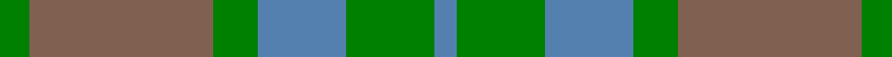
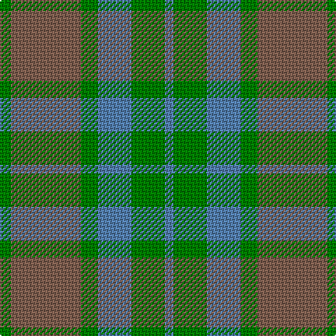

In pattern [BGBGRG](/stripes/bgbgrg/).

This was sourced from weddslist.  It is a [6 stripe tartan](/stripes/stripes6/).

Original link http://www.weddslist.com/cgi-bin/tartans/pg.pl?source=sts

## Thread count
G/8 LT50 G12 B24 G24 B/6

## Palette
Each colour and the base-6 reference it is a variant of.

| Colour | Shade | Base |
|---|---|---|
| B | <code style="background-color:#5480B0;">#5480B0</code> `oklch(58.8% 0.089 251.5)` <small>#5480B0</small> | B <code style="background-color:#2A418A;">#2A418A</code> |
| G | <code style="background-color:#008000;">#008000</code> `oklch(52.0% 0.177 142.5)` <small>#008000</small> | G <code style="background-color:#006100;">#006100</code> |
| LT | <code style="background-color:#806050;">#806050</code> `oklch(51.7% 0.049 47.8)` <small>#806050</small> | R <code style="background-color:#CC0000;">#CC0000</code> |

# Sample pattern

## Nearest tartans

The nearest existing variants by ΔTartan distance.

1. [Canadian Fancy](/setts/s6/g4dy25g6t12g12t3~x2/) — ΔT 0.88
1. [Bright of Garth (Personal)](/setts/s5/g7y6n7y1n2~x6/) — ΔT 1.16
1. [Universal, Ancient](/setts/s8/t12g2t2g2t2o8g8o1~x2/) — ΔT 1.52
1. [Dewar (WCWM)](/setts/s6/dt1dy1dt7dy5y7lr1~x4/) — ΔT 1.55
1. [Bright of Garth (Personal)](/setts/s5/g7dy6dt7dy1dt2~x6/) — ΔT 1.69
1. [Ancient Universal (Fashion?)](/setts/s8/y12dg2y2dg2y2dy8y8dy1~x2/) — ΔT 1.72
1. [Auld Lang Syne (Fashion)](/setts/s8/lb1y1lb1y7t7lb1t1lb1~x6/) — ΔT 1.77
1. [Spring Morning (Fashion)](/setts/s4/g1y9g9lo1~x4/) — ΔT 1.78
1. [Porcelanosa](/setts/s4/lr24o9n23ly3~x2/) — ΔT 1.83
1. [Spring Morning](/setts/s6/y9g9lo1g9y9g1~x4/) — ΔT 1.84

## Neighbour map

Every grey dot is one of 14299 variants placed by the first two principal components of the ΔTartan feature space (44% of its variance). Red is this tartan; blue dots are its nearest — click one to open its page.

<svg viewBox="0 0 640 380" role="img" style="max-width:100%;height:auto;border:1px solid #e0e0e0;border-radius:4px;display:block" xmlns="http://www.w3.org/2000/svg"><image href="/nn/cloud.v1.png" width="640" height="380"/><a href="/setts/s6/g4dy25g6t12g12t3~x2/"><circle cx="302.3" cy="289.1" r="4" fill="#3465a4"><title>Canadian Fancy</title></circle></a><a href="/setts/s5/g7y6n7y1n2~x6/"><circle cx="301.9" cy="334.8" r="4" fill="#3465a4"><title>Bright of Garth (Personal)</title></circle></a><a href="/setts/s8/t12g2t2g2t2o8g8o1~x2/"><circle cx="290.1" cy="234.8" r="4" fill="#3465a4"><title>Universal, Ancient</title></circle></a><a href="/setts/s6/dt1dy1dt7dy5y7lr1~x4/"><circle cx="256.2" cy="272.5" r="4" fill="#3465a4"><title>Dewar (WCWM)</title></circle></a><a href="/setts/s5/g7dy6dt7dy1dt2~x6/"><circle cx="292.3" cy="332.0" r="4" fill="#3465a4"><title>Bright of Garth (Personal)</title></circle></a><a href="/setts/s8/y12dg2y2dg2y2dy8y8dy1~x2/"><circle cx="283.5" cy="227.2" r="4" fill="#3465a4"><title>Ancient Universal (Fashion?)</title></circle></a><a href="/setts/s8/lb1y1lb1y7t7lb1t1lb1~x6/"><circle cx="318.6" cy="249.0" r="4" fill="#3465a4"><title>Auld Lang Syne (Fashion)</title></circle></a><a href="/setts/s4/g1y9g9lo1~x4/"><circle cx="413.6" cy="313.0" r="4" fill="#3465a4"><title>Spring Morning (Fashion)</title></circle></a><a href="/setts/s4/lr24o9n23ly3~x2/"><circle cx="281.4" cy="292.2" r="4" fill="#3465a4"><title>Porcelanosa</title></circle></a><a href="/setts/s6/y9g9lo1g9y9g1~x4/"><circle cx="402.3" cy="322.2" r="4" fill="#3465a4"><title>Spring Morning</title></circle></a><circle cx="315.3" cy="294.4" r="5" fill="#c00000"/></svg>

ID: /setts/s6/g4o25g6t12g12t3~x2/
