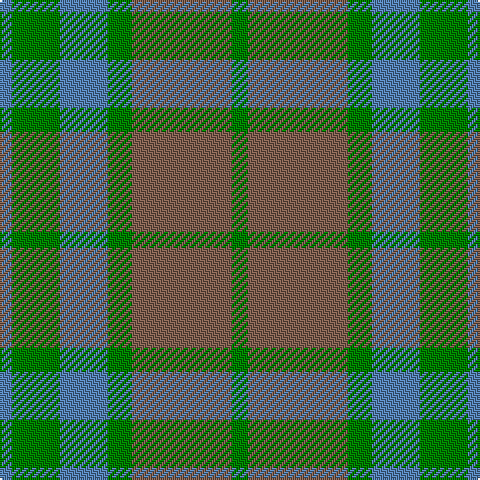

In pattern [BGBGRG](/patterns/bgbgrg/).

This was sourced from weddslist.  It is a [6 stripes tartan](/stripes/stripes6/).

Original link http://www.weddslist.com/cgi-bin/tartans/pg.pl?source=sts

## Thread count
B/6 G24 B24 G12 LT50 G/8

## Palette
Each colour and its ΔE from the base-6 reference it is a variant of.

| Colour | Shade | Base | ΔE (OKLab) |
|---|---|---|---|
| B | <code style="background-color:#5480B0;">#5480B0</code> `#5480B0` | B <code style="background-color:#2A418A;">#2A418A</code> | 0.19 |
| G | <code style="background-color:#008000;">#008000</code> `#008000` | G <code style="background-color:#006100;">#006100</code> | 0.10 |
| LT | <code style="background-color:#806050;">#806050</code> `#806050` | R <code style="background-color:#CC0000;">#CC0000</code> | 0.17 |

# Sample pattern

## Nearest tartans

The nearest existing variants by ΔTartan distance.

1. [Canadian Fancy](/setts/s6/g4ga25g6b12g12b3~b5c8ca8-g006818-ga604000~x2/) — ΔT 0.89
1. [Bright of Garth (Personal)](/setts/s5/g7ga6b7ga1b2~b245078-g006818-ga845800~x6/) — ΔT 1.16
1. [Universal, Ancient](/setts/s8/b12g2b2g2b2r8ga8r1~b5480b0-g008000-ga30a010-r806050~x2/) — ΔT 1.52
1. [Dewar (WCWM)](/setts/s6/b1g1b7g5ga7y1~b084848-g604000-ga8c7038-yb8b8b8~x4/) — ΔT 1.55
1. [Bright of Garth (Personal)](/setts/s5/g7ga6b7ga1b2~b14283c-g006818-ga604000~x6/) — ΔT 1.68
1. [Ancient Universal (Fashion?)](/setts/s8/g12ga2g2ga2g2gb8gc8gb1~g789484-ga003820-gb604000-gc5c6428~x2/) — ΔT 1.72
1. [Auld Lang Syne (Fashion)](/setts/s8/w1b1w1b7g7w1g1w1~b5c8ca8-g8c7038-w98c8e8~x6/) — ΔT 1.76
1. [Spring Morning (Fashion)](/setts/s4/g1ga9g9y1~g006818-ga74846c-yd09800~x4/) — ΔT 1.79
1. [Porcelanosa](/setts/s4/y24r9b23ya3~b5c5c5c-r888888-ya0a0a0-yae8c000~x2/) — ΔT 1.82
1. [Spring Morning](/setts/s6/g9ga9y1ga9g9ga1~g74846c-ga006818-yd09800~x4/) — ΔT 1.84

## Neighbour map

Every grey dot is one of 15726 variants placed by the first two principal components of the ΔTartan feature space (44% of its variance). Red is this tartan; blue dots are its nearest — click one to open its page.

<svg viewBox="0 0 640 380" role="img" style="max-width:100%;height:auto;border:1px solid #e0e0e0;border-radius:4px;display:block" xmlns="http://www.w3.org/2000/svg"><image href="/nn/cloud.v1.png" width="640" height="380"/><a href="/setts/s6/g4ga25g6b12g12b3~b5c8ca8-g006818-ga604000~x2/"><circle cx="300.7" cy="278.9" r="4" fill="#3465a4"><title>Canadian Fancy</title></circle></a><a href="/setts/s5/g7ga6b7ga1b2~b245078-g006818-ga845800~x6/"><circle cx="300.5" cy="321.4" r="4" fill="#3465a4"><title>Bright of Garth (Personal)</title></circle></a><a href="/setts/s8/b12g2b2g2b2r8ga8r1~b5480b0-g008000-ga30a010-r806050~x2/"><circle cx="288.3" cy="223.0" r="4" fill="#3465a4"><title>Universal, Ancient</title></circle></a><a href="/setts/s6/b1g1b7g5ga7y1~b084848-g604000-ga8c7038-yb8b8b8~x4/"><circle cx="254.8" cy="261.8" r="4" fill="#3465a4"><title>Dewar (WCWM)</title></circle></a><a href="/setts/s5/g7ga6b7ga1b2~b14283c-g006818-ga604000~x6/"><circle cx="290.5" cy="320.1" r="4" fill="#3465a4"><title>Bright of Garth (Personal)</title></circle></a><a href="/setts/s8/g12ga2g2ga2g2gb8gc8gb1~g789484-ga003820-gb604000-gc5c6428~x2/"><circle cx="282.1" cy="217.6" r="4" fill="#3465a4"><title>Ancient Universal (Fashion?)</title></circle></a><a href="/setts/s8/w1b1w1b7g7w1g1w1~b5c8ca8-g8c7038-w98c8e8~x6/"><circle cx="317.3" cy="238.9" r="4" fill="#3465a4"><title>Auld Lang Syne (Fashion)</title></circle></a><a href="/setts/s4/g1ga9g9y1~g006818-ga74846c-yd09800~x4/"><circle cx="412.6" cy="301.9" r="4" fill="#3465a4"><title>Spring Morning (Fashion)</title></circle></a><a href="/setts/s4/y24r9b23ya3~b5c5c5c-r888888-ya0a0a0-yae8c000~x2/"><circle cx="280.6" cy="282.8" r="4" fill="#3465a4"><title>Porcelanosa</title></circle></a><a href="/setts/s6/g9ga9y1ga9g9ga1~g74846c-ga006818-yd09800~x4/"><circle cx="401.4" cy="309.6" r="4" fill="#3465a4"><title>Spring Morning</title></circle></a><circle cx="314.0" cy="282.4" r="5" fill="#c00000"/></svg>

ID: /setts/s6/g4r25g6b12g12b3~b5480b0-g008000-r806050~x2/
