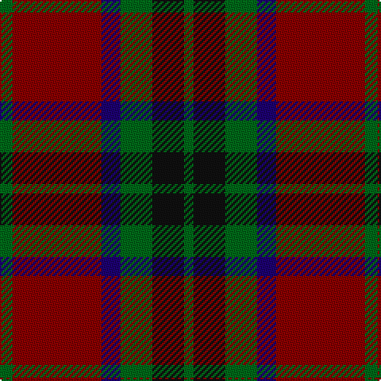

In pattern [GKGBRG](/patterns/gkgbrg/).

This was sourced from register-of-tartans.  It is a [6 stripes tartan](/stripes/stripes6/).

Original link https://www.tartanregister.gov.uk/tartanDetails.aspx?ref=539

## Attestations

This cloth appears in 2 source records; the oldest owns this page.

- 01/01/2002 — Canadian Autumn (register-of-tartans, [record](https://www.tartanregister.gov.uk/tartanDetails.aspx?ref=539))
- pre 2002 — Canadian Autumn (Fashion) (tartans-authority, [record](http://www.tartansauthority.com/tartan-ferret/display/4440/))

## Register references

External register numbers recorded for this tartan.

- Scottish Register of Tartans: [539](https://www.tartanregister.gov.uk/tartanDetails.aspx?ref=539)
- Scottish Tartans Authority (ITI): 4440

## Thread count
G/8 DR56 DB12 G20 K20 G/6

## Palette
Each colour and its ΔE from the base-6 reference it is a variant of.

| Colour | Shade | Base | ΔE (OKLab) |
|---|---|---|---|
| DB | <code style="background-color:#1C0070;">#1C0070</code> `#1C0070` | B <code style="background-color:#2A418A;">#2A418A</code> | 0.14 |
| DR | <code style="background-color:#880000;">#880000</code> `#880000` | R <code style="background-color:#CC0000;">#CC0000</code> | 0.15 |
| G | <code style="background-color:#006818;">#006818</code> `#006818` | G <code style="background-color:#006100;">#006100</code> | 0.02 |
| K | <code style="background-color:#101010;">#101010</code> `#101010` | K <code style="background-color:#000000;">#000000</code> | 0.17 |

# Sample pattern

## Nearest tartans

The nearest existing variants by ΔTartan distance.

1. [Strathspey (Fashion)](/setts/s6/g3r22b5g10k10g2~b48748c-g006818-k101010-r880000~x2/) — ΔT 0.58
1. [Fraser Green](/setts/s6/w2b12g6b1ba6b1~b4c0000-ba5c5c5c-g447438-wc0c0c0~x4/) — ΔT 0.70
1. [Portrait, The](/setts/s6/b2r11b2k11b16w2~b441800-k101010-ra07c58-we8ccb8~x4/) — ΔT 0.94
1. [Montrose (Macnaughton variation)](/setts/s9/b1k1r12g12k6b5r12k1b1~b1c0070-g006818-k101010-r880000~x4/) — ΔT 0.95
1. [Denny Hunting](/setts/s6/k4g5k2g5r17b2~b00008c-g004c00-k000000-r8c0000~x2/) — ΔT 1.01
1. [Invertere, (Daks)](/setts/s8/r5g12ra4b4ra22g3ra4r5~b000050-g003000-r900030-ra906030/) — ΔT 1.06
1. [Eyre (Personal)](/setts/s6/r3b12r4g18r6k2~b202060-g006818-k101010-rc80000~x2/) — ΔT 1.08
1. [(2) Cook](/setts/s7/g12b6g6r15k1r1k2~b006090-g004c00-k000000-r800000~x2/) — ΔT 1.12
1. [McInery (Personal)](/setts/s8/r8g2r12k6r3b3g24k2~b1c0070-g006818-k101010-r880000~x2/) — ΔT 1.13
1. [Skene D](/setts/s7/b9r6g2r6g18r6g2~b000052-g11450d-raa0000~x2/) — ΔT 1.13

## Neighbour map

Every grey dot is one of 15726 variants placed by the first two principal components of the ΔTartan feature space (44% of its variance). Red is this tartan; blue dots are its nearest — click one to open its page.

<svg viewBox="0 0 640 380" role="img" style="max-width:100%;height:auto;border:1px solid #e0e0e0;border-radius:4px;display:block" xmlns="http://www.w3.org/2000/svg"><image href="/nn/cloud.v1.png" width="640" height="380"/><a href="/setts/s6/g3r22b5g10k10g2~b48748c-g006818-k101010-r880000~x2/"><circle cx="250.4" cy="222.5" r="4" fill="#3465a4"><title>Strathspey (Fashion)</title></circle></a><a href="/setts/s6/w2b12g6b1ba6b1~b4c0000-ba5c5c5c-g447438-wc0c0c0~x4/"><circle cx="287.1" cy="210.8" r="4" fill="#3465a4"><title>Fraser Green</title></circle></a><a href="/setts/s6/b2r11b2k11b16w2~b441800-k101010-ra07c58-we8ccb8~x4/"><circle cx="231.1" cy="226.0" r="4" fill="#3465a4"><title>Portrait, The</title></circle></a><a href="/setts/s9/b1k1r12g12k6b5r12k1b1~b1c0070-g006818-k101010-r880000~x4/"><circle cx="271.3" cy="195.3" r="4" fill="#3465a4"><title>Montrose (Macnaughton variation)</title></circle></a><a href="/setts/s6/k4g5k2g5r17b2~b00008c-g004c00-k000000-r8c0000~x2/"><circle cx="265.0" cy="216.4" r="4" fill="#3465a4"><title>Denny Hunting</title></circle></a><a href="/setts/s8/r5g12ra4b4ra22g3ra4r5~b000050-g003000-r900030-ra906030/"><circle cx="284.5" cy="221.5" r="4" fill="#3465a4"><title>Invertere, (Daks)</title></circle></a><a href="/setts/s6/r3b12r4g18r6k2~b202060-g006818-k101010-rc80000~x2/"><circle cx="213.6" cy="222.4" r="4" fill="#3465a4"><title>Eyre (Personal)</title></circle></a><a href="/setts/s7/g12b6g6r15k1r1k2~b006090-g004c00-k000000-r800000~x2/"><circle cx="273.2" cy="206.2" r="4" fill="#3465a4"><title>(2) Cook</title></circle></a><a href="/setts/s8/r8g2r12k6r3b3g24k2~b1c0070-g006818-k101010-r880000~x2/"><circle cx="279.7" cy="197.6" r="4" fill="#3465a4"><title>McInery (Personal)</title></circle></a><a href="/setts/s7/b9r6g2r6g18r6g2~b000052-g11450d-raa0000~x2/"><circle cx="275.6" cy="244.8" r="4" fill="#3465a4"><title>Skene D</title></circle></a><circle cx="266.4" cy="223.9" r="5" fill="#c00000"/></svg>

ID: /setts/s6/g4r28b6g10k10g3~b1c0070-g006818-k101010-r880000~x2/
