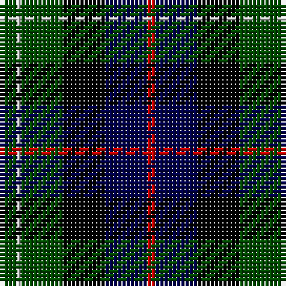

In pattern [GWGKBR](/patterns/gwgkbr/).

This was sourced from weddslist.  It is a [6 stripes tartan](/stripes/stripes6/).

Original link http://www.weddslist.com/cgi-bin/tartans/pg.pl?source=rb

## Thread count
G/4 N1 G10 K10 DB10 R/2

## Palette
Each colour and its ΔE from the base-6 reference it is a variant of.

| Colour | Shade | Base | ΔE (OKLab) |
|---|---|---|---|
| DB | <code style="background-color:#00004C;">#00004C</code> `#00004C` | B <code style="background-color:#2C4084;">#2C4084</code> | 0.21 |
| G | <code style="background-color:#004C00;">#004C00</code> `#004C00` | G <code style="background-color:#006400;">#006400</code> | 0.08 |
| K | <code style="background-color:#000000;">#000000</code> `#000000` | K <code style="background-color:#000000;">#000000</code> | 0.00 |
| N | <code style="background-color:#D0D0D0;">#D0D0D0</code> `#D0D0D0` | W <code style="background-color:#F4F4F0;">#F4F4F0</code> | 0.11 |
| R | <code style="background-color:#C80000;">#C80000</code> `#C80000` | R <code style="background-color:#C80000;">#C80000</code> | 0.00 |

# Sample pattern

## Nearest tartans

The nearest existing variants by ΔTartan distance.

1. [Rose Hunting](/setts/s6/k8y2g20k20b20r4-b000052-g11450d-k000000-raa0000-yaaaaaa/) — ΔT 0.65
1. [Mitchell](/setts/s6/k2g12k12r1b12w2-b00004c-g004c00-k000000-rc80000-wd0d0d0/) — ΔT 0.72
1. [Leslie Hunting](/setts/s6/r4b16k16w2g16k2-b000064-g004c00-k000000-rc80000-wd0d0d0/) — ΔT 0.82
1. [Mitchell](/setts/s6/k4g24k24r2b24y4-b000052-g11450d-k000000-raa0000-yaaaaaa/) — ΔT 0.82
1. [Mitchell](/setts/s6/k2g12k12r1b12y2-b000052-g11450d-k000000-raa0000-yaaaaaa/) — ΔT 0.82
1. [Leslie Hunting](/setts/s6/r4b16k16y2g16k2-b000052-g11450d-k000000-raa0000-yaaaaaa/) — ΔT 0.85
1. [Leslie Hunting](/setts/s6/r2b8k8y1g8k1-b000052-g11450d-k000000-raa0000-yaaaaaa/) — ΔT 0.85
1. [Royal College of Physicians of Edinburgh](/setts/s6/b56r8k28r8g66y8-b000050-g003000-k000000-rc00000-yf0c000/) — ΔT 0.86
1. [Brodie Hunting](/setts/s7/r2b8g8k8y1g8r2-b00004c-g004c00-k000000-rc80000-yffc800/) — ΔT 0.87
1. [Lanark](/setts/s6/g62y8g12k38b36ba18-b304080-ba5480b0-g004010-k000000-yf0c000/) — ΔT 0.87

## Neighbour map

Every grey dot is one of 15726 variants placed by the first two principal components of the ΔTartan feature space (44% of its variance). Red is this tartan; blue dots are its nearest — click one to open its page.

<svg viewBox="0 0 640 380" role="img" style="max-width:100%;height:auto;border:1px solid #e0e0e0;border-radius:4px;display:block" xmlns="http://www.w3.org/2000/svg"><image href="/nn/cloud.v1.png" width="640" height="380"/><a href="/setts/s6/k8y2g20k20b20r4-b000052-g11450d-k000000-raa0000-yaaaaaa/"><circle cx="165.0" cy="227.0" r="4" fill="#3465a4"><title>Rose Hunting</title></circle></a><a href="/setts/s6/k2g12k12r1b12w2-b00004c-g004c00-k000000-rc80000-wd0d0d0/"><circle cx="153.7" cy="202.5" r="4" fill="#3465a4"><title>Mitchell</title></circle></a><a href="/setts/s6/r4b16k16w2g16k2-b000064-g004c00-k000000-rc80000-wd0d0d0/"><circle cx="120.4" cy="216.7" r="4" fill="#3465a4"><title>Leslie Hunting</title></circle></a><a href="/setts/s6/k4g24k24r2b24y4-b000052-g11450d-k000000-raa0000-yaaaaaa/"><circle cx="165.4" cy="207.5" r="4" fill="#3465a4"><title>Mitchell</title></circle></a><a href="/setts/s6/k2g12k12r1b12y2-b000052-g11450d-k000000-raa0000-yaaaaaa/"><circle cx="165.4" cy="207.5" r="4" fill="#3465a4"><title>Mitchell</title></circle></a><a href="/setts/s6/r4b16k16y2g16k2-b000052-g11450d-k000000-raa0000-yaaaaaa/"><circle cx="134.6" cy="223.1" r="4" fill="#3465a4"><title>Leslie Hunting</title></circle></a><a href="/setts/s6/r2b8k8y1g8k1-b000052-g11450d-k000000-raa0000-yaaaaaa/"><circle cx="134.6" cy="223.1" r="4" fill="#3465a4"><title>Leslie Hunting</title></circle></a><a href="/setts/s6/b56r8k28r8g66y8-b000050-g003000-k000000-rc00000-yf0c000/"><circle cx="164.9" cy="210.2" r="4" fill="#3465a4"><title>Royal College of Physicians of Edinburgh</title></circle></a><a href="/setts/s7/r2b8g8k8y1g8r2-b00004c-g004c00-k000000-rc80000-yffc800/"><circle cx="150.8" cy="222.3" r="4" fill="#3465a4"><title>Brodie Hunting</title></circle></a><a href="/setts/s6/g62y8g12k38b36ba18-b304080-ba5480b0-g004010-k000000-yf0c000/"><circle cx="150.5" cy="225.7" r="4" fill="#3465a4"><title>Lanark</title></circle></a><circle cx="153.0" cy="221.6" r="5" fill="#c00000"/></svg>

ID: /setts/s6/g4w1g10k10b10r2-b00004c-g004c00-k000000-rc80000-wd0d0d0/
