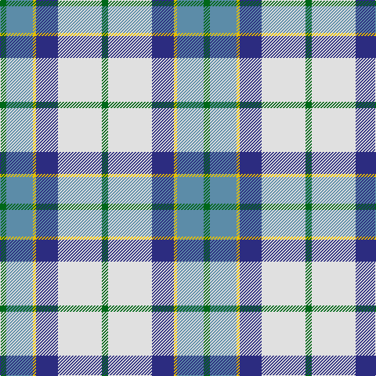

In pattern [GBYBWG](/patterns/gbybwg/).

This was sourced from tartans-authority.  It is a [6 stripes tartan](/stripes/stripes6/).

Original link http://www.tartansauthority.com/tartan-ferret/display/3031/

## Attestations

This cloth appears in 2 source records; the oldest owns this page.

- 1980 — Allanton Dress (Fashion) (tartans-authority, [record](http://www.tartansauthority.com/tartan-ferret/display/3031/))
- undated — Allanton Dress (register-of-tartans, [record](https://www.tartanregister.gov.uk/tartanDetails.aspx?ref=4830))

## Register references

External register numbers recorded for this tartan.

- Scottish Register of Tartans: [4830](https://www.tartanregister.gov.uk/tartanDetails.aspx?ref=4830)
- Scottish Tartans Authority (ITI): 3031

## Thread count
G/8 B34 Y4 DB28 LN56 G/8

## Palette
Each colour and its ΔE from the base-6 reference it is a variant of.

| Colour | Shade | Base | ΔE (OKLab) |
|---|---|---|---|
| B | <code style="background-color:#5C8CA8;">#5C8CA8</code> `#5C8CA8` | B <code style="background-color:#2A418A;">#2A418A</code> | 0.23 |
| DB | <code style="background-color:#2C2C80;">#2C2C80</code> `#2C2C80` | B <code style="background-color:#2A418A;">#2A418A</code> | 0.06 |
| G | <code style="background-color:#006818;">#006818</code> `#006818` | G <code style="background-color:#006100;">#006100</code> | 0.02 |
| LN | <code style="background-color:#E0E0E0;">#E0E0E0</code> `#E0E0E0` | W <code style="background-color:#F7F7F7;">#F7F7F7</code> | 0.07 |
| Y | <code style="background-color:#E8C000;">#E8C000</code> `#E8C000` | Y <code style="background-color:#F2BF00;">#F2BF00</code> | 0.02 |

# Sample pattern

## Nearest tartans

The nearest existing variants by ΔTartan distance.

1. [Ferguson Dress Clan Tartan Tartan Number: 92. Earliest known date: 1980 See also 371 where the dark blue is changed to black. These are problably one and the same tartan. Dark blue being the correct colour. See products available Copyright © Blair Urquhart, Comrie, 2015](/setts/s7/b34ba24w18r3w18g2w3~b588ca8-ba202060-g006818-r880000-we0e0e0~x2/) — ΔT 0.73
1. [Manx, dress](/setts/s6/g4w28b8y2ba17g4~b800080-ba304080-g008000-we0e0e0-yf0c000~x2/) — ΔT 0.75
1. [Manx Laxey, dress green](/setts/s6/b2w14ba4y1g8b2~b304080-ba800080-g008000-we0e0e0-yf0c000~x2/) — ΔT 0.89
1. [St Andrews, Earl of, dress](/setts/s7/w28b19ba19w4bb2wa2ba7~b5480b0-ba304080-bb000050-we0e0e0-wac0a0e0~x2/) — ΔT 0.90
1. [Ferguson Dress](/setts/s7/b17k12w9r2w9g1w2~b5c8ca8-g006818-k101010-r980044-we0e0e0~x4/) — ΔT 0.94
1. [Manx Dress](/setts/s6/g4w28b8y2ba17g4~b780078-ba2c2c80-g006818-we0e0e0-ye8c000~x2/) — ΔT 0.96
1. [St Andrews Dress, Earl of.. District Tartan Tartan Number: 45. Earliest known date: pre 2003 See products available Copyright © Blair Urquhart, Comrie, 2015](/setts/s7/w28b19ba19w4bb2wa2ba7~b5c8ca8-ba2c2c80-bb202060-we0e0e0-wac49cd8~x2/) — ΔT 0.97
1. [MacTavish of Dunardry (Clan)](/setts/s7/b8w28y3g3b8k9b4~b5c8ca8-g408060-k101010-we0e0e0-ya08858~x2/) — ΔT 0.98
1. [St. Andrews Dress, Earl of (Danc](/setts/s7/w28b19ba19w4bb2bc2ba7~b5c8ca8-ba2c2c80-bb202060-bc9058d8-we0e0e0~x2/) — ΔT 1.02
1. [Ferguson, dress](/setts/s7/b34ba24w18r3w18g2w3~b5480b0-ba000050-g008000-rc00000-we0e0e0~x2/) — ΔT 1.06

## Neighbour map

Every grey dot is one of 15726 variants placed by the first two principal components of the ΔTartan feature space (44% of its variance). Red is this tartan; blue dots are its nearest — click one to open its page.

<svg viewBox="0 0 640 380" role="img" style="max-width:100%;height:auto;border:1px solid #e0e0e0;border-radius:4px;display:block" xmlns="http://www.w3.org/2000/svg"><image href="/nn/cloud.v1.png" width="640" height="380"/><a href="/setts/s7/b34ba24w18r3w18g2w3~b588ca8-ba202060-g006818-r880000-we0e0e0~x2/"><circle cx="165.0" cy="153.2" r="4" fill="#3465a4"><title>Ferguson Dress Clan Tartan Tartan Number: 92. Earliest known date: 1980 See also 371 where the dark blue is changed to black. These are problably one and the same tartan. Dark blue being the correct colour. See products available Copyright © Blair Urquhart, Comrie, 2015</title></circle></a><a href="/setts/s6/g4w28b8y2ba17g4~b800080-ba304080-g008000-we0e0e0-yf0c000~x2/"><circle cx="182.2" cy="154.2" r="4" fill="#3465a4"><title>Manx, dress</title></circle></a><a href="/setts/s6/b2w14ba4y1g8b2~b304080-ba800080-g008000-we0e0e0-yf0c000~x2/"><circle cx="185.1" cy="154.7" r="4" fill="#3465a4"><title>Manx Laxey, dress green</title></circle></a><a href="/setts/s7/w28b19ba19w4bb2wa2ba7~b5480b0-ba304080-bb000050-we0e0e0-wac0a0e0~x2/"><circle cx="171.1" cy="158.4" r="4" fill="#3465a4"><title>St Andrews, Earl of, dress</title></circle></a><a href="/setts/s7/b17k12w9r2w9g1w2~b5c8ca8-g006818-k101010-r980044-we0e0e0~x4/"><circle cx="153.1" cy="152.9" r="4" fill="#3465a4"><title>Ferguson Dress</title></circle></a><a href="/setts/s6/g4w28b8y2ba17g4~b780078-ba2c2c80-g006818-we0e0e0-ye8c000~x2/"><circle cx="178.9" cy="153.5" r="4" fill="#3465a4"><title>Manx Dress</title></circle></a><a href="/setts/s7/w28b19ba19w4bb2wa2ba7~b5c8ca8-ba2c2c80-bb202060-we0e0e0-wac49cd8~x2/"><circle cx="166.8" cy="156.4" r="4" fill="#3465a4"><title>St Andrews Dress, Earl of.. District Tartan Tartan Number: 45. Earliest known date: pre 2003 See products available Copyright © Blair Urquhart, Comrie, 2015</title></circle></a><a href="/setts/s7/b8w28y3g3b8k9b4~b5c8ca8-g408060-k101010-we0e0e0-ya08858~x2/"><circle cx="174.4" cy="163.1" r="4" fill="#3465a4"><title>MacTavish of Dunardry (Clan)</title></circle></a><a href="/setts/s7/w28b19ba19w4bb2bc2ba7~b5c8ca8-ba2c2c80-bb202060-bc9058d8-we0e0e0~x2/"><circle cx="166.8" cy="156.6" r="4" fill="#3465a4"><title>St. Andrews Dress, Earl of (Danc</title></circle></a><a href="/setts/s7/b34ba24w18r3w18g2w3~b5480b0-ba000050-g008000-rc00000-we0e0e0~x2/"><circle cx="155.8" cy="151.5" r="4" fill="#3465a4"><title>Ferguson, dress</title></circle></a><circle cx="159.6" cy="164.6" r="5" fill="#c00000"/></svg>

ID: /setts/s6/g4w28b14y2ba17g4~b2c2c80-ba5c8ca8-g006818-we0e0e0-ye8c000~x2/
