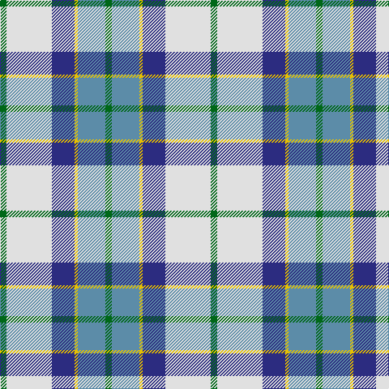

This page is one **sett** — a single exact thread-count. It belongs to the [tartan](/tartans/g4w28db14ly2t17g4/)
(the same proportion at any scale), whose colour order is pattern [GBYBWG](/stripes/gbybwg/).

Sourced from tartans-authority.  It is a [6 stripe tartan](/stripes/stripes6/).

Original link http://www.tartansauthority.com/tartan-ferret/display/3031/

2 attestations — the source records this cloth was collapsed from (oldest owns this page)

<ul>
<li>1980 — Allanton Dress (Fashion) (tartans-authority, <a href="http://www.tartansauthority.com/tartan-ferret/display/3031/">record</a>)</li>
<li>undated — Allanton Dress (register-of-tartans, <a href="https://www.tartanregister.gov.uk/tartanDetails.aspx?ref=4830">record</a>)</li>
</ul>

## Register references

External register numbers recorded for this tartan.

- Scottish Register of Tartans: [4830](https://www.tartanregister.gov.uk/tartanDetails.aspx?ref=4830)
- Scottish Tartans Authority (ITI): 3031

## Thread count
G/8 LN56 DB28 Y4 B34 G/8

## Palette

Palette: <strong>Tartan Register</strong>
<table><thead><tr><th>Colour</th><th>Threads</th><th>Shade</th><th>Base</th><th>OKLCh</th></tr></thead><tbody><tr><td>G/</td><td style="text-align:right;font-variant-numeric:tabular-nums">8</td><td><code style="background-color:#006818;">#006818</code> <small style="color:#888">#006818</small></td><td>G <code style="background-color:#006100;">#006100</code></td><td><small style="color:#888">oklch(45.0% 0.142 145.0)</small></td></tr><tr><td>LN</td><td style="text-align:right;font-variant-numeric:tabular-nums">56</td><td><code style="background-color:#E0E0E0;">#E0E0E0</code> <small style="color:#888">#E0E0E0</small></td><td>W <code style="background-color:#F7F7F7;">#F7F7F7</code></td><td><small style="color:#888">oklch(90.7% 0.000 89.9)</small></td></tr><tr><td>DB</td><td style="text-align:right;font-variant-numeric:tabular-nums">28</td><td><code style="background-color:#2C2C80;">#2C2C80</code> <small style="color:#888">#2C2C80</small></td><td>B <code style="background-color:#2A418A;">#2A418A</code></td><td><small style="color:#888">oklch(35.0% 0.138 276.6)</small></td></tr><tr><td>Y</td><td style="text-align:right;font-variant-numeric:tabular-nums">4</td><td><code style="background-color:#E8C000;">#E8C000</code> <small style="color:#888">#E8C000</small></td><td>Y <code style="background-color:#F2BF00;">#F2BF00</code></td><td><small style="color:#888">oklch(81.9% 0.168 93.7)</small></td></tr><tr><td>B</td><td style="text-align:right;font-variant-numeric:tabular-nums">34</td><td><code style="background-color:#5C8CA8;">#5C8CA8</code> <small style="color:#888">#5C8CA8</small></td><td>B <code style="background-color:#2A418A;">#2A418A</code></td><td><small style="color:#888">oklch(61.7% 0.067 235.0)</small></td></tr><tr><td>G/</td><td style="text-align:right;font-variant-numeric:tabular-nums">8</td><td><code style="background-color:#006818;">#006818</code> <small style="color:#888">#006818</small></td><td>G <code style="background-color:#006100;">#006100</code></td><td><small style="color:#888">oklch(45.0% 0.142 145.0)</small></td></tr></tbody></table>

# Sample pattern

## Nearest tartans

The nearest existing variants by ΔTartan distance, with this tartan at the top so the swatches line up against it.

ΔTartan

Tartan

Sett

—

<a href="/ttd/edit/#slug=g4w28db14ly2t17g4~x2">Allanton Dress (Fashion)</a> <a class="nn-out" href="/setts/s6/g4w28db14ly2t17g4~x2/" title="open its dictionary page">↗</a>

0.75

<a href="/ttd/edit/#slug=g4w28p8ly2db17g4~x2">Manx, dress</a> <a class="nn-out" href="/setts/s6/g4w28p8ly2db17g4~x2/" title="open its dictionary page">↗</a>

0.89

<a href="/ttd/edit/#slug=db2w14p4ly1g8db2~x2">Manx Laxey, dress green</a> <a class="nn-out" href="/setts/s6/db2w14p4ly1g8db2~x2/" title="open its dictionary page">↗</a>

0.90

<a href="/ttd/edit/#slug=w28t19db19w4dbi2lp2db7~x2">St Andrews, Earl of, dress</a> <a class="nn-out" href="/setts/s7/w28t19db19w4dbi2lp2db7~x2/" title="open its dictionary page">↗</a>

0.94

<a href="/ttd/edit/#slug=t17k12w9m2w9g1w2~x4">Ferguson Dress</a> <a class="nn-out" href="/setts/s7/t17k12w9m2w9g1w2~x4/" title="open its dictionary page">↗</a>

0.96

<a href="/ttd/edit/#slug=g4w28dp8ly2db17g4~x2">Manx Dress</a> <a class="nn-out" href="/setts/s6/g4w28dp8ly2db17g4~x2/" title="open its dictionary page">↗</a>

0.97

<a href="/ttd/edit/#slug=w28t19dbi19w4db2lp2dbi7~x2">St Andrews Dress, Earl of.. District Tartan Tartan Number: 45. Earliest known date: pre 2003 See products available Copyright © Blair Urquhart, Comrie, 2015</a> <a class="nn-out" href="/setts/s7/w28t19dbi19w4db2lp2dbi7~x2/" title="open its dictionary page">↗</a>

0.98

<a href="/ttd/edit/#slug=t8w28lo3g3t8k9t4~x2">MacTavish of Dunardry (Clan)</a> <a class="nn-out" href="/setts/s7/t8w28lo3g3t8k9t4~x2/" title="open its dictionary page">↗</a>

1.02

<a href="/ttd/edit/#slug=w28t19dbi19w4db2p2dbi7~x2">St. Andrews Dress, Earl of (Danc</a> <a class="nn-out" href="/setts/s7/w28t19dbi19w4db2p2dbi7~x2/" title="open its dictionary page">↗</a>

1.06

<a href="/ttd/edit/#slug=t34db24w18r3w18g2w3~x2">Ferguson, dress</a> <a class="nn-out" href="/setts/s7/t34db24w18r3w18g2w3~x2/" title="open its dictionary page">↗</a>

1.07

<a href="/ttd/edit/#slug=w8g5dp10t24w30g2lp2~x2">Shiel, Purple V2 (Dance)</a> <a class="nn-out" href="/setts/s7/w8g5dp10t24w30g2lp2~x2/" title="open its dictionary page">↗</a>

## Neighbour map

Every grey dot is one of 14359 variants placed by the first two principal components of the ΔTartan feature space (44% of its variance). Red is this tartan; blue dots are its nearest — click one to open its page.

<svg viewBox="0 0 640 380" role="img" style="max-width:100%;height:auto;border:1px solid #e0e0e0;border-radius:4px;display:block" xmlns="http://www.w3.org/2000/svg"><image href="/nn/cloud.v1.png" width="640" height="380"/><a href="/setts/s6/g4w28p8ly2db17g4~x2/"><circle cx="183.8" cy="152.5" r="4" fill="#3465a4"><title>Manx, dress</title></circle></a><a href="/setts/s6/db2w14p4ly1g8db2~x2/"><circle cx="186.6" cy="153.1" r="4" fill="#3465a4"><title>Manx Laxey, dress green</title></circle></a><a href="/setts/s7/w28t19db19w4dbi2lp2db7~x2/"><circle cx="173.4" cy="158.9" r="4" fill="#3465a4"><title>St Andrews, Earl of, dress</title></circle></a><a href="/setts/s7/t17k12w9m2w9g1w2~x4/"><circle cx="155.2" cy="151.6" r="4" fill="#3465a4"><title>Ferguson Dress</title></circle></a><a href="/setts/s6/g4w28dp8ly2db17g4~x2/"><circle cx="180.7" cy="151.4" r="4" fill="#3465a4"><title>Manx Dress</title></circle></a><a href="/setts/s7/w28t19dbi19w4db2lp2dbi7~x2/"><circle cx="169.1" cy="156.3" r="4" fill="#3465a4"><title>St Andrews Dress, Earl of.. District Tartan Tartan Number: 45. Earliest known date: pre 2003 See products available Copyright © Blair Urquhart, Comrie, 2015</title></circle></a><a href="/setts/s7/t8w28lo3g3t8k9t4~x2/"><circle cx="176.2" cy="162.2" r="4" fill="#3465a4"><title>MacTavish of Dunardry (Clan)</title></circle></a><a href="/setts/s7/w28t19dbi19w4db2p2dbi7~x2/"><circle cx="169.1" cy="156.5" r="4" fill="#3465a4"><title>St. Andrews Dress, Earl of (Danc</title></circle></a><a href="/setts/s7/t34db24w18r3w18g2w3~x2/"><circle cx="158.4" cy="150.7" r="4" fill="#3465a4"><title>Ferguson, dress</title></circle></a><a href="/setts/s7/w8g5dp10t24w30g2lp2~x2/"><circle cx="207.7" cy="145.1" r="4" fill="#3465a4"><title>Shiel, Purple V2 (Dance)</title></circle></a><circle cx="161.8" cy="164.8" r="5" fill="#c00000"/></svg>

ID: /setts/s6/g4w28db14ly2t17g4~x2/
