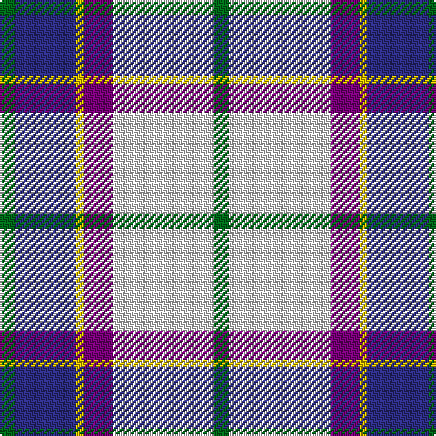

**Bands:** [GBYBWG](/stripes/gbybwg/) · **Stripes:** [G DB LY DP W G](/stripes/stripes6/) G DB LY DP W G

This was sourced from register-of-tartans.  It is a [6 band tartan](/bands/bands6/).

Original link https://www.tartanregister.gov.uk/tartanDetails.aspx?ref=2814

## Attestations

This cloth appears in 2 source records; the oldest owns this page.

- 01/01/1981 — Manx Dress (register-of-tartans, [record](https://www.tartanregister.gov.uk/tartanDetails.aspx?ref=2814))
- undated — Manx Dress District Tartan Tartan Number: 748. Earliest known date: 1984. Sample loaned by Dr. D.G. Teall in 1985 See products available Copyright © Blair Urquhart, Comrie, 2015 (house-of-tartan, [record](http://www.house-of-tartan.scotland.net/house/TartanViewjs.asp?colr=Def&tnam=748))

## Register references

External register numbers recorded for this tartan.

- Scottish Register of Tartans: [2814](https://www.tartanregister.gov.uk/tartanDetails.aspx?ref=2814)
- Scottish Tartans Authority (ITI): 748
- Scottish Tartans World Register: 748

## Thread count
G/8 LN56 P16 Y4 DB34 G/8

## Palette
Each colour and its ΔE from the base-6 reference it is a variant of.

| Colour | Shade | Base | ΔE (OKLab) |
|---|---|---|---|
| DB | <code style="background-color:#2C2C80;">#2C2C80</code> `#2C2C80` | B <code style="background-color:#2A418A;">#2A418A</code> | 0.06 |
| G | <code style="background-color:#006818;">#006818</code> `#006818` | G <code style="background-color:#006100;">#006100</code> | 0.02 |
| LN | <code style="background-color:#E0E0E0;">#E0E0E0</code> `#E0E0E0` | W <code style="background-color:#F7F7F7;">#F7F7F7</code> | 0.07 |
| P | <code style="background-color:#780078;">#780078</code> `#780078` | B <code style="background-color:#2A418A;">#2A418A</code> | 0.17 |
| Y | <code style="background-color:#E8C000;">#E8C000</code> `#E8C000` | Y <code style="background-color:#F2BF00;">#F2BF00</code> | 0.02 |

# Sample pattern

## Nearest tartans

The nearest existing variants by ΔTartan distance.

1. [Manx, dress](/setts/s6/g4w28p8ly2db17g4~x2/) — ΔT 0.36
1. [Shiel, Purple (Dance)](/setts/s7/w8g5t10dp24w30g2lp2~x2/) — ΔT 0.82
1. [Afternoon Tea / Earl Grey](/setts/s6/r15t98db72ly25db8w15/) — ΔT 0.87
1. [St. Andrews Dress, Earl of (Danc](/setts/s7/w28t19db19w4db2p2db7~x2/) — ΔT 0.90
1. [Shiel, Magenta (Dance)](/setts/s7/w8b5t10dp24w30b2dg2~x2/) — ΔT 0.92
1. [Davidson (Wedding) (Personal)](/setts/s7/r2db14k6g1w12g1w2~x4/) — ΔT 0.94
1. [Ferguson Dress](/setts/s7/t17k12w9m2w9g1w2~x4/) — ΔT 0.95
1. [Ferguson, dress](/setts/s7/t34db24w18r3w18g2w3~x2/) — ΔT 0.96
1. [Allanton Dress (Fashion)](/setts/s6/g4w28db14ly2t17g4~x2/) — ΔT 0.96
1. [St Andrews, Earl of, dress](/setts/s7/w28t19db19w4db2lp2db7~x2/) — ΔT 0.97

## Neighbour map

Every grey dot is one of 14299 variants placed by the first two principal components of the ΔTartan feature space (44% of its variance). Red is this tartan; blue dots are its nearest — click one to open its page.

<svg viewBox="0 0 640 380" role="img" style="max-width:100%;height:auto;border:1px solid #e0e0e0;border-radius:4px;display:block" xmlns="http://www.w3.org/2000/svg"><image href="/nn/cloud.v1.png" width="640" height="380"/><a href="/setts/s6/g4w28p8ly2db17g4~x2/"><circle cx="184.6" cy="151.6" r="4" fill="#3465a4"><title>Manx, dress</title></circle></a><a href="/setts/s7/w8g5t10dp24w30g2lp2~x2/"><circle cx="198.8" cy="137.3" r="4" fill="#3465a4"><title>Shiel, Purple (Dance)</title></circle></a><a href="/setts/s6/r15t98db72ly25db8w15/"><circle cx="186.0" cy="168.3" r="4" fill="#3465a4"><title>Afternoon Tea / Earl Grey</title></circle></a><a href="/setts/s7/w28t19db19w4db2p2db7~x2/"><circle cx="169.8" cy="155.5" r="4" fill="#3465a4"><title>St. Andrews Dress, Earl of (Danc</title></circle></a><a href="/setts/s7/w8b5t10dp24w30b2dg2~x2/"><circle cx="208.5" cy="140.3" r="4" fill="#3465a4"><title>Shiel, Magenta (Dance)</title></circle></a><a href="/setts/s7/r2db14k6g1w12g1w2~x4/"><circle cx="149.4" cy="138.7" r="4" fill="#3465a4"><title>Davidson (Wedding) (Personal)</title></circle></a><a href="/setts/s7/t17k12w9m2w9g1w2~x4/"><circle cx="155.9" cy="150.6" r="4" fill="#3465a4"><title>Ferguson Dress</title></circle></a><a href="/setts/s7/t34db24w18r3w18g2w3~x2/"><circle cx="159.1" cy="149.7" r="4" fill="#3465a4"><title>Ferguson, dress</title></circle></a><a href="/setts/s6/g4w28db14ly2t17g4~x2/"><circle cx="162.5" cy="163.9" r="4" fill="#3465a4"><title>Allanton Dress (Fashion)</title></circle></a><a href="/setts/s7/w28t19db19w4db2lp2db7~x2/"><circle cx="174.1" cy="158.0" r="4" fill="#3465a4"><title>St Andrews, Earl of, dress</title></circle></a><circle cx="181.6" cy="150.5" r="5" fill="#c00000"/></svg>

ID: /setts/s6/g4w28dp8ly2db17g4~x2/
