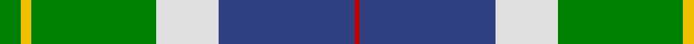
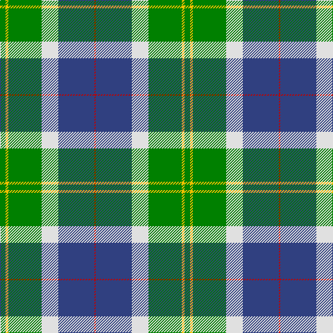

In pattern [GYGWBR](/patterns/gygwbr/).

This was sourced from weddslist.  It is a [6 stripes tartan](/stripes/stripes6/).

Original link http://www.weddslist.com/cgi-bin/tartans/pg.pl?source=sts

## Thread count
G/8 Y4 G48 LN24 B52 R/2

## Palette
Each colour and its ΔE from the base-6 reference it is a variant of.

| Colour | Shade | Base | ΔE (OKLab) |
|---|---|---|---|
| B | <code style="background-color:#304080;">#304080</code> `#304080` | B <code style="background-color:#2A418A;">#2A418A</code> | 0.02 |
| G | <code style="background-color:#008000;">#008000</code> `#008000` | G <code style="background-color:#006100;">#006100</code> | 0.10 |
| LN | <code style="background-color:#E0E0E0;">#E0E0E0</code> `#E0E0E0` | W <code style="background-color:#F7F7F7;">#F7F7F7</code> | 0.07 |
| R | <code style="background-color:#C00000;">#C00000</code> `#C00000` | R <code style="background-color:#CC0000;">#CC0000</code> | 0.03 |
| Y | <code style="background-color:#F0C000;">#F0C000</code> `#F0C000` | Y <code style="background-color:#F2BF00;">#F2BF00</code> | 0.00 |

# Sample pattern

## Nearest tartans

The nearest existing variants by ΔTartan distance.

1. [Vancouver Centennial Commemorative Tartan Tartan Number: 2083. Earliest known date: 1988 Registered by Lord Lyon on 30th August, 1991. See products available Copyright © Blair Urquhart, Comrie, 2015](/setts/s6/g4y2g24w12b26r1~b2c2c80-g006818-rc80000-we0e0e0-ye8c000~x2/) — ΔT 0.70
1. [Big Sur MacLaren (Personal)](/setts/s7/y31k18g13r3g13k1ya3~g005030-k101010-rc80000-y88acb8-yae8c000~x2/) — ΔT 0.96
1. [Centennial-King George Lodge No.171](/setts/s5/r2w7b30g36y2~b1870a4-g004028-rff0000-wffffff-yffe600~x2/) — ΔT 1.22
1. [Scottish Prison Service (Corporate)](/setts/s8/w3k1r4g20k3b30w4r2~b1474b4-g289c18-k101010-rc80000-we0e0e0~x2/) — ΔT 1.24
1. [Delaware Fine Spirits Guild (Corp)](/setts/s6/k5g25k10y15ya1y5~g589058-k101010-y9cc484-yae8c000~x2/) — ΔT 1.26
1. [Centennial-King George Lodge No.171](/setts/s5/r2w7b30g36y2~b202060-g006818-rc80000-wfcfcfc-ye8c000~x2/) — ΔT 1.29
1. [Gillies (House of Edgar)](/setts/s8/b32k12b12g6r6g18k2y3~b1474b4-g289c18-k101010-rc80000-ye8c000~x2/) — ΔT 1.31
1. [Colquhoun](/setts/s7/b4k2b16w1k8g24r4~b304080-g008000-k000000-rc00000-we0e0e0~x2/) — ΔT 1.39
1. [Gigha, Green (Dance)](/setts/s8/b4w2b1w18g18ga18y3ga4~b2c2c80-g003820-ga38885c-wf0e0c8-ye8d468~x2/) — ΔT 1.40
1. [Vancouver Centennial](/setts/s6/g4y2g24w12b26r1~b0000cd-g008b00-rff0000-wffffff-yffe600~x2/) — ΔT 1.42

## Neighbour map

Every grey dot is one of 15726 variants placed by the first two principal components of the ΔTartan feature space (44% of its variance). Red is this tartan; blue dots are its nearest — click one to open its page.

<svg viewBox="0 0 640 380" role="img" style="max-width:100%;height:auto;border:1px solid #e0e0e0;border-radius:4px;display:block" xmlns="http://www.w3.org/2000/svg"><image href="/nn/cloud.v1.png" width="640" height="380"/><a href="/setts/s6/g4y2g24w12b26r1~b2c2c80-g006818-rc80000-we0e0e0-ye8c000~x2/"><circle cx="215.4" cy="149.8" r="4" fill="#3465a4"><title>Vancouver Centennial Commemorative Tartan Tartan Number: 2083. Earliest known date: 1988 Registered by Lord Lyon on 30th August, 1991. See products available Copyright © Blair Urquhart, Comrie, 2015</title></circle></a><a href="/setts/s7/y31k18g13r3g13k1ya3~g005030-k101010-rc80000-y88acb8-yae8c000~x2/"><circle cx="195.2" cy="139.0" r="4" fill="#3465a4"><title>Big Sur MacLaren (Personal)</title></circle></a><a href="/setts/s5/r2w7b30g36y2~b1870a4-g004028-rff0000-wffffff-yffe600~x2/"><circle cx="252.5" cy="173.3" r="4" fill="#3465a4"><title>Centennial-King George Lodge No.171</title></circle></a><a href="/setts/s8/w3k1r4g20k3b30w4r2~b1474b4-g289c18-k101010-rc80000-we0e0e0~x2/"><circle cx="249.3" cy="113.9" r="4" fill="#3465a4"><title>Scottish Prison Service (Corporate)</title></circle></a><a href="/setts/s6/k5g25k10y15ya1y5~g589058-k101010-y9cc484-yae8c000~x2/"><circle cx="222.4" cy="173.6" r="4" fill="#3465a4"><title>Delaware Fine Spirits Guild (Corp)</title></circle></a><a href="/setts/s5/r2w7b30g36y2~b202060-g006818-rc80000-wfcfcfc-ye8c000~x2/"><circle cx="249.3" cy="172.1" r="4" fill="#3465a4"><title>Centennial-King George Lodge No.171</title></circle></a><a href="/setts/s8/b32k12b12g6r6g18k2y3~b1474b4-g289c18-k101010-rc80000-ye8c000~x2/"><circle cx="220.9" cy="167.5" r="4" fill="#3465a4"><title>Gillies (House of Edgar)</title></circle></a><a href="/setts/s7/b4k2b16w1k8g24r4~b304080-g008000-k000000-rc00000-we0e0e0~x2/"><circle cx="209.3" cy="147.7" r="4" fill="#3465a4"><title>Colquhoun</title></circle></a><a href="/setts/s8/b4w2b1w18g18ga18y3ga4~b2c2c80-g003820-ga38885c-wf0e0c8-ye8d468~x2/"><circle cx="133.4" cy="140.1" r="4" fill="#3465a4"><title>Gigha, Green (Dance)</title></circle></a><a href="/setts/s6/g4y2g24w12b26r1~b0000cd-g008b00-rff0000-wffffff-yffe600~x2/"><circle cx="190.1" cy="142.8" r="4" fill="#3465a4"><title>Vancouver Centennial</title></circle></a><circle cx="217.9" cy="150.4" r="5" fill="#c00000"/></svg>

ID: /setts/s6/g4y2g24w12b26r1~b304080-g008000-rc00000-we0e0e0-yf0c000~x2/
