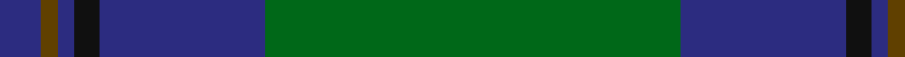
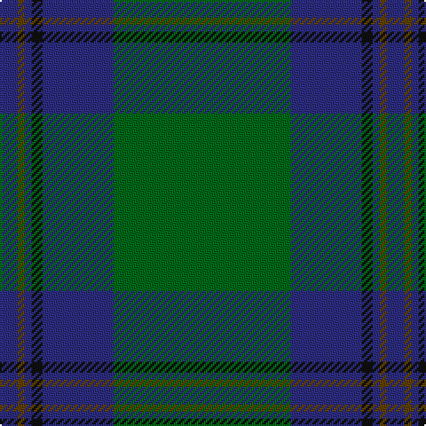

**Bands:** [BGBKBG](/stripes/bgbkbg/) · **Stripes:** [DB DY DB K DB G](/stripes/stripes6/) DB DY DB K DB G

This was sourced from house-of-tartan.  It is a [6 band tartan](/bands/bands6/).

Original link http://www.house-of-tartan.scotland.net/house/TartanViewjs.asp?colr=Def&tnam=2332

## Variants

Other setts woven to the same stripe pattern.

- [St. Andrews Old Course Hotel (Corp)](/setts/s6/g26db10k3db2dy2db10~x4/)

## Thread count
DB/10 T4 DB4 K6 DB40 G/100

## Palette
Each colour and its ΔE from the base-6 reference it is a variant of.

| Colour | Shade | Base | ΔE (OKLab) |
|---|---|---|---|
| DB | <code style="background-color:#2C2C80;">#2C2C80</code> `#2C2C80` | B <code style="background-color:#2A418A;">#2A418A</code> | 0.06 |
| G | <code style="background-color:#006818;">#006818</code> `#006818` | G <code style="background-color:#006100;">#006100</code> | 0.02 |
| K | <code style="background-color:#101010;">#101010</code> `#101010` | K <code style="background-color:#000000;">#000000</code> | 0.17 |
| T | <code style="background-color:#604000;">#604000</code> `#604000` | G <code style="background-color:#006100;">#006100</code> | 0.14 |

# Sample pattern

## Nearest tartans

The nearest existing variants by ΔTartan distance.

1. [Royal and Ancient, The](/setts/s6/g49db16dy3db2dy2db6~x2/) — ΔT 0.97
1. [Celtic (New) Corporate Sport Tartan Tartan Number: 2232. Earliest known date: 1842 Should have a white line (?). See products available Copyright © Blair Urquhart, Comrie, 2015](/setts/s8/g44k2g2k2g3k12db10r3~x2/) — ΔT 1.20
1. [St Andrews Hotel, Golf Resort, and SPA](/setts/s6/g50db20k3db2o2db5~x2/) — ΔT 1.22
1. [Semper](/setts/s8/g16dg1y4dg41y1dg6g2dg2~x2/) — ΔT 1.32
1. [Royal and Ancient, The](/setts/s6/g49db16o3db2o2db6~x2/) — ΔT 1.32
1. [Semper](/setts/s8/g16dg1lg4dg41lg1dg6g2dg2~x2/) — ΔT 1.32
1. [Green Swamp Youth Campers](/setts/s6/k8r2k13lo2dg48b6~x2/) — ΔT 1.35
1. [Greenlaw, American (Name)](/setts/s8/b46r2b3r2b14g38k3g4~x2/) — ΔT 1.36
1. [MacAuliffe/McAucliffe](/setts/s8/dg38w2dg6db24o6db2o3db2~x2/) — ΔT 1.38
1. [Shaw (Clan 1)](/setts/s6/g24k2db3k2db8r2~x2/) — ΔT 1.43

## Neighbour map

Every grey dot is one of 14313 variants placed by the first two principal components of the ΔTartan feature space (44% of its variance). Red is this tartan; blue dots are its nearest — click one to open its page.

<svg viewBox="0 0 640 380" role="img" style="max-width:100%;height:auto;border:1px solid #e0e0e0;border-radius:4px;display:block" xmlns="http://www.w3.org/2000/svg"><image href="/nn/cloud.v1.png" width="640" height="380"/><a href="/setts/s6/g49db16dy3db2dy2db6~x2/"><circle cx="485.4" cy="209.7" r="4" fill="#3465a4"><title>Royal and Ancient, The</title></circle></a><a href="/setts/s8/g44k2g2k2g3k12db10r3~x2/"><circle cx="420.0" cy="164.9" r="4" fill="#3465a4"><title>Celtic (New) Corporate Sport Tartan Tartan Number: 2232. Earliest known date: 1842 Should have a white line (?). See products available Copyright © Blair Urquhart, Comrie, 2015</title></circle></a><a href="/setts/s6/g50db20k3db2o2db5~x2/"><circle cx="416.9" cy="173.6" r="4" fill="#3465a4"><title>St Andrews Hotel, Golf Resort, and SPA</title></circle></a><a href="/setts/s8/g16dg1y4dg41y1dg6g2dg2~x2/"><circle cx="513.0" cy="158.1" r="4" fill="#3465a4"><title>Semper</title></circle></a><a href="/setts/s6/g49db16o3db2o2db6~x2/"><circle cx="471.0" cy="201.8" r="4" fill="#3465a4"><title>Royal and Ancient, The</title></circle></a><a href="/setts/s8/g16dg1lg4dg41lg1dg6g2dg2~x2/"><circle cx="503.9" cy="153.3" r="4" fill="#3465a4"><title>Semper</title></circle></a><a href="/setts/s6/k8r2k13lo2dg48b6~x2/"><circle cx="408.4" cy="175.3" r="4" fill="#3465a4"><title>Green Swamp Youth Campers</title></circle></a><a href="/setts/s8/b46r2b3r2b14g38k3g4~x2/"><circle cx="410.8" cy="183.2" r="4" fill="#3465a4"><title>Greenlaw, American (Name)</title></circle></a><a href="/setts/s8/dg38w2dg6db24o6db2o3db2~x2/"><circle cx="364.6" cy="179.2" r="4" fill="#3465a4"><title>MacAuliffe/McAucliffe</title></circle></a><a href="/setts/s6/g24k2db3k2db8r2~x2/"><circle cx="369.9" cy="208.7" r="4" fill="#3465a4"><title>Shaw (Clan 1)</title></circle></a><circle cx="447.5" cy="189.1" r="5" fill="#c00000"/></svg>

ID: /setts/s6/g50db20k3db2dy2db5~x2/
