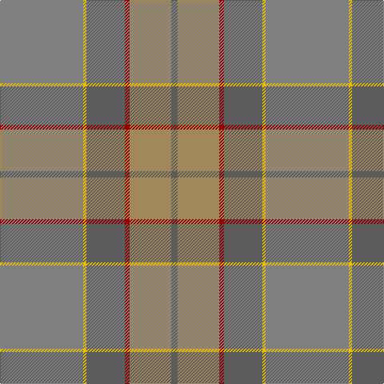

In pattern [BYRBYG](/patterns/byrbyg/).

This was sourced from register-of-tartans.  It is a [6 stripes tartan](/stripes/stripes6/).

Original link https://www.tartanregister.gov.uk/tartanDetails.aspx?ref=11113

## Thread count
N/104 Y4 Na48 DR6 LT52 Na/8

## Palette
Each colour and its ΔE from the base-6 reference it is a variant of.

| Colour | Shade | Base | ΔE (OKLab) |
|---|---|---|---|
| DR | <code style="background-color:#960000;">#960000</code> `#960000` | R <code style="background-color:#CC0000;">#CC0000</code> | 0.12 |
| LT | <code style="background-color:#A08858;">#A08858</code> `#A08858` | Y <code style="background-color:#F2BF00;">#F2BF00</code> | 0.21 |
| N | <code style="background-color:#808080;">#808080</code> `#808080` | G <code style="background-color:#006100;">#006100</code> | 0.23 |
| Na | <code style="background-color:#5C5C5C;">#5C5C5C</code> `#5C5C5C` | B <code style="background-color:#2A418A;">#2A418A</code> | 0.15 |
| Y | <code style="background-color:#E8C000;">#E8C000</code> `#E8C000` | Y <code style="background-color:#F2BF00;">#F2BF00</code> | 0.02 |

# Sample pattern

## Nearest tartans

The nearest existing variants by ΔTartan distance.

1. [Outlander #1](/setts/s6/r52y2b24ra3ya26b4~b5c5c5c-r888888-raa00000-yfccc00-yaa08858~x2/) — ΔT 0.59
1. [Rikaco Morning Dew #2](/setts/s8/y3w3y1g25y15ya5w4yb2~g789484-w98c8e8-yb8b8b8-yae08070-ybe8c000~x2/) — ΔT 1.78
1. [Isle of Cumbrae (Corporate)](/setts/s7/k3g3r3g28b28w2b2~b5c5c5c-g787468-k101010-r901c38-wbcc8c4~x2/) — ΔT 1.85
1. [Roddy's Highland Spirit (Fashion)](/setts/s10/g30b3g3b3g3b10ga10gb20r2ga5~b80588c-g5c6428-ga3c6434-gb608064-rb07cc8~x2/) — ΔT 1.87
1. [McWilliams (2014)](/setts/s4/g22b1ga22r4~b780078-g8c7038-ga5c6428-rc80000~x4/) — ΔT 1.99
1. [Jardine](/setts/s8/b9r9g9ra1ga1r9ga1ra1~b5c5c5c-g787878-ga789484-ra46000-rac80000~x4/) — ΔT 2.05
1. [The Broons (Corporate)](/setts/s9/r3k1g8y1ga7y1g19gb25k1~g5c6428-ga604000-gb603800-k101010-rc80000-ybc8c00~x2/) — ΔT 2.24
1. [Tricor](/setts/s12/g4w1g4ga6gb6r4g23r4gb6ga6g4w1~g8c7038-ga00643c-gb604000-r98481c-wc0c0c0~x4/) — ΔT 2.33
1. [Long Way Down, The (Corporate)](/setts/s11/r55g6ga3w3ga3w3ga10gb5ga5y2ga3~g606000-ga708048-gb707070-r888888-wc0c8cc-yb8b8b8~x2/) — ΔT 2.34
1. [Granite City (Fashion)](/setts/s8/k3b3k3b21ba21k3ba3y1~b5c5c5c-ba505050-k101010-ya0a0a0~x2/) — ΔT 2.36

## Neighbour map

Every grey dot is one of 15726 variants placed by the first two principal components of the ΔTartan feature space (44% of its variance). Red is this tartan; blue dots are its nearest — click one to open its page.

<svg viewBox="0 0 640 380" role="img" style="max-width:100%;height:auto;border:1px solid #e0e0e0;border-radius:4px;display:block" xmlns="http://www.w3.org/2000/svg"><image href="/nn/cloud.v1.png" width="640" height="380"/><a href="/setts/s6/r52y2b24ra3ya26b4~b5c5c5c-r888888-raa00000-yfccc00-yaa08858~x2/"><circle cx="409.5" cy="203.0" r="4" fill="#3465a4"><title>Outlander #1</title></circle></a><a href="/setts/s8/y3w3y1g25y15ya5w4yb2~g789484-w98c8e8-yb8b8b8-yae08070-ybe8c000~x2/"><circle cx="374.5" cy="173.9" r="4" fill="#3465a4"><title>Rikaco Morning Dew #2</title></circle></a><a href="/setts/s7/k3g3r3g28b28w2b2~b5c5c5c-g787468-k101010-r901c38-wbcc8c4~x2/"><circle cx="395.8" cy="205.6" r="4" fill="#3465a4"><title>Isle of Cumbrae (Corporate)</title></circle></a><a href="/setts/s10/g30b3g3b3g3b10ga10gb20r2ga5~b80588c-g5c6428-ga3c6434-gb608064-rb07cc8~x2/"><circle cx="360.4" cy="215.0" r="4" fill="#3465a4"><title>Roddy's Highland Spirit (Fashion)</title></circle></a><a href="/setts/s4/g22b1ga22r4~b780078-g8c7038-ga5c6428-rc80000~x4/"><circle cx="470.1" cy="273.8" r="4" fill="#3465a4"><title>McWilliams (2014)</title></circle></a><a href="/setts/s8/b9r9g9ra1ga1r9ga1ra1~b5c5c5c-g787878-ga789484-ra46000-rac80000~x4/"><circle cx="358.1" cy="246.0" r="4" fill="#3465a4"><title>Jardine</title></circle></a><a href="/setts/s9/r3k1g8y1ga7y1g19gb25k1~g5c6428-ga604000-gb603800-k101010-rc80000-ybc8c00~x2/"><circle cx="375.7" cy="165.7" r="4" fill="#3465a4"><title>The Broons (Corporate)</title></circle></a><a href="/setts/s12/g4w1g4ga6gb6r4g23r4gb6ga6g4w1~g8c7038-ga00643c-gb604000-r98481c-wc0c0c0~x4/"><circle cx="385.2" cy="174.2" r="4" fill="#3465a4"><title>Tricor</title></circle></a><a href="/setts/s11/r55g6ga3w3ga3w3ga10gb5ga5y2ga3~g606000-ga708048-gb707070-r888888-wc0c8cc-yb8b8b8~x2/"><circle cx="480.8" cy="133.5" r="4" fill="#3465a4"><title>Long Way Down, The (Corporate)</title></circle></a><a href="/setts/s8/k3b3k3b21ba21k3ba3y1~b5c5c5c-ba505050-k101010-ya0a0a0~x2/"><circle cx="394.3" cy="208.3" r="4" fill="#3465a4"><title>Granite City (Fashion)</title></circle></a><circle cx="424.7" cy="210.3" r="5" fill="#c00000"/></svg>

ID: /setts/s6/g52y2b24r3ya26b4~b5c5c5c-g808080-r960000-ye8c000-yaa08858~x2/
