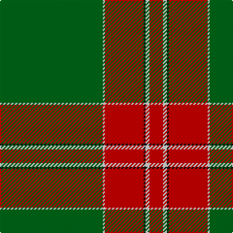

This page is one **sett** — a single exact thread-count. It belongs to the [tartan](/tartans/g53w1r20k1w2r7/)
(the same proportion at any scale), whose colour order is pattern [GWRKWR](/stripes/gwrkwr/).

Sourced from tartans-authority.  It is a [6 stripe tartan](/stripes/stripes6/).

Original link http://www.tartansauthority.com/tartan-ferret/display/7165/

## Register references

External register numbers recorded for this tartan.

- Scottish Tartans Authority (ITI): 7165

## Thread count
G/106 LN2 R40 K2 LN4 R/14

## Palette

Palette: <strong>Tartan Register</strong>
<table><thead><tr><th>Colour</th><th>Threads</th><th>Shade</th><th>Base</th><th>OKLCh</th></tr></thead><tbody><tr><td>G/</td><td style="text-align:right;font-variant-numeric:tabular-nums">106</td><td><code style="background-color:#006818;">#006818</code> <small style="color:#888">#006818</small></td><td>G <code style="background-color:#006100;">#006100</code></td><td><small style="color:#888">oklch(45.0% 0.142 145.0)</small></td></tr><tr><td>LN</td><td style="text-align:right;font-variant-numeric:tabular-nums">2</td><td><code style="background-color:#E0E0E0;">#E0E0E0</code> <small style="color:#888">#E0E0E0</small></td><td>W <code style="background-color:#F7F7F7;">#F7F7F7</code></td><td><small style="color:#888">oklch(90.7% 0.000 89.9)</small></td></tr><tr><td>R</td><td style="text-align:right;font-variant-numeric:tabular-nums">40</td><td><code style="background-color:#C80000;">#C80000</code> <small style="color:#888">#C80000</small></td><td>R <code style="background-color:#CC0000;">#CC0000</code></td><td><small style="color:#888">oklch(52.3% 0.215 29.2)</small></td></tr><tr><td>K</td><td style="text-align:right;font-variant-numeric:tabular-nums">2</td><td><code style="background-color:#101010;">#101010</code> <small style="color:#888">#101010</small></td><td>K <code style="background-color:#000000;">#000000</code></td><td><small style="color:#888">oklch(17.3% 0.000 89.9)</small></td></tr><tr><td>LN</td><td style="text-align:right;font-variant-numeric:tabular-nums">4</td><td><code style="background-color:#E0E0E0;">#E0E0E0</code> <small style="color:#888">#E0E0E0</small></td><td>W <code style="background-color:#F7F7F7;">#F7F7F7</code></td><td><small style="color:#888">oklch(90.7% 0.000 89.9)</small></td></tr><tr><td>R/</td><td style="text-align:right;font-variant-numeric:tabular-nums">14</td><td><code style="background-color:#C80000;">#C80000</code> <small style="color:#888">#C80000</small></td><td>R <code style="background-color:#CC0000;">#CC0000</code></td><td><small style="color:#888">oklch(52.3% 0.215 29.2)</small></td></tr></tbody></table>

# Sample pattern

## Nearest tartans

The nearest existing variants by ΔTartan distance, with this tartan at the top so the swatches line up against it.

ΔTartan

Tartan

Sett

—

<a href="/ttd/edit/#slug=g53w1r20k1w2r7~x2">Masai Shuka 10 (Artefact)</a> <a class="nn-out" href="/setts/s6/g53w1r20k1w2r7~x2/" title="open its dictionary page">↗</a>

0.81

<a href="/ttd/edit/#slug=g36r18g4r6k1w2~x2">Princess Margaret Rose Tartan Tartan Number: 986. Earliest known date: 1930 Colours reversed from MacGregor See products available Copyright © Blair Urquhart, Comrie, 2015</a> <a class="nn-out" href="/setts/s6/g36r18g4r6k1w2~x2/" title="open its dictionary page">↗</a>

1.35

<a href="/ttd/edit/#slug=dg40k3w1k5r1k2ri10~x2">Aviemore Highland (Corporate)</a> <a class="nn-out" href="/setts/s7/dg40k3w1k5r1k2ri10~x2/" title="open its dictionary page">↗</a>

1.41

<a href="/ttd/edit/#slug=r4dp12g2dp2g46w1~x2">Kinfauns Castle (Corporate)</a> <a class="nn-out" href="/setts/s6/r4dp12g2dp2g46w1~x2/" title="open its dictionary page">↗</a>

1.55

<a href="/ttd/edit/#slug=g4r16g4r2g3r2g32w1g1w2~x2">Rothesay #2</a> <a class="nn-out" href="/setts/s10/g4r16g4r2g3r2g32w1g1w2~x2/" title="open its dictionary page">↗</a>

1.59

<a href="/ttd/edit/#slug=g50r1ri20k2w1~x2">Kenspeckle</a> <a class="nn-out" href="/setts/s5/g50r1ri20k2w1~x2/" title="open its dictionary page">↗</a>

1.63

<a href="/ttd/edit/#slug=dg5r3dg3lo2dg1ly8dg24lo2~x2">St. Christopher (Corporate)</a> <a class="nn-out" href="/setts/s8/dg5r3dg3lo2dg1ly8dg24lo2~x2/" title="open its dictionary page">↗</a>

1.73

<a href="/ttd/edit/#slug=lr2r12dg2r1dg32r1dg2r12ly2">MacFie</a> <a class="nn-out" href="/setts/s9/lr2r12dg2r1dg32r1dg2r12ly2/" title="open its dictionary page">↗</a>

1.75

<a href="/ttd/edit/#slug=dg60ly16m8t2o3~x2">Isle of Raasay</a> <a class="nn-out" href="/setts/s5/dg60ly16m8t2o3~x2/" title="open its dictionary page">↗</a>

1.76

<a href="/ttd/edit/#slug=dy2lb2lo4dy5lo5dy46lo7dy1w2~x2">KIltwalk, The (Corporate)</a> <a class="nn-out" href="/setts/s9/dy2lb2lo4dy5lo5dy46lo7dy1w2~x2/" title="open its dictionary page">↗</a>

1.77

<a href="/ttd/edit/#slug=lo2db4g60dp30w1~x2">McGuinness, Tam (Personal)</a> <a class="nn-out" href="/setts/s5/lo2db4g60dp30w1~x2/" title="open its dictionary page">↗</a>

## Neighbour map

Every grey dot is one of 14359 variants placed by the first two principal components of the ΔTartan feature space (44% of its variance). Red is this tartan; blue dots are its nearest — click one to open its page.

<svg viewBox="0 0 640 380" role="img" style="max-width:100%;height:auto;border:1px solid #e0e0e0;border-radius:4px;display:block" xmlns="http://www.w3.org/2000/svg"><image href="/nn/cloud.v1.png" width="640" height="380"/><a href="/setts/s6/g36r18g4r6k1w2~x2/"><circle cx="421.0" cy="152.3" r="4" fill="#3465a4"><title>Princess Margaret Rose Tartan Tartan Number: 986. Earliest known date: 1930 Colours reversed from MacGregor See products available Copyright © Blair Urquhart, Comrie, 2015</title></circle></a><a href="/setts/s7/dg40k3w1k5r1k2ri10~x2/"><circle cx="420.3" cy="110.2" r="4" fill="#3465a4"><title>Aviemore Highland (Corporate)</title></circle></a><a href="/setts/s6/r4dp12g2dp2g46w1~x2/"><circle cx="517.4" cy="140.9" r="4" fill="#3465a4"><title>Kinfauns Castle (Corporate)</title></circle></a><a href="/setts/s10/g4r16g4r2g3r2g32w1g1w2~x2/"><circle cx="462.1" cy="133.5" r="4" fill="#3465a4"><title>Rothesay #2</title></circle></a><a href="/setts/s5/g50r1ri20k2w1~x2/"><circle cx="497.9" cy="147.4" r="4" fill="#3465a4"><title>Kenspeckle</title></circle></a><a href="/setts/s8/dg5r3dg3lo2dg1ly8dg24lo2~x2/"><circle cx="441.4" cy="158.6" r="4" fill="#3465a4"><title>St. Christopher (Corporate)</title></circle></a><a href="/setts/s9/lr2r12dg2r1dg32r1dg2r12ly2/"><circle cx="412.3" cy="136.5" r="4" fill="#3465a4"><title>MacFie</title></circle></a><a href="/setts/s5/dg60ly16m8t2o3~x2/"><circle cx="424.2" cy="151.8" r="4" fill="#3465a4"><title>Isle of Raasay</title></circle></a><a href="/setts/s9/dy2lb2lo4dy5lo5dy46lo7dy1w2~x2/"><circle cx="550.0" cy="113.5" r="4" fill="#3465a4"><title>KIltwalk, The (Corporate)</title></circle></a><a href="/setts/s5/lo2db4g60dp30w1~x2/"><circle cx="426.0" cy="136.3" r="4" fill="#3465a4"><title>McGuinness, Tam (Personal)</title></circle></a><circle cx="461.0" cy="130.0" r="5" fill="#c00000"/></svg>

ID: /setts/s6/g53w1r20k1w2r7~x2/
