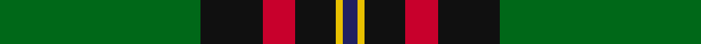

In pattern [BYKRKG](/stripes/bykrkg/).

This was sourced from house-of-tartan.  It is a [6 stripe tartan](/stripes/stripes6/).

Original link http://www.house-of-tartan.scotland.net/house/TartanViewjs.asp?colr=Def&tnam=675

## Thread count
G/110 K34 R18 K22 Y4 DB/8

## Palette
Each colour and the base-6 reference it is a variant of.

| Colour | Shade | Base |
|---|---|---|
| DB | <code style="background-color:#202060;">#202060</code> `oklch(28.9% 0.111 276.9)` <small>#202060</small> | B <code style="background-color:#2A418A;">#2A418A</code> |
| G | <code style="background-color:#006818;">#006818</code> `oklch(45.0% 0.142 145.0)` <small>#006818</small> | G <code style="background-color:#006100;">#006100</code> |
| K | <code style="background-color:#101010;">#101010</code> `oklch(17.3% 0.000 89.9)` <small>#101010</small> | K <code style="background-color:#000000;">#000000</code> |
| R | <code style="background-color:#C8002C;">#C8002C</code> `oklch(52.6% 0.212 22.0)` <small>#C8002C</small> | R <code style="background-color:#CC0000;">#CC0000</code> |
| Y | <code style="background-color:#E8C000;">#E8C000</code> `oklch(81.9% 0.168 93.7)` <small>#E8C000</small> | Y <code style="background-color:#F2BF00;">#F2BF00</code> |

# Sample pattern

## Nearest tartans

The nearest existing variants by ΔTartan distance.

1. [Moran (Name)](/setts/s6/g55k17r9k11ly2k4~x2/) — ΔT 0.88
1. [Nolan Family, John J (Personal)](/setts/s5/do8g19dg42lo3o1~x2/) — ΔT 0.94
1. [Vipont (Yellow line)](/setts/s7/r3g14k2p2g14k36ly3~x2/) — ΔT 1.08
1. [Merwe](/setts/s6/g15ly2k30g32r3w2~x2/) — ΔT 1.13
1. [Sarafilovic (Corporate)](/setts/s9/r4db15k18g3k2g2k2g44ly4~x2/) — ΔT 1.21
1. [MacArthur-Fox Htg (Personal)](/setts/s6/r3g30k12g1k16lo2~x2/) — ΔT 1.21
1. [Bomb Disposal](/setts/s10/k28r3ly2r3k13g28w1g3w1g16~x2/) — ΔT 1.27
1. [O'Donoghue](/setts/s5/g62k40ly3k3w3~x2/) — ΔT 1.29
1. [Williams, Jodi (Personal)](/setts/s7/o2db20r2g3r4g35r1~x2/) — ΔT 1.29
1. [Highlands of Durham (Corporate)](/setts/s6/r6dt4w2g27dt37ly2~x2/) — ΔT 1.31

## Neighbour map

Every grey dot is one of 14299 variants placed by the first two principal components of the ΔTartan feature space (44% of its variance). Red is this tartan; blue dots are its nearest — click one to open its page.

<svg viewBox="0 0 640 380" role="img" style="max-width:100%;height:auto;border:1px solid #e0e0e0;border-radius:4px;display:block" xmlns="http://www.w3.org/2000/svg"><image href="/nn/cloud.v1.png" width="640" height="380"/><a href="/setts/s6/g55k17r9k11ly2k4~x2/"><circle cx="369.9" cy="171.1" r="4" fill="#3465a4"><title>Moran (Name)</title></circle></a><a href="/setts/s5/do8g19dg42lo3o1~x2/"><circle cx="378.3" cy="157.0" r="4" fill="#3465a4"><title>Nolan Family, John J (Personal)</title></circle></a><a href="/setts/s7/r3g14k2p2g14k36ly3~x2/"><circle cx="303.9" cy="160.9" r="4" fill="#3465a4"><title>Vipont (Yellow line)</title></circle></a><a href="/setts/s6/g15ly2k30g32r3w2~x2/"><circle cx="313.2" cy="184.5" r="4" fill="#3465a4"><title>Merwe</title></circle></a><a href="/setts/s9/r4db15k18g3k2g2k2g44ly4~x2/"><circle cx="302.6" cy="135.3" r="4" fill="#3465a4"><title>Sarafilovic (Corporate)</title></circle></a><a href="/setts/s6/r3g30k12g1k16lo2~x2/"><circle cx="348.3" cy="184.8" r="4" fill="#3465a4"><title>MacArthur-Fox Htg (Personal)</title></circle></a><a href="/setts/s10/k28r3ly2r3k13g28w1g3w1g16~x2/"><circle cx="303.6" cy="136.8" r="4" fill="#3465a4"><title>Bomb Disposal</title></circle></a><a href="/setts/s5/g62k40ly3k3w3~x2/"><circle cx="362.9" cy="187.4" r="4" fill="#3465a4"><title>O'Donoghue</title></circle></a><a href="/setts/s7/o2db20r2g3r4g35r1~x2/"><circle cx="376.6" cy="144.8" r="4" fill="#3465a4"><title>Williams, Jodi (Personal)</title></circle></a><a href="/setts/s6/r6dt4w2g27dt37ly2~x2/"><circle cx="301.7" cy="159.2" r="4" fill="#3465a4"><title>Highlands of Durham (Corporate)</title></circle></a><circle cx="345.4" cy="155.8" r="5" fill="#c00000"/></svg>

ID: /setts/s6/g55k17r9k11ly2db4~x2/
