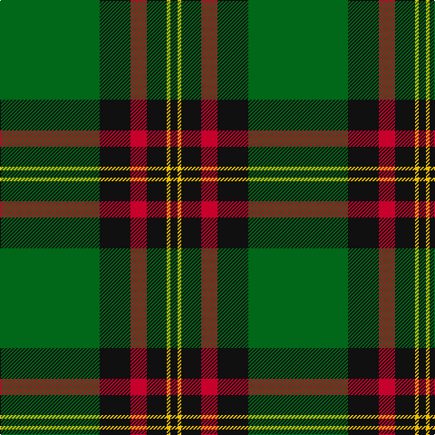

In pattern [GKRKYK](/stripes/gkrkyk/).

This was sourced from tartans-authority.  It is a [6 stripe tartan](/stripes/stripes6/).

Original link http://www.tartansauthority.com/tartan-ferret/display/675/

## Attestations

This cloth appears in 3 source records; the oldest owns this page.

- 1986 — Moran (Name) (tartans-authority, [record](http://www.tartansauthority.com/tartan-ferret/display/675/))
- 01/01/1987 — Moran (Personal) (register-of-tartans, [record](https://www.tartanregister.gov.uk/tartanDetails.aspx?ref=3005))
- undated — Moran (weddslist, [record](http://www.weddslist.com/cgi-bin/tartans/pg.pl?source=sts))

## Register references

External register numbers recorded for this tartan.

- Scottish Register of Tartans: [3005](https://www.tartanregister.gov.uk/tartanDetails.aspx?ref=3005)
- Scottish Tartans Authority (ITI): 675
- Scottish Tartans World Register: 675

## Thread count
G/110 K34 R18 K22 Y4 K/8

## Palette
Each colour and the base-6 reference it is a variant of.

| Colour | Shade | Base |
|---|---|---|
| G | <code style="background-color:#006818;">#006818</code> `oklch(45.0% 0.142 145.0)` <small>#006818</small> | G <code style="background-color:#006100;">#006100</code> |
| K | <code style="background-color:#101010;">#101010</code> `oklch(17.3% 0.000 89.9)` <small>#101010</small> | K <code style="background-color:#000000;">#000000</code> |
| R | <code style="background-color:#C8002C;">#C8002C</code> `oklch(52.6% 0.212 22.0)` <small>#C8002C</small> | R <code style="background-color:#CC0000;">#CC0000</code> |
| Y | <code style="background-color:#E8C000;">#E8C000</code> `oklch(81.9% 0.168 93.7)` <small>#E8C000</small> | Y <code style="background-color:#F2BF00;">#F2BF00</code> |

# Sample pattern

## Nearest tartans

The nearest existing variants by ΔTartan distance, with this tartan at the top so the swatches line up against it.

ΔTartan

Tartan

Sett

—

<a href="/ttd/edit/#slug=g55k17r9k11ly2k4~x2">Moran (Name)</a> <a class="nn-out" href="/setts/s6/g55k17r9k11ly2k4~x2/" title="open its dictionary page">↗</a>

0.84

<a href="/ttd/edit/#slug=g62k40ly3k3w3~x2">O'Donoghue</a> <a class="nn-out" href="/setts/s5/g62k40ly3k3w3~x2/" title="open its dictionary page">↗</a>

0.86

<a href="/ttd/edit/#slug=r3g30k12g1k16lo2~x2">MacArthur-Fox Htg (Personal)</a> <a class="nn-out" href="/setts/s6/r3g30k12g1k16lo2~x2/" title="open its dictionary page">↗</a>

0.88

<a href="/ttd/edit/#slug=g55k17r9k11ly2db4~x2">Moran Family Tartan Tartan Number: 675. Earliest known date: 1986 The designers requested that the threadcount be Restricted. See products available Copyright © Blair Urquhart, Comrie, 2015</a> <a class="nn-out" href="/setts/s6/g55k17r9k11ly2db4~x2/" title="open its dictionary page">↗</a>

1.02

<a href="/ttd/edit/#slug=o2db20r2g3r4g35r1~x2">Williams, Jodi (Personal)</a> <a class="nn-out" href="/setts/s7/o2db20r2g3r4g35r1~x2/" title="open its dictionary page">↗</a>

1.10

<a href="/ttd/edit/#slug=g2k1db6k11g26k1g1lo2~x2">Mackie (2016)</a> <a class="nn-out" href="/setts/s8/g2k1db6k11g26k1g1lo2~x2/" title="open its dictionary page">↗</a>

1.23

<a href="/ttd/edit/#slug=g25k8o10r1o3~x4">Herbage Family Tartan Tartan Number: 811. Earliest known date: 1983 Designed by the Scottish Tartans Society for Mr Herbage, Laggan. See products available Copyright © Blair Urquhart, Comrie, 2015</a> <a class="nn-out" href="/setts/s5/g25k8o10r1o3~x4/" title="open its dictionary page">↗</a>

1.26

<a href="/ttd/edit/#slug=k6db1k6g4k10g20r2~x2">MacKinross</a> <a class="nn-out" href="/setts/s7/k6db1k6g4k10g20r2~x2/" title="open its dictionary page">↗</a>

1.26

<a href="/ttd/edit/#slug=g4r4k12w2k12g32r4k3~x2">MacHardy (Clans Originaux)</a> <a class="nn-out" href="/setts/s8/g4r4k12w2k12g32r4k3~x2/" title="open its dictionary page">↗</a>

1.26

<a href="/ttd/edit/#slug=r3g30k12g6k16ly2~x2">MacArthur (Variant)</a> <a class="nn-out" href="/setts/s6/r3g30k12g6k16ly2~x2/" title="open its dictionary page">↗</a>

1.29

<a href="/ttd/edit/#slug=k83r16dg56k2w5k2dg56r5~x2">MacDiarmid #2</a> <a class="nn-out" href="/setts/s8/k83r16dg56k2w5k2dg56r5~x2/" title="open its dictionary page">↗</a>

## Neighbour map

Every grey dot is one of 14299 variants placed by the first two principal components of the ΔTartan feature space (44% of its variance). Red is this tartan; blue dots are its nearest — click one to open its page.

<svg viewBox="0 0 640 380" role="img" style="max-width:100%;height:auto;border:1px solid #e0e0e0;border-radius:4px;display:block" xmlns="http://www.w3.org/2000/svg"><image href="/nn/cloud.v1.png" width="640" height="380"/><a href="/setts/s5/g62k40ly3k3w3~x2/"><circle cx="362.9" cy="187.4" r="4" fill="#3465a4"><title>O'Donoghue</title></circle></a><a href="/setts/s6/r3g30k12g1k16lo2~x2/"><circle cx="348.3" cy="184.8" r="4" fill="#3465a4"><title>MacArthur-Fox Htg (Personal)</title></circle></a><a href="/setts/s6/g55k17r9k11ly2db4~x2/"><circle cx="345.4" cy="155.8" r="4" fill="#3465a4"><title>Moran Family Tartan Tartan Number: 675. Earliest known date: 1986 The designers requested that the threadcount be Restricted. See products available Copyright © Blair Urquhart, Comrie, 2015</title></circle></a><a href="/setts/s7/o2db20r2g3r4g35r1~x2/"><circle cx="376.6" cy="144.8" r="4" fill="#3465a4"><title>Williams, Jodi (Personal)</title></circle></a><a href="/setts/s8/g2k1db6k11g26k1g1lo2~x2/"><circle cx="380.7" cy="157.4" r="4" fill="#3465a4"><title>Mackie (2016)</title></circle></a><a href="/setts/s5/g25k8o10r1o3~x4/"><circle cx="339.6" cy="198.8" r="4" fill="#3465a4"><title>Herbage Family Tartan Tartan Number: 811. Earliest known date: 1983 Designed by the Scottish Tartans Society for Mr Herbage, Laggan. See products available Copyright © Blair Urquhart, Comrie, 2015</title></circle></a><a href="/setts/s7/k6db1k6g4k10g20r2~x2/"><circle cx="333.1" cy="203.8" r="4" fill="#3465a4"><title>MacKinross</title></circle></a><a href="/setts/s8/g4r4k12w2k12g32r4k3~x2/"><circle cx="296.8" cy="176.4" r="4" fill="#3465a4"><title>MacHardy (Clans Originaux)</title></circle></a><a href="/setts/s6/r3g30k12g6k16ly2~x2/"><circle cx="319.5" cy="213.9" r="4" fill="#3465a4"><title>MacArthur (Variant)</title></circle></a><a href="/setts/s8/k83r16dg56k2w5k2dg56r5~x2/"><circle cx="358.6" cy="151.7" r="4" fill="#3465a4"><title>MacDiarmid #2</title></circle></a><circle cx="369.9" cy="171.1" r="5" fill="#c00000"/></svg>

ID: /setts/s6/g55k17r9k11ly2k4~x2/
