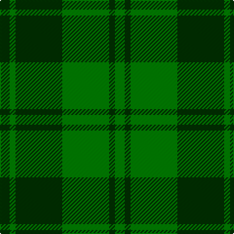

In pattern [GGGGGG](/patterns/gggggg/).

This was sourced from weddslist.  It is a [6 stripes tartan](/stripes/stripes6/).

Original link http://www.weddslist.com/cgi-bin/tartans/pg.pl?source=sts

## Thread count
DG/10 G6 DG48 G48 DG6 G/10

## Palette
Each colour and its ΔE from the base-6 reference it is a variant of.

| Colour | Shade | Base | ΔE (OKLab) |
|---|---|---|---|
| DG | <code style="background-color:#003000;">#003000</code> `#003000` | G <code style="background-color:#006100;">#006100</code> | 0.17 |
| G | <code style="background-color:#008000;">#008000</code> `#008000` | G <code style="background-color:#006100;">#006100</code> | 0.10 |

# Sample pattern

## Nearest tartans

The nearest existing variants by ΔTartan distance.

1. [MacSporran, Rejected design](/setts/s6/g30ga13g7ga30g2y4~g003000-ga008000-yf0c000~x2/) — ΔT 1.64
1. [Campbell-Simpson (Personal)](/setts/s6/g12k2g2ga9g4k2~g289c18-ga285800-k101010~x4/) — ΔT 1.85
1. [MacArthur-Fox (Personal)](/setts/s5/k8g3k4g20r4~g006818-k101010-r880000~x2/) — ΔT 1.97
1. [Campbell-Simpson (Personal)](/setts/s10/g12k2g2ga9g4k2g4ga9g2k2~g289c18-ga285800-k101010~x4/) — ΔT 2.03
1. [Campbell Simpson (Dalgliesh)](/setts/s6/g22k3g3ga16g6k4~g408060-ga006818-k101010~x2/) — ΔT 2.04
1. [MacArthur (Highland Society)](/setts/s6/g18y2g18k4g2k15~g006818-k101010-yd8b000~x2/) — ΔT 2.08
1. [North Dakota State University (Corp.](/setts/s6/y11g5y10ga4g26y4~g006818-ga289c18-ybc8c00~x2/) — ΔT 2.09
1. [Angle, Green (Fashion)](/setts/s7/y1g11k6g3y1g1y1~g285800-k101010-ybc8c00~x4/) — ΔT 2.11
1. [MacArthur-Fox Family Tartan Tartan Number: 1088. Earliest known date: 1986 This is the older of the two MacArthur setts, which links the clan with the Campbells. See products available Copyright © Blair Urquhart, Comrie, 2015](/setts/s5/k19g8k10g31r3~g006818-k101010-rc80000/) — ΔT 2.16
1. [Confederate Cavalry (Military)](/setts/s6/g2ga14g8ga3g12y2~g003820-ga8c7038-yd09800~x2/) — ΔT 2.19

## Neighbour map

Every grey dot is one of 15726 variants placed by the first two principal components of the ΔTartan feature space (44% of its variance). Red is this tartan; blue dots are its nearest — click one to open its page.

<svg viewBox="0 0 640 380" role="img" style="max-width:100%;height:auto;border:1px solid #e0e0e0;border-radius:4px;display:block" xmlns="http://www.w3.org/2000/svg"><image href="/nn/cloud.v1.png" width="640" height="380"/><a href="/setts/s6/g30ga13g7ga30g2y4~g003000-ga008000-yf0c000~x2/"><circle cx="340.5" cy="239.5" r="4" fill="#3465a4"><title>MacSporran, Rejected design</title></circle></a><a href="/setts/s6/g12k2g2ga9g4k2~g289c18-ga285800-k101010~x4/"><circle cx="316.1" cy="271.7" r="4" fill="#3465a4"><title>Campbell-Simpson (Personal)</title></circle></a><a href="/setts/s5/k8g3k4g20r4~g006818-k101010-r880000~x2/"><circle cx="353.7" cy="276.3" r="4" fill="#3465a4"><title>MacArthur-Fox (Personal)</title></circle></a><a href="/setts/s10/g12k2g2ga9g4k2g4ga9g2k2~g289c18-ga285800-k101010~x4/"><circle cx="272.6" cy="252.1" r="4" fill="#3465a4"><title>Campbell-Simpson (Personal)</title></circle></a><a href="/setts/s6/g22k3g3ga16g6k4~g408060-ga006818-k101010~x2/"><circle cx="371.9" cy="277.9" r="4" fill="#3465a4"><title>Campbell Simpson (Dalgliesh)</title></circle></a><a href="/setts/s6/g18y2g18k4g2k15~g006818-k101010-yd8b000~x2/"><circle cx="384.1" cy="265.1" r="4" fill="#3465a4"><title>MacArthur (Highland Society)</title></circle></a><a href="/setts/s6/y11g5y10ga4g26y4~g006818-ga289c18-ybc8c00~x2/"><circle cx="344.7" cy="274.6" r="4" fill="#3465a4"><title>North Dakota State University (Corp.</title></circle></a><a href="/setts/s7/y1g11k6g3y1g1y1~g285800-k101010-ybc8c00~x4/"><circle cx="394.9" cy="225.0" r="4" fill="#3465a4"><title>Angle, Green (Fashion)</title></circle></a><a href="/setts/s5/k19g8k10g31r3~g006818-k101010-rc80000/"><circle cx="344.7" cy="270.3" r="4" fill="#3465a4"><title>MacArthur-Fox Family Tartan Tartan Number: 1088. Earliest known date: 1986 This is the older of the two MacArthur setts, which links the clan with the Campbells. See products available Copyright © Blair Urquhart, Comrie, 2015</title></circle></a><a href="/setts/s6/g2ga14g8ga3g12y2~g003820-ga8c7038-yd09800~x2/"><circle cx="335.4" cy="272.1" r="4" fill="#3465a4"><title>Confederate Cavalry (Military)</title></circle></a><circle cx="383.3" cy="285.0" r="5" fill="#c00000"/></svg>

ID: /setts/s6/g5ga3g24ga24g3ga5~g003000-ga008000~x2/
