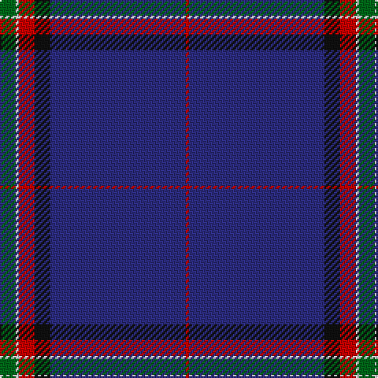

This page is one **sett** — a single exact thread-count. It belongs to the [tartan](/tartans/g5w1r5k5db43r1/)
(the same proportion at any scale), whose colour order is pattern [GWRKBR](/stripes/gwrkbr/).

Sourced from tartans-authority.  It is a [6 stripe tartan](/stripes/stripes6/).

Original link http://www.tartansauthority.com/tartan-ferret/display/3117/

## Register references

External register numbers recorded for this tartan.

- Scottish Tartans Authority (ITI): 3117

## Thread count
G/10 LN2 R10 K10 DB86 R/2

## Palette

Palette: <strong>Tartan Register</strong>
<table><thead><tr><th>Colour</th><th>Threads</th><th>Shade</th><th>Base</th><th>OKLCh</th></tr></thead><tbody><tr><td>G/</td><td style="text-align:right;font-variant-numeric:tabular-nums">10</td><td><code style="background-color:#006818;">#006818</code> <small style="color:#888">#006818</small></td><td>G <code style="background-color:#006100;">#006100</code></td><td><small style="color:#888">oklch(45.0% 0.142 145.0)</small></td></tr><tr><td>LN</td><td style="text-align:right;font-variant-numeric:tabular-nums">2</td><td><code style="background-color:#E0E0E0;">#E0E0E0</code> <small style="color:#888">#E0E0E0</small></td><td>W <code style="background-color:#F7F7F7;">#F7F7F7</code></td><td><small style="color:#888">oklch(90.7% 0.000 89.9)</small></td></tr><tr><td>R</td><td style="text-align:right;font-variant-numeric:tabular-nums">10</td><td><code style="background-color:#C80000;">#C80000</code> <small style="color:#888">#C80000</small></td><td>R <code style="background-color:#CC0000;">#CC0000</code></td><td><small style="color:#888">oklch(52.3% 0.215 29.2)</small></td></tr><tr><td>K</td><td style="text-align:right;font-variant-numeric:tabular-nums">10</td><td><code style="background-color:#101010;">#101010</code> <small style="color:#888">#101010</small></td><td>K <code style="background-color:#000000;">#000000</code></td><td><small style="color:#888">oklch(17.3% 0.000 89.9)</small></td></tr><tr><td>DB</td><td style="text-align:right;font-variant-numeric:tabular-nums">86</td><td><code style="background-color:#2C2C80;">#2C2C80</code> <small style="color:#888">#2C2C80</small></td><td>B <code style="background-color:#2A418A;">#2A418A</code></td><td><small style="color:#888">oklch(35.0% 0.138 276.6)</small></td></tr><tr><td>R/</td><td style="text-align:right;font-variant-numeric:tabular-nums">2</td><td><code style="background-color:#C80000;">#C80000</code> <small style="color:#888">#C80000</small></td><td>R <code style="background-color:#CC0000;">#CC0000</code></td><td><small style="color:#888">oklch(52.3% 0.215 29.2)</small></td></tr></tbody></table>

# Sample pattern

## Nearest tartans

The nearest existing variants by ΔTartan distance, with this tartan at the top so the swatches line up against it.

ΔTartan

Tartan

Sett

—

<a href="/ttd/edit/#slug=g5w1r5k5db43r1~x2">Michael (John) (Personal)</a> <a class="nn-out" href="/setts/s6/g5w1r5k5db43r1~x2/" title="open its dictionary page">↗</a>

1.15

<a href="/ttd/edit/#slug=g20r10ly2db100w1y10">Ravetta (Name)</a> <a class="nn-out" href="/setts/s6/g20r10ly2db100w1y10/" title="open its dictionary page">↗</a>

1.27

<a href="/ttd/edit/#slug=w2db45g9r1n9ri1~x2">Wilton (Name)</a> <a class="nn-out" href="/setts/s6/w2db45g9r1n9ri1~x2/" title="open its dictionary page">↗</a>

1.27

<a href="/ttd/edit/#slug=db80k5g12k2ly2g2k10~x2">Affara (Personal)</a> <a class="nn-out" href="/setts/s7/db80k5g12k2ly2g2k10~x2/" title="open its dictionary page">↗</a>

1.29

<a href="/ttd/edit/#slug=db73g16db10r8db10k4db10w2~x2">Scotch Whisky Heritage Centre</a> <a class="nn-out" href="/setts/s8/db73g16db10r8db10k4db10w2~x2/" title="open its dictionary page">↗</a>

1.30

<a href="/ttd/edit/#slug=w3dt9ly1lb3dp9lb1dt40dp2~x2">Parkin</a> <a class="nn-out" href="/setts/s8/w3dt9ly1lb3dp9lb1dt40dp2~x2/" title="open its dictionary page">↗</a>

1.36

<a href="/ttd/edit/#slug=db62k22w3k2w2k3r1~x2">Tyneside Blue, North Tyneside Pipe Band</a> <a class="nn-out" href="/setts/s7/db62k22w3k2w2k3r1~x2/" title="open its dictionary page">↗</a>

1.41

<a href="/ttd/edit/#slug=db57ly2db10dg4db4dg9r12db4r4lr2~x2">Unidentified #64</a> <a class="nn-out" href="/setts/s10/db57ly2db10dg4db4dg9r12db4r4lr2~x2/" title="open its dictionary page">↗</a>

1.52

<a href="/ttd/edit/#slug=db32ly4dbi12db2dbi4db2o16db67ly6">Calum's Cabin</a> <a class="nn-out" href="/setts/s9/db32ly4dbi12db2dbi4db2o16db67ly6/" title="open its dictionary page">↗</a>

1.54

<a href="/ttd/edit/#slug=db128r8t41n4t4n4">French Freemasons' Pride (Fashion)</a> <a class="nn-out" href="/setts/s6/db128r8t41n4t4n4/" title="open its dictionary page">↗</a>

1.58

<a href="/ttd/edit/#slug=db35k10db4w2db3r2ly2~x2">Laidlaw's Highland Drovers (Corp)</a> <a class="nn-out" href="/setts/s7/db35k10db4w2db3r2ly2~x2/" title="open its dictionary page">↗</a>

## Neighbour map

Every grey dot is one of 14359 variants placed by the first two principal components of the ΔTartan feature space (44% of its variance). Red is this tartan; blue dots are its nearest — click one to open its page.

<svg viewBox="0 0 640 380" role="img" style="max-width:100%;height:auto;border:1px solid #e0e0e0;border-radius:4px;display:block" xmlns="http://www.w3.org/2000/svg"><image href="/nn/cloud.v1.png" width="640" height="380"/><a href="/setts/s6/g20r10ly2db100w1y10/"><circle cx="469.7" cy="109.2" r="4" fill="#3465a4"><title>Ravetta (Name)</title></circle></a><a href="/setts/s6/w2db45g9r1n9ri1~x2/"><circle cx="453.9" cy="121.7" r="4" fill="#3465a4"><title>Wilton (Name)</title></circle></a><a href="/setts/s7/db80k5g12k2ly2g2k10~x2/"><circle cx="535.2" cy="149.2" r="4" fill="#3465a4"><title>Affara (Personal)</title></circle></a><a href="/setts/s8/db73g16db10r8db10k4db10w2~x2/"><circle cx="540.4" cy="142.6" r="4" fill="#3465a4"><title>Scotch Whisky Heritage Centre</title></circle></a><a href="/setts/s8/w3dt9ly1lb3dp9lb1dt40dp2~x2/"><circle cx="473.4" cy="109.7" r="4" fill="#3465a4"><title>Parkin</title></circle></a><a href="/setts/s7/db62k22w3k2w2k3r1~x2/"><circle cx="476.3" cy="126.9" r="4" fill="#3465a4"><title>Tyneside Blue, North Tyneside Pipe Band</title></circle></a><a href="/setts/s10/db57ly2db10dg4db4dg9r12db4r4lr2~x2/"><circle cx="458.6" cy="118.3" r="4" fill="#3465a4"><title>Unidentified #64</title></circle></a><a href="/setts/s9/db32ly4dbi12db2dbi4db2o16db67ly6/"><circle cx="467.0" cy="140.9" r="4" fill="#3465a4"><title>Calum's Cabin</title></circle></a><a href="/setts/s6/db128r8t41n4t4n4/"><circle cx="480.5" cy="159.3" r="4" fill="#3465a4"><title>French Freemasons' Pride (Fashion)</title></circle></a><a href="/setts/s7/db35k10db4w2db3r2ly2~x2/"><circle cx="452.2" cy="154.0" r="4" fill="#3465a4"><title>Laidlaw's Highland Drovers (Corp)</title></circle></a><circle cx="503.9" cy="129.8" r="5" fill="#c00000"/></svg>

ID: /setts/s6/g5w1r5k5db43r1~x2/
