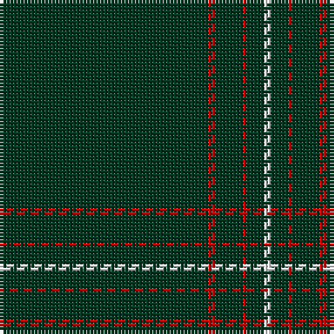

In pattern [GRGRGW](/patterns/grgrgw/).

This was sourced from house-of-tartan.  It is a [6 stripes tartan](/stripes/stripes6/).

Original link http://www.house-of-tartan.scotland.net/house/TartanViewjs.asp?colr=Def&tnam=5746

## Thread count
DG/60 R2 DG8 R1 DG5 W/2

## Palette
Each colour and its ΔE from the base-6 reference it is a variant of.

| Colour | Shade | Base | ΔE (OKLab) |
|---|---|---|---|
| DG | <code style="background-color:#003820;">#003820</code> `#003820` | G <code style="background-color:#006400;">#006400</code> | 0.16 |
| DR | <code style="background-color:#880000;">#880000</code> `#880000` | R <code style="background-color:#C80000;">#C80000</code> | 0.14 |
| G | <code style="background-color:#285800;">#285800</code> `#285800` | G <code style="background-color:#006400;">#006400</code> | 0.04 |
| Ga | <code style="background-color:#006818;">#006818</code> `#006818` | G <code style="background-color:#006400;">#006400</code> | 0.02 |
| Gb | <code style="background-color:#289C18;">#289C18</code> `#289C18` | G <code style="background-color:#006400;">#006400</code> | 0.18 |
| LN | <code style="background-color:#E0E0E0;">#E0E0E0</code> `#E0E0E0` | W <code style="background-color:#F4F4F0;">#F4F4F0</code> | 0.06 |
| R | <code style="background-color:#C80000;">#C80000</code> `#C80000` | R <code style="background-color:#C80000;">#C80000</code> | 0.00 |
| W | <code style="background-color:#FCFCFC;">#FCFCFC</code> `#FCFCFC` | W <code style="background-color:#F4F4F0;">#F4F4F0</code> | 0.03 |

# Sample pattern

## Nearest tartans

The nearest existing variants by ΔTartan distance.

1. [Dewi Sant](/setts/s6/g30r2g8r1g5w2-g003c14-r960000-we0e0e0/) — ΔT 1.37
1. [Lochaber (Hesketh)](/setts/s7/k16y6k240y6k80b4k8-b5c8ca8-k101010-ye8c000/) — ΔT 1.71
1. [Brithwe Dewi Sant (Welsh)](/setts/s11/g30r2g8r1g5w2g5r1g8r2g30-g003820-rc80000-wfcfcfc/) — ΔT 1.71
1. [St. David's (District)](/setts/s6/g60r2g8r1g5k2-g003820-k000000-rc80000/) — ΔT 2.00
1. [Black Camel Tartan Tartan Number: 3333. Earliest known date: Marton Mills Jura./Threadcount and colours aren't 100% original. Generated manually./ See products available Copyright © Blair Urquhart, Comrie, 2015](/setts/s5/k320w12k4w6k6-k101010-we0e0e0/) — ΔT 2.16
1. [Galloway (Name)](/setts/s4/r4k100b4r2-b5c5c5c-k101010-rc80000/) — ΔT 2.20
1. [Pasteur Fancy Tartan Tartan Number: 7094. Earliest known date: 1836 The pattern is taken from a shawl or cloak which appears in a portrait of Louie Pasteur's mother. The portrait was drawn in pastels when Pasteur was just 13 years old. The information came Marie-Claude Fortier researching the life of Pasteur. See products available Copyright © Blair Urquhart, Comrie, 2015](/setts/s4/b40y4b120g12-b34281c-g789484-ye4cca4/) — ΔT 2.20
1. [NewGeneration Alchemy (NGA) Inc](/setts/s6/k124r8k40b4k4w4-b2c2c80-k101010-rc80000-wfcfcfc/) — ΔT 2.23
1. [SmartWool](/setts/s5/k200g3y3g3y3-g604000-k101010-yd87c00/) — ΔT 2.25
1. [NewGeneration Alchemy (NGA) Inc](/setts/s6/k124r8k40b4k4w4-b0000cd-k101010-rc8002c-wffffff/) — ΔT 2.28

## Neighbour map

Every grey dot is one of 15726 variants placed by the first two principal components of the ΔTartan feature space (44% of its variance). Red is this tartan; blue dots are its nearest — click one to open its page.

<svg viewBox="0 0 640 380" role="img" style="max-width:100%;height:auto;border:1px solid #e0e0e0;border-radius:4px;display:block" xmlns="http://www.w3.org/2000/svg"><image href="/nn/cloud.v1.png" width="640" height="380"/><a href="/setts/s6/g30r2g8r1g5w2-g003c14-r960000-we0e0e0/"><circle cx="626.0" cy="198.8" r="4" fill="#3465a4"><title>Dewi Sant</title></circle></a><a href="/setts/s7/k16y6k240y6k80b4k8-b5c8ca8-k101010-ye8c000/"><circle cx="626.0" cy="165.9" r="4" fill="#3465a4"><title>Lochaber (Hesketh)</title></circle></a><a href="/setts/s11/g30r2g8r1g5w2g5r1g8r2g30-g003820-rc80000-wfcfcfc/"><circle cx="626.0" cy="177.8" r="4" fill="#3465a4"><title>Brithwe Dewi Sant (Welsh)</title></circle></a><a href="/setts/s6/g60r2g8r1g5k2-g003820-k000000-rc80000/"><circle cx="626.0" cy="192.2" r="4" fill="#3465a4"><title>St. David's (District)</title></circle></a><a href="/setts/s5/k320w12k4w6k6-k101010-we0e0e0/"><circle cx="626.0" cy="175.7" r="4" fill="#3465a4"><title>Black Camel Tartan Tartan Number: 3333. Earliest known date: Marton Mills Jura./Threadcount and colours aren't 100% original. Generated manually./ See products available Copyright © Blair Urquhart, Comrie, 2015</title></circle></a><a href="/setts/s4/r4k100b4r2-b5c5c5c-k101010-rc80000/"><circle cx="626.0" cy="198.8" r="4" fill="#3465a4"><title>Galloway (Name)</title></circle></a><a href="/setts/s4/b40y4b120g12-b34281c-g789484-ye4cca4/"><circle cx="626.0" cy="229.1" r="4" fill="#3465a4"><title>Pasteur Fancy Tartan Tartan Number: 7094. Earliest known date: 1836 The pattern is taken from a shawl or cloak which appears in a portrait of Louie Pasteur's mother. The portrait was drawn in pastels when Pasteur was just 13 years old. The information came Marie-Claude Fortier researching the life of Pasteur. See products available Copyright © Blair Urquhart, Comrie, 2015</title></circle></a><a href="/setts/s6/k124r8k40b4k4w4-b2c2c80-k101010-rc80000-wfcfcfc/"><circle cx="626.0" cy="171.7" r="4" fill="#3465a4"><title>NewGeneration Alchemy (NGA) Inc</title></circle></a><a href="/setts/s5/k200g3y3g3y3-g604000-k101010-yd87c00/"><circle cx="626.0" cy="184.7" r="4" fill="#3465a4"><title>SmartWool</title></circle></a><a href="/setts/s6/k124r8k40b4k4w4-b0000cd-k101010-rc8002c-wffffff/"><circle cx="626.0" cy="169.9" r="4" fill="#3465a4"><title>NewGeneration Alchemy (NGA) Inc</title></circle></a><circle cx="626.0" cy="167.5" r="5" fill="#c00000"/></svg>

ID: /setts/s6/g60r2g8r1g5w2-g003820-rc80000-wfcfcfc/
