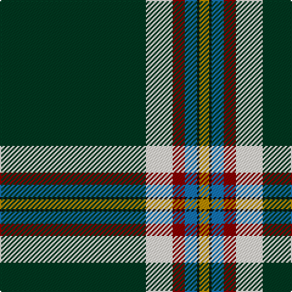

In pattern [GWRBKY](/patterns/gwrbky/).

This was sourced from tartans-authority.  It is a [6 stripes tartan](/stripes/stripes6/).

Original link http://www.tartansauthority.com/tartan-ferret/display/10294/

## Thread count
DG/120 LY22 DR10 B10 K2 DY/8

## Palette
Each colour and its ΔE from the base-6 reference it is a variant of.

| Colour | Shade | Base | ΔE (OKLab) |
|---|---|---|---|
| B | <code style="background-color:#1474B4;">#1474B4</code> `#1474B4` | B <code style="background-color:#2A418A;">#2A418A</code> | 0.15 |
| DG | <code style="background-color:#003820;">#003820</code> `#003820` | G <code style="background-color:#006100;">#006100</code> | 0.15 |
| DR | <code style="background-color:#880000;">#880000</code> `#880000` | R <code style="background-color:#CC0000;">#CC0000</code> | 0.15 |
| DY | <code style="background-color:#BC8C00;">#BC8C00</code> `#BC8C00` | Y <code style="background-color:#F2BF00;">#F2BF00</code> | 0.16 |
| K | <code style="background-color:#101010;">#101010</code> `#101010` | K <code style="background-color:#000000;">#000000</code> | 0.17 |
| LY | <code style="background-color:#F8F0E4;">#F8F0E4</code> `#F8F0E4` | W <code style="background-color:#F7F7F7;">#F7F7F7</code> | 0.03 |

# Sample pattern

## Nearest tartans

The nearest existing variants by ΔTartan distance.

1. [Greeven, Wolfgang H (Personal)](/setts/s8/g62r5w1r4ga5y4b4w2x2~b1c1c1c-g003c14-ga649848-rc80000-wf8f8f8-ye0a126/) — ΔT 1.32
1. [Michael Pellicci (Personal)](/setts/s9/g60b1y5k1r15k1w15k1g15x2~b000080-g005020-k1c1714-rdc0000-wf8f4d0-yd87c00/) — ΔT 1.35
1. [CREATeGlasgow](/setts/s6/k49r1w4b5g5y5x2~b000080-g005020-k101010-ra00000-wc49cd8-yffff00/) — ΔT 1.39
1. [Aviemore Highland (Corporate)](/setts/s7/g40k3w1k5r1k2ra10x2~g285800-k101010-rc80000-rae87878-we0e0e0/) — ΔT 1.65
1. [Pavelka Limited](/setts/s8/w3g5ga2y3wa3y5k48wa3x2~g048888-ga00643c-k101010-w00fcfc-waf8f8f8-ya08858/) — ΔT 1.68
1. [Washington County Sheriff's Office](/setts/s8/w6k6w6b3wa1k39y3k3x2~b1474b4-k101010-wc0c0c0-wae0e0e0-ybc8c00/) — ΔT 1.68
1. [Charlotte Fire Department](/setts/s6/k75r10g7y3b2w5x2~b202060-g006818-k101010-rc80000-wfcfcfc-ye8c000/) — ΔT 1.69
1. [Knox, David Paul (Personal)](/setts/s11/w2k2w2k10wa1g40w1r4w1g5ra1x2~g285800-k101010-rdc0000-rae87878-wffffff-wa98c8e8/) — ΔT 1.69
1. [Pellicci, Michael (Personal)](/setts/s9/g60b1y5k1r15k1w15k1g15x2~b2c2c80-g006818-k101010-rc80000-wfcfcfc-ybc8c00/) — ΔT 1.71
1. [Charlotte Fire Department](/setts/s6/k78r10g7y3b2w5x2~b3c82af-g004c00-k101010-rdc0000-wffffff-yffd700/) — ΔT 1.72

## Neighbour map

Every grey dot is one of 15726 variants placed by the first two principal components of the ΔTartan feature space (44% of its variance). Red is this tartan; blue dots are its nearest — click one to open its page.

<svg viewBox="0 0 640 380" role="img" style="max-width:100%;height:auto;border:1px solid #e0e0e0;border-radius:4px;display:block" xmlns="http://www.w3.org/2000/svg"><image href="/nn/cloud.v1.png" width="640" height="380"/><a href="/setts/s8/g62r5w1r4ga5y4b4w2x2~b1c1c1c-g003c14-ga649848-rc80000-wf8f8f8-ye0a126/"><circle cx="461.3" cy="73.7" r="4" fill="#3465a4"><title>Greeven, Wolfgang H (Personal)</title></circle></a><a href="/setts/s9/g60b1y5k1r15k1w15k1g15x2~b000080-g005020-k1c1714-rdc0000-wf8f4d0-yd87c00/"><circle cx="381.6" cy="67.1" r="4" fill="#3465a4"><title>Michael Pellicci (Personal)</title></circle></a><a href="/setts/s6/k49r1w4b5g5y5x2~b000080-g005020-k101010-ra00000-wc49cd8-yffff00/"><circle cx="431.4" cy="93.7" r="4" fill="#3465a4"><title>CREATeGlasgow</title></circle></a><a href="/setts/s7/g40k3w1k5r1k2ra10x2~g285800-k101010-rc80000-rae87878-we0e0e0/"><circle cx="419.4" cy="110.8" r="4" fill="#3465a4"><title>Aviemore Highland (Corporate)</title></circle></a><a href="/setts/s8/w3g5ga2y3wa3y5k48wa3x2~g048888-ga00643c-k101010-w00fcfc-waf8f8f8-ya08858/"><circle cx="360.1" cy="89.1" r="4" fill="#3465a4"><title>Pavelka Limited</title></circle></a><a href="/setts/s8/w6k6w6b3wa1k39y3k3x2~b1474b4-k101010-wc0c0c0-wae0e0e0-ybc8c00/"><circle cx="436.0" cy="104.0" r="4" fill="#3465a4"><title>Washington County Sheriff's Office</title></circle></a><a href="/setts/s6/k75r10g7y3b2w5x2~b202060-g006818-k101010-rc80000-wfcfcfc-ye8c000/"><circle cx="453.6" cy="101.1" r="4" fill="#3465a4"><title>Charlotte Fire Department</title></circle></a><a href="/setts/s11/w2k2w2k10wa1g40w1r4w1g5ra1x2~g285800-k101010-rdc0000-rae87878-wffffff-wa98c8e8/"><circle cx="383.0" cy="56.7" r="4" fill="#3465a4"><title>Knox, David Paul (Personal)</title></circle></a><a href="/setts/s9/g60b1y5k1r15k1w15k1g15x2~b2c2c80-g006818-k101010-rc80000-wfcfcfc-ybc8c00/"><circle cx="381.2" cy="67.6" r="4" fill="#3465a4"><title>Pellicci, Michael (Personal)</title></circle></a><a href="/setts/s6/k78r10g7y3b2w5x2~b3c82af-g004c00-k101010-rdc0000-wffffff-yffd700/"><circle cx="459.3" cy="98.0" r="4" fill="#3465a4"><title>Charlotte Fire Department</title></circle></a><circle cx="418.1" cy="90.1" r="5" fill="#c00000"/></svg>

ID: /setts/s6/g60w11r5b5k1y4x2~b1474b4-g003820-k101010-r880000-wf8f0e4-ybc8c00/
