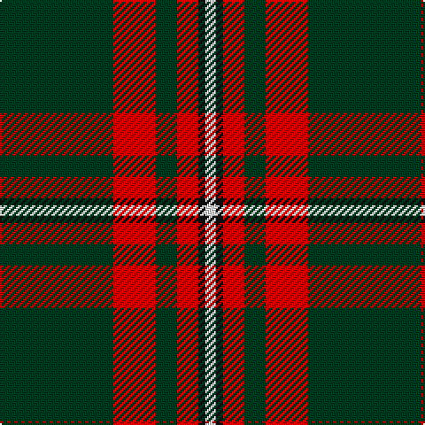

In pattern [GRGRKW](/patterns/grgrkw/).

This was sourced from register-of-tartans.  It is a [6 stripes tartan](/stripes/stripes6/).

Original link https://www.tartanregister.gov.uk/tartanDetails.aspx?ref=3405

## Attestations

This cloth appears in 2 source records; the oldest owns this page.

- 01/01/2002 — Princess Margaret Rose (register-of-tartans, [record](https://www.tartanregister.gov.uk/tartanDetails.aspx?ref=3405))
- pre 2002 — Princess Margaret Rose (Royal) (tartans-authority, [record](http://www.tartansauthority.com/tartan-ferret/display/986/))

## Thread count
DG/64 R24 DG12 R12 K4 W/6

## Palette
Each colour and its ΔE from the base-6 reference it is a variant of.

| Colour | Shade | Base | ΔE (OKLab) |
|---|---|---|---|
| DG | <code style="background-color:#003820;">#003820</code> `#003820` | G <code style="background-color:#006400;">#006400</code> | 0.16 |
| K | <code style="background-color:#101010;">#101010</code> `#101010` | K <code style="background-color:#000000;">#000000</code> | 0.17 |
| R | <code style="background-color:#C80000;">#C80000</code> `#C80000` | R <code style="background-color:#C80000;">#C80000</code> | 0.00 |
| W | <code style="background-color:#FCFCFC;">#FCFCFC</code> `#FCFCFC` | W <code style="background-color:#F4F4F0;">#F4F4F0</code> | 0.03 |

# Sample pattern

ID: /setts/s6/g64r24g12r12k4w6-g003820-k101010-rc80000-wfcfcfc/
