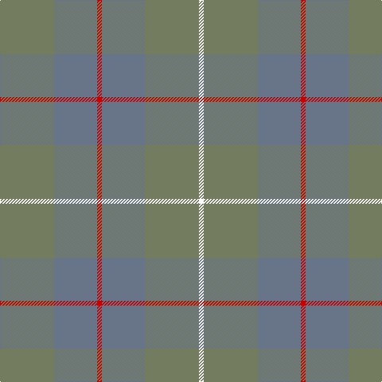

In pattern [GBRBGW](/patterns/gbrbgw/).

This was sourced from tartans-authority.  It is a [6 stripes tartan](/stripes/stripes6/).

Original link http://www.tartansauthority.com/tartan-ferret/display/6097/

## Thread count
G/68 B54 R6 B54 G68 W/6

## Palette
Each colour and its ΔE from the base-6 reference it is a variant of.

| Colour | Shade | Base | ΔE (OKLab) |
|---|---|---|---|
| B | <code style="background-color:#687488;">#687488</code> `#687488` | B <code style="background-color:#2A418A;">#2A418A</code> | 0.18 |
| G | <code style="background-color:#747C60;">#747C60</code> `#747C60` | G <code style="background-color:#006100;">#006100</code> | 0.18 |
| R | <code style="background-color:#C80000;">#C80000</code> `#C80000` | R <code style="background-color:#CC0000;">#CC0000</code> | 0.01 |
| W | <code style="background-color:#FCFCFC;">#FCFCFC</code> `#FCFCFC` | W <code style="background-color:#F7F7F7;">#F7F7F7</code> | 0.01 |

# Sample pattern

## Nearest tartans

The nearest existing variants by ΔTartan distance.

1. [McKerrell of Hillhouse Dress](/setts/s6/b96r56w8r56b96y6-b5c8ca8-r888888-we0e0e0-ye8c000/) — ΔT 1.80
1. [Outlander #3](/setts/s4/g112b56y48b16-b5c5c5c-g808080-ya08858/) — ΔT 1.82
1. [McKerrell of Hillhouse Dress (Clan)](/setts/s4/w8r56b96y6-b5c8ca8-r888888-we0e0e0-ye8c000/) — ΔT 1.95
1. [Outlander #3](/setts/s4/r112b56y56b16-b5c5c5c-r888888-ya08858/) — ΔT 1.98
1. [Bute Heather, Ancient Wth'd (Fashion](/setts/s11/y10b4g16b2g16b8g8b12g36ya2y10-b5c5c5c-g707070-ya08858-yaa0a0a0/) — ΔT 2.36
1. [Cairns, David (Personal)](/setts/s5/b88ba8b32ba64r8-b393939-ba5b5b5b-ra40b00/) — ΔT 2.45
1. [McWilliams (2014)](/setts/s4/g88b4ga88r16-b780078-g8c7038-ga5c6428-rc80000/) — ΔT 2.46
1. [MacKinnon Htg (Clan)](/setts/s7/g4ga32g32ga4g32ga32g4-g604000-ga006818/) — ΔT 2.48
1. [Daks, (Muted Skye)](/setts/s8/b5g15r4g4r24g4r4b5-b304080-g808080-r806050/) — ΔT 2.54
1. [Callum (Buchan)](/setts/s5/b56r8ba48r64ra8-b4b4f4b-ba4b4b58-r8c2828-raa07d73/) — ΔT 2.58

## Neighbour map

Every grey dot is one of 15726 variants placed by the first two principal components of the ΔTartan feature space (44% of its variance). Red is this tartan; blue dots are its nearest — click one to open its page.

<svg viewBox="0 0 640 380" role="img" style="max-width:100%;height:auto;border:1px solid #e0e0e0;border-radius:4px;display:block" xmlns="http://www.w3.org/2000/svg"><image href="/nn/cloud.v1.png" width="640" height="380"/><a href="/setts/s6/b96r56w8r56b96y6-b5c8ca8-r888888-we0e0e0-ye8c000/"><circle cx="548.3" cy="309.6" r="4" fill="#3465a4"><title>McKerrell of Hillhouse Dress</title></circle></a><a href="/setts/s4/g112b56y48b16-b5c5c5c-g808080-ya08858/"><circle cx="436.3" cy="362.3" r="4" fill="#3465a4"><title>Outlander #3</title></circle></a><a href="/setts/s4/w8r56b96y6-b5c8ca8-r888888-we0e0e0-ye8c000/"><circle cx="499.5" cy="279.5" r="4" fill="#3465a4"><title>McKerrell of Hillhouse Dress (Clan)</title></circle></a><a href="/setts/s4/r112b56y56b16-b5c5c5c-r888888-ya08858/"><circle cx="406.5" cy="355.5" r="4" fill="#3465a4"><title>Outlander #3</title></circle></a><a href="/setts/s11/y10b4g16b2g16b8g8b12g36ya2y10-b5c5c5c-g707070-ya08858-yaa0a0a0/"><circle cx="556.8" cy="272.2" r="4" fill="#3465a4"><title>Bute Heather, Ancient Wth'd (Fashion</title></circle></a><a href="/setts/s5/b88ba8b32ba64r8-b393939-ba5b5b5b-ra40b00/"><circle cx="544.0" cy="324.2" r="4" fill="#3465a4"><title>Cairns, David (Personal)</title></circle></a><a href="/setts/s4/g88b4ga88r16-b780078-g8c7038-ga5c6428-rc80000/"><circle cx="467.3" cy="278.7" r="4" fill="#3465a4"><title>McWilliams (2014)</title></circle></a><a href="/setts/s7/g4ga32g32ga4g32ga32g4-g604000-ga006818/"><circle cx="443.0" cy="318.1" r="4" fill="#3465a4"><title>MacKinnon Htg (Clan)</title></circle></a><a href="/setts/s8/b5g15r4g4r24g4r4b5-b304080-g808080-r806050/"><circle cx="413.1" cy="296.0" r="4" fill="#3465a4"><title>Daks, (Muted Skye)</title></circle></a><a href="/setts/s5/b56r8ba48r64ra8-b4b4f4b-ba4b4b58-r8c2828-raa07d73/"><circle cx="373.3" cy="322.0" r="4" fill="#3465a4"><title>Callum (Buchan)</title></circle></a><circle cx="466.6" cy="311.9" r="5" fill="#c00000"/></svg>

ID: /setts/s6/g68b54r6b54g68w6-b687488-g747c60-rc80000-wfcfcfc/
