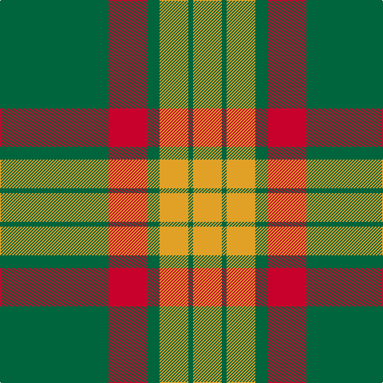

In pattern [GRGYGY](/stripes/grgygy/).

This was sourced from register-of-tartans.  It is a [6 stripe tartan](/stripes/stripes6/).

Original link https://www.tartanregister.gov.uk/tartanDetails.aspx?ref=6019

## Register references

External register numbers recorded for this tartan.

- Scottish Register of Tartans: [6019](https://www.tartanregister.gov.uk/tartanDetails.aspx?ref=6019)
- Scottish Tartans Authority (ITI): 6310

## Thread count
G/136 R48 G16 Y36 G6 Y/36

## Palette
Each colour and the base-6 reference it is a variant of.

| Colour | Shade | Base |
|---|---|---|
| G | <code style="background-color:#00643C;">#00643C</code> `oklch(44.3% 0.104 157.7)` <small>#00643C</small> | G <code style="background-color:#006100;">#006100</code> |
| R | <code style="background-color:#C8002C;">#C8002C</code> `oklch(52.6% 0.212 22.0)` <small>#C8002C</small> | R <code style="background-color:#CC0000;">#CC0000</code> |
| Y | <code style="background-color:#E0A126;">#E0A126</code> `oklch(75.1% 0.146 78.3)` <small>#E0A126</small> | Y <code style="background-color:#F2BF00;">#F2BF00</code> |

# Sample pattern

## Nearest tartans

The nearest existing variants by ΔTartan distance.

1. [MacMillan/Isetan (Corporate)](/setts/s6/dg68r24dg8lo18dg3lo18~x2/) — ΔT 1.04
1. [Pollock](/setts/s7/g3lo16w4k6g28lo1g3~x4/) — ΔT 1.34
1. [Skene](/setts/s7/db6r3g1r3g12r3g1~x2/) — ΔT 1.39
1. [Forget Family (Yonne)](/setts/s6/dg8lo1dg8lo12r1lo1~x4/) — ΔT 1.42
1. [Pollock (Name)](/setts/s7/g6lo2g32k8w6lo20g5~x2/) — ΔT 1.43
1. [Rice (Welsh Name)](/setts/s10/dt4lo21dt1lo21y8db4y5db4y4dt4/) — ΔT 1.46
1. [Machair](/setts/s6/lo72dt16w9dt4w5dt16~x2/) — ΔT 1.50
1. [Maxwell, hunting](/setts/s7/g3r16g4k6g28r1g3~x2/) — ΔT 1.50
1. [Princess Margaret Rose Tartan Tartan Number: 986. Earliest known date: 1930 Colours reversed from MacGregor See products available Copyright © Blair Urquhart, Comrie, 2015](/setts/s6/g36r18g4r6k1w2~x2/) — ΔT 1.51
1. [Nithsdale](/setts/s10/db10r2g2r6g16r1g2r1g3r6~x2/) — ΔT 1.56

## Neighbour map

Every grey dot is one of 14299 variants placed by the first two principal components of the ΔTartan feature space (44% of its variance). Red is this tartan; blue dots are its nearest — click one to open its page.

<svg viewBox="0 0 640 380" role="img" style="max-width:100%;height:auto;border:1px solid #e0e0e0;border-radius:4px;display:block" xmlns="http://www.w3.org/2000/svg"><image href="/nn/cloud.v1.png" width="640" height="380"/><a href="/setts/s6/dg68r24dg8lo18dg3lo18~x2/"><circle cx="392.6" cy="205.8" r="4" fill="#3465a4"><title>MacMillan/Isetan (Corporate)</title></circle></a><a href="/setts/s7/g3lo16w4k6g28lo1g3~x4/"><circle cx="337.5" cy="145.0" r="4" fill="#3465a4"><title>Pollock</title></circle></a><a href="/setts/s7/db6r3g1r3g12r3g1~x2/"><circle cx="297.8" cy="216.5" r="4" fill="#3465a4"><title>Skene</title></circle></a><a href="/setts/s6/dg8lo1dg8lo12r1lo1~x4/"><circle cx="321.5" cy="211.4" r="4" fill="#3465a4"><title>Forget Family (Yonne)</title></circle></a><a href="/setts/s7/g6lo2g32k8w6lo20g5~x2/"><circle cx="293.9" cy="174.1" r="4" fill="#3465a4"><title>Pollock (Name)</title></circle></a><a href="/setts/s10/dt4lo21dt1lo21y8db4y5db4y4dt4/"><circle cx="323.8" cy="160.1" r="4" fill="#3465a4"><title>Rice (Welsh Name)</title></circle></a><a href="/setts/s6/lo72dt16w9dt4w5dt16~x2/"><circle cx="382.0" cy="178.5" r="4" fill="#3465a4"><title>Machair</title></circle></a><a href="/setts/s7/g3r16g4k6g28r1g3~x2/"><circle cx="397.9" cy="166.6" r="4" fill="#3465a4"><title>Maxwell, hunting</title></circle></a><a href="/setts/s6/g36r18g4r6k1w2~x2/"><circle cx="422.0" cy="152.1" r="4" fill="#3465a4"><title>Princess Margaret Rose Tartan Tartan Number: 986. Earliest known date: 1930 Colours reversed from MacGregor See products available Copyright © Blair Urquhart, Comrie, 2015</title></circle></a><a href="/setts/s10/db10r2g2r6g16r1g2r1g3r6~x2/"><circle cx="301.7" cy="184.7" r="4" fill="#3465a4"><title>Nithsdale</title></circle></a><circle cx="367.9" cy="192.4" r="5" fill="#c00000"/></svg>

ID: /setts/s6/g68r24g8lo18g3lo18~x2/
