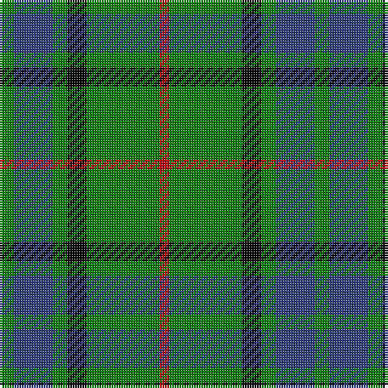

In pattern [GBGKGR](/patterns/gbgkgr/).

This was sourced from weddslist.  It is a [6 stripes tartan](/stripes/stripes6/).

Original link http://www.weddslist.com/cgi-bin/tartans/pg.pl?source=sts

## Thread count
G/6 B16 G6 K8 G30 R/4

## Palette
Each colour and its ΔE from the base-6 reference it is a variant of.

| Colour | Shade | Base | ΔE (OKLab) |
|---|---|---|---|
| B | <code style="background-color:#304080;">#304080</code> `#304080` | B <code style="background-color:#2C4084;">#2C4084</code> | 0.01 |
| G | <code style="background-color:#008000;">#008000</code> `#008000` | G <code style="background-color:#006400;">#006400</code> | 0.09 |
| K | <code style="background-color:#000000;">#000000</code> `#000000` | K <code style="background-color:#000000;">#000000</code> | 0.00 |
| R | <code style="background-color:#C00000;">#C00000</code> `#C00000` | R <code style="background-color:#C80000;">#C80000</code> | 0.02 |

# Sample pattern

## Nearest tartans

The nearest existing variants by ΔTartan distance.

1. [Moore Caledonian (Personal)](/setts/s6/r6k36g36y6g36y6-g006818-k101010-rc8002c-yfccc00/) — ΔT 0.76
1. [Paton Family Tartan Tartan Number: 2127. Earliest known date: 1930 Discovered in 1993 at P and J Haggart, weavers in Aberfeldy. It was possibly designed by the late Mr John Robertson around the 1930's, but the sample appears to have been woven in 1952. The Paton family associated with the tartan come from Aberdeenshire. Apart from the red stripe this sett resembles the Gordon of Abergeldy previously known as Ancient Gordon. See products available Copyright © Blair Urquhart, Comrie, 2015](/setts/s7/r6g48k56g38y6g6y6-g006818-k101010-rc80000-ye8c000/) — ΔT 0.93
1. [Duncan, or Leslie of Wardis](/setts/s6/k8g42w6g42b42r8-b304080-g008000-k000000-rc00000-we0e0e0/) — ΔT 1.03
1. [Wilson's No.140](/setts/s4/k4y2g14b2-b5c8ca8-g006818-k101010-ye8c000/) — ΔT 1.16
1. [MacAulay of Lewis](/setts/s8/g12k32r6k32g56k8g24w6-g006818-k101010-rc80000-wf8f8f8/) — ΔT 1.20
1. [Paton (Personal)](/setts/s7/r6g40k40g40y4g4y4-g006818-k101010-r880000-yd09800/) — ΔT 1.22
1. [MacKintosh Hunting](/setts/s7/y4g24b12r6g24r8b2-b000064-g004c00-rc80000-yffff00/) — ΔT 1.23
1. [MacIver Hunting](/setts/s9/w4g24k6g6k32g6k6g24y4-g507830-k101010-we0e0e0-yd8b000/) — ΔT 1.25
1. [MacIntyre Hunting (VS)](/setts/s6/g8b24r6b24g64w8-b202060-g006818-rc80000-wfcfcfc/) — ΔT 1.25
1. [Vermont](/setts/s8/g4w4g24k24g24r4g4y4-g008000-k000030-rc00000-we0e0e0-yf0c000/) — ΔT 1.26

## Neighbour map

Every grey dot is one of 15726 variants placed by the first two principal components of the ΔTartan feature space (44% of its variance). Red is this tartan; blue dots are its nearest — click one to open its page.

<svg viewBox="0 0 640 380" role="img" style="max-width:100%;height:auto;border:1px solid #e0e0e0;border-radius:4px;display:block" xmlns="http://www.w3.org/2000/svg"><image href="/nn/cloud.v1.png" width="640" height="380"/><a href="/setts/s6/r6k36g36y6g36y6-g006818-k101010-rc8002c-yfccc00/"><circle cx="261.6" cy="242.7" r="4" fill="#3465a4"><title>Moore Caledonian (Personal)</title></circle></a><a href="/setts/s7/r6g48k56g38y6g6y6-g006818-k101010-rc80000-ye8c000/"><circle cx="294.7" cy="211.1" r="4" fill="#3465a4"><title>Paton Family Tartan Tartan Number: 2127. Earliest known date: 1930 Discovered in 1993 at P and J Haggart, weavers in Aberfeldy. It was possibly designed by the late Mr John Robertson around the 1930's, but the sample appears to have been woven in 1952. The Paton family associated with the tartan come from Aberdeenshire. Apart from the red stripe this sett resembles the Gordon of Abergeldy previously known as Ancient Gordon. See products available Copyright © Blair Urquhart, Comrie, 2015</title></circle></a><a href="/setts/s6/k8g42w6g42b42r8-b304080-g008000-k000000-rc00000-we0e0e0/"><circle cx="246.0" cy="224.6" r="4" fill="#3465a4"><title>Duncan, or Leslie of Wardis</title></circle></a><a href="/setts/s4/k4y2g14b2-b5c8ca8-g006818-k101010-ye8c000/"><circle cx="336.5" cy="246.1" r="4" fill="#3465a4"><title>Wilson's No.140</title></circle></a><a href="/setts/s8/g12k32r6k32g56k8g24w6-g006818-k101010-rc80000-wf8f8f8/"><circle cx="277.9" cy="219.7" r="4" fill="#3465a4"><title>MacAulay of Lewis</title></circle></a><a href="/setts/s7/r6g40k40g40y4g4y4-g006818-k101010-r880000-yd09800/"><circle cx="345.8" cy="218.2" r="4" fill="#3465a4"><title>Paton (Personal)</title></circle></a><a href="/setts/s7/y4g24b12r6g24r8b2-b000064-g004c00-rc80000-yffff00/"><circle cx="300.9" cy="208.7" r="4" fill="#3465a4"><title>MacKintosh Hunting</title></circle></a><a href="/setts/s9/w4g24k6g6k32g6k6g24y4-g507830-k101010-we0e0e0-yd8b000/"><circle cx="271.9" cy="204.4" r="4" fill="#3465a4"><title>MacIver Hunting</title></circle></a><a href="/setts/s6/g8b24r6b24g64w8-b202060-g006818-rc80000-wfcfcfc/"><circle cx="292.6" cy="209.1" r="4" fill="#3465a4"><title>MacIntyre Hunting (VS)</title></circle></a><a href="/setts/s8/g4w4g24k24g24r4g4y4-g008000-k000030-rc00000-we0e0e0-yf0c000/"><circle cx="252.3" cy="199.9" r="4" fill="#3465a4"><title>Vermont</title></circle></a><circle cx="286.7" cy="232.0" r="5" fill="#c00000"/></svg>

ID: /setts/s6/g6b16g6k8g30r4-b304080-g008000-k000000-rc00000/
