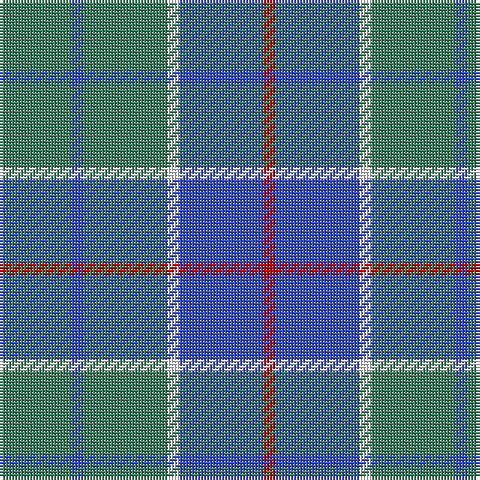

In pattern [GBGWBR](/patterns/gbgwbr/).

This was sourced from register-of-tartans.  It is a [6 stripes tartan](/stripes/stripes6/).

Original link https://www.tartanregister.gov.uk/tartanDetails.aspx?ref=3149

## Attestations

This cloth appears in 2 source records; the oldest owns this page.

- 01/01/1957 — Norris (1957) (register-of-tartans, [record](https://www.tartanregister.gov.uk/tartanDetails.aspx?ref=3149))
- 1957 — Norris (1957) (Name) (tartans-authority, [record](http://www.tartansauthority.com/tartan-ferret/display/5943/))

## Register references

External register numbers recorded for this tartan.

- Scottish Register of Tartans: [3149](https://www.tartanregister.gov.uk/tartanDetails.aspx?ref=3149)
- Scottish Tartans Authority (ITI): 5943

## Thread count
G/24 Ba4 G28 W4 Ba28 R/4

## Palette
Each colour and its ΔE from the base-6 reference it is a variant of.

| Colour | Shade | Base | ΔE (OKLab) |
|---|---|---|---|
| B | <code style="background-color:#48A4C0;">#48A4C0</code> `#48A4C0` | Y <code style="background-color:#F2BF00;">#F2BF00</code> | 0.29 |
| Ba | <code style="background-color:#3850C8;">#3850C8</code> `#3850C8` | B <code style="background-color:#2A418A;">#2A418A</code> | 0.11 |
| G | <code style="background-color:#408060;">#408060</code> `#408060` | G <code style="background-color:#006100;">#006100</code> | 0.14 |
| LN | <code style="background-color:#E0E0E0;">#E0E0E0</code> `#E0E0E0` | W <code style="background-color:#F7F7F7;">#F7F7F7</code> | 0.07 |
| O | <code style="background-color:#E86000;">#E86000</code> `#E86000` | R <code style="background-color:#CC0000;">#CC0000</code> | 0.14 |
| R | <code style="background-color:#C80000;">#C80000</code> `#C80000` | R <code style="background-color:#CC0000;">#CC0000</code> | 0.01 |
| W | <code style="background-color:#FCFCFC;">#FCFCFC</code> `#FCFCFC` | W <code style="background-color:#F7F7F7;">#F7F7F7</code> | 0.01 |

# Sample pattern

## Nearest tartans

The nearest existing variants by ΔTartan distance.

1. [Outdoorsmen (Fashion)](/setts/s7/b3k1g4k1b4g9k2~b2474e8-g408060-k101010~x4/) — ΔT 1.30
1. [MacHardy](/setts/s8/b1r1g6b6y1b6r1g1~b304080-g008000-rc00000-yf0c000~x2/) — ΔT 1.35
1. [Thorburn (Lochcarron)](/setts/s6/b3ba14b3r16b34ra3~b003c64-ba5c8ca8-r888888-rac80000~x2/) — ΔT 1.41
1. [HMS Duncan (Military)](/setts/s6/b3r15ba15ra2ba15y3~b780078-ba003c64-r888888-rac80000-ycca800~x2/) — ΔT 1.41
1. [MacHardy](/setts/s8/b1r1g6b6y1b6r1g1~b2c4084-g005020-rdc0000-ye8c000~x2/) — ΔT 1.41
1. [Digital Equipment Corp.](/setts/s10/b8k5b16r9b3r3b3r3b10w3~b2c6c80-k000000-r888888-wc8c8c8~x2/) — ΔT 1.43
1. [Bermuda Plaid (1947) (District)](/setts/s7/b33r8ba12g12b8ba2b8~b5c8ca8-ba2c2c80-g006818-rc80000~x2/) — ΔT 1.48
1. [Hamilton, hunting](/setts/s5/b11g2b15g18w2~b304080-g008000-we0e0e0~x2/) — ΔT 1.53
1. [Digital Corporate Tartan Tartan Number: 2140. Earliest known date: 1991 Designed in Company colours. See products available Copyright © Blair Urquhart, Comrie, 2015](/setts/s10/b6k3b10y5b2y2b2y2b7w2~b2888c4-k101010-we0e0e0-ya08858~x2/) — ΔT 1.55
1. [North Sea Commission](/setts/s5/b9ba3b1ba12y1~b5c8ca8-ba344054-ye8c000~x4/) — ΔT 1.56

## Neighbour map

Every grey dot is one of 15726 variants placed by the first two principal components of the ΔTartan feature space (44% of its variance). Red is this tartan; blue dots are its nearest — click one to open its page.

<svg viewBox="0 0 640 380" role="img" style="max-width:100%;height:auto;border:1px solid #e0e0e0;border-radius:4px;display:block" xmlns="http://www.w3.org/2000/svg"><image href="/nn/cloud.v1.png" width="640" height="380"/><a href="/setts/s7/b3k1g4k1b4g9k2~b2474e8-g408060-k101010~x4/"><circle cx="295.3" cy="243.8" r="4" fill="#3465a4"><title>Outdoorsmen (Fashion)</title></circle></a><a href="/setts/s8/b1r1g6b6y1b6r1g1~b304080-g008000-rc00000-yf0c000~x2/"><circle cx="289.1" cy="227.3" r="4" fill="#3465a4"><title>MacHardy</title></circle></a><a href="/setts/s6/b3ba14b3r16b34ra3~b003c64-ba5c8ca8-r888888-rac80000~x2/"><circle cx="330.6" cy="220.5" r="4" fill="#3465a4"><title>Thorburn (Lochcarron)</title></circle></a><a href="/setts/s6/b3r15ba15ra2ba15y3~b780078-ba003c64-r888888-rac80000-ycca800~x2/"><circle cx="277.1" cy="229.4" r="4" fill="#3465a4"><title>HMS Duncan (Military)</title></circle></a><a href="/setts/s8/b1r1g6b6y1b6r1g1~b2c4084-g005020-rdc0000-ye8c000~x2/"><circle cx="307.7" cy="235.5" r="4" fill="#3465a4"><title>MacHardy</title></circle></a><a href="/setts/s10/b8k5b16r9b3r3b3r3b10w3~b2c6c80-k000000-r888888-wc8c8c8~x2/"><circle cx="305.8" cy="242.4" r="4" fill="#3465a4"><title>Digital Equipment Corp.</title></circle></a><a href="/setts/s7/b33r8ba12g12b8ba2b8~b5c8ca8-ba2c2c80-g006818-rc80000~x2/"><circle cx="345.1" cy="207.0" r="4" fill="#3465a4"><title>Bermuda Plaid (1947) (District)</title></circle></a><a href="/setts/s5/b11g2b15g18w2~b304080-g008000-we0e0e0~x2/"><circle cx="325.8" cy="269.4" r="4" fill="#3465a4"><title>Hamilton, hunting</title></circle></a><a href="/setts/s10/b6k3b10y5b2y2b2y2b7w2~b2888c4-k101010-we0e0e0-ya08858~x2/"><circle cx="321.3" cy="245.7" r="4" fill="#3465a4"><title>Digital Corporate Tartan Tartan Number: 2140. Earliest known date: 1991 Designed in Company colours. See products available Copyright © Blair Urquhart, Comrie, 2015</title></circle></a><a href="/setts/s5/b9ba3b1ba12y1~b5c8ca8-ba344054-ye8c000~x4/"><circle cx="396.1" cy="249.5" r="4" fill="#3465a4"><title>North Sea Commission</title></circle></a><circle cx="309.8" cy="247.0" r="5" fill="#c00000"/></svg>

ID: /setts/s6/g6b1g7w1b7r1~b3850c8-g408060-rc80000-wfcfcfc~x4/
