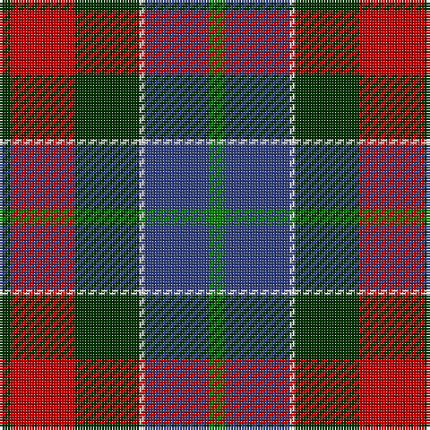

In pattern [GBWGRG](/patterns/gbwgrg/).

This was sourced from weddslist.  It is a [6 stripes tartan](/stripes/stripes6/).

Original link http://www.weddslist.com/cgi-bin/tartans/pg.pl?source=sts

## Thread count
DG/4 R24 DG24 LN2 B24 G/6

## Palette
Each colour and its ΔE from the base-6 reference it is a variant of.

| Colour | Shade | Base | ΔE (OKLab) |
|---|---|---|---|
| B | <code style="background-color:#304080;">#304080</code> `#304080` | B <code style="background-color:#2A418A;">#2A418A</code> | 0.02 |
| DG | <code style="background-color:#003000;">#003000</code> `#003000` | G <code style="background-color:#006100;">#006100</code> | 0.17 |
| G | <code style="background-color:#008000;">#008000</code> `#008000` | G <code style="background-color:#006100;">#006100</code> | 0.10 |
| LN | <code style="background-color:#E0E0E0;">#E0E0E0</code> `#E0E0E0` | W <code style="background-color:#F7F7F7;">#F7F7F7</code> | 0.07 |
| R | <code style="background-color:#C00000;">#C00000</code> `#C00000` | R <code style="background-color:#CC0000;">#CC0000</code> | 0.03 |

# Sample pattern

## Nearest tartans

The nearest existing variants by ΔTartan distance.

1. [Patterson, John (Personal)](/setts/s6/g6b24w2ga24r24ga4-b2c2c80-g006818-ga003820-rc80000-wfcfcfc/) — ΔT 0.45
1. [Patterson, John (Personal)](/setts/s6/g6b24w2ga24r24ga4-b2c4084-g005020-ga002814-rdc0000-we0e0e0/) — ΔT 0.50
1. [Canine All Dogs (Fashion)](/setts/s6/r10b6g24ba24r6y3-b2c2c80-ba1c1c50-g006818-rc80000-ye8c000/) — ΔT 0.70
1. [Bryant (Dalgleish) (Personal)](/setts/s6/w6r60k36b12g60k4-b1c0070-g006818-k101010-r880000-wc0c0c0/) — ΔT 0.72
1. [St. Clement of Rome (Corporate)](/setts/s8/b36k10r52k10g50k10b36y4-b202060-g006818-k101010-rc80000-ye8c000/) — ΔT 0.75
1. [Kilgour (Asymmetrical)](/setts/s8/b24k12r56k12g56k12b24y4-b2c2c80-g006818-k101010-rc80000-ye8c000/) — ΔT 0.88
1. [Kilgour (Cant)](/setts/s8/b24y4b24k12r56k12g56k12-b2c2c80-g006818-k101010-rc80000-ye8c000/) — ΔT 0.88
1. [Kilgour (Symmetrical)](/setts/s8/b24k12g56k12r56k12b24y4-b2c2c80-g006818-k101010-rc80000-ye8c000/) — ΔT 0.88
1. [Thompson's Fancy Personal Tartan Tartan Number: 286. Earliest known date: pre 2003 Designed for his own use. See products available Copyright © Blair Urquhart, Comrie, 2015](/setts/s6/r12g48b12ba24k24ba6-b2c2c80-ba5c8ca8-g604000-k101010-rc80000/) — ΔT 0.89
1. [Commonwealth Games Council (Corp.)](/setts/s6/r6k34b22r4ra40w4-b484848-k101010-rb468ac-ra888888-we0e0e0/) — ΔT 1.01

## Neighbour map

Every grey dot is one of 15726 variants placed by the first two principal components of the ΔTartan feature space (44% of its variance). Red is this tartan; blue dots are its nearest — click one to open its page.

<svg viewBox="0 0 640 380" role="img" style="max-width:100%;height:auto;border:1px solid #e0e0e0;border-radius:4px;display:block" xmlns="http://www.w3.org/2000/svg"><image href="/nn/cloud.v1.png" width="640" height="380"/><a href="/setts/s6/g6b24w2ga24r24ga4-b2c2c80-g006818-ga003820-rc80000-wfcfcfc/"><circle cx="166.0" cy="197.6" r="4" fill="#3465a4"><title>Patterson, John (Personal)</title></circle></a><a href="/setts/s6/g6b24w2ga24r24ga4-b2c4084-g005020-ga002814-rdc0000-we0e0e0/"><circle cx="160.3" cy="194.1" r="4" fill="#3465a4"><title>Patterson, John (Personal)</title></circle></a><a href="/setts/s6/r10b6g24ba24r6y3-b2c2c80-ba1c1c50-g006818-rc80000-ye8c000/"><circle cx="139.1" cy="212.2" r="4" fill="#3465a4"><title>Canine All Dogs (Fashion)</title></circle></a><a href="/setts/s6/w6r60k36b12g60k4-b1c0070-g006818-k101010-r880000-wc0c0c0/"><circle cx="190.0" cy="187.5" r="4" fill="#3465a4"><title>Bryant (Dalgleish) (Personal)</title></circle></a><a href="/setts/s8/b36k10r52k10g50k10b36y4-b202060-g006818-k101010-rc80000-ye8c000/"><circle cx="155.3" cy="183.0" r="4" fill="#3465a4"><title>St. Clement of Rome (Corporate)</title></circle></a><a href="/setts/s8/b24k12r56k12g56k12b24y4-b2c2c80-g006818-k101010-rc80000-ye8c000/"><circle cx="133.1" cy="172.2" r="4" fill="#3465a4"><title>Kilgour (Asymmetrical)</title></circle></a><a href="/setts/s8/b24y4b24k12r56k12g56k12-b2c2c80-g006818-k101010-rc80000-ye8c000/"><circle cx="133.1" cy="172.2" r="4" fill="#3465a4"><title>Kilgour (Cant)</title></circle></a><a href="/setts/s8/b24k12g56k12r56k12b24y4-b2c2c80-g006818-k101010-rc80000-ye8c000/"><circle cx="133.1" cy="172.2" r="4" fill="#3465a4"><title>Kilgour (Symmetrical)</title></circle></a><a href="/setts/s6/r12g48b12ba24k24ba6-b2c2c80-ba5c8ca8-g604000-k101010-rc80000/"><circle cx="160.7" cy="222.4" r="4" fill="#3465a4"><title>Thompson's Fancy Personal Tartan Tartan Number: 286. Earliest known date: pre 2003 Designed for his own use. See products available Copyright © Blair Urquhart, Comrie, 2015</title></circle></a><a href="/setts/s6/r6k34b22r4ra40w4-b484848-k101010-rb468ac-ra888888-we0e0e0/"><circle cx="156.8" cy="190.0" r="4" fill="#3465a4"><title>Commonwealth Games Council (Corp.)</title></circle></a><circle cx="166.7" cy="198.6" r="5" fill="#c00000"/></svg>

ID: /setts/s6/g6b24w2ga24r24ga4-b304080-g008000-ga003000-rc00000-we0e0e0/
