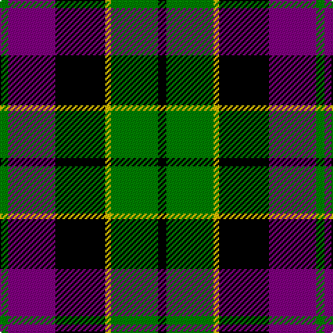

In pattern [GBKYGK](/patterns/gbkygk/).

This was sourced from weddslist.  It is a [6 stripes tartan](/stripes/stripes6/).

Original link http://www.weddslist.com/cgi-bin/tartans/pg.pl?source=sts

## Thread count
G/6 P34 K36 Y4 G34 K/6

## Palette
Each colour and its ΔE from the base-6 reference it is a variant of.

| Colour | Shade | Base | ΔE (OKLab) |
|---|---|---|---|
| G | <code style="background-color:#008000;">#008000</code> `#008000` | G <code style="background-color:#006100;">#006100</code> | 0.10 |
| K | <code style="background-color:#000000;">#000000</code> `#000000` | K <code style="background-color:#000000;">#000000</code> | 0.00 |
| P | <code style="background-color:#800080;">#800080</code> `#800080` | B <code style="background-color:#2A418A;">#2A418A</code> | 0.17 |
| Y | <code style="background-color:#F0C000;">#F0C000</code> `#F0C000` | Y <code style="background-color:#F2BF00;">#F2BF00</code> | 0.00 |

# Sample pattern

## Nearest tartans

The nearest existing variants by ΔTartan distance.

1. [Wilson's, No 76](/setts/s6/g6b34k36w4g34k6-b800080-g008000-k000000-we0e0e0/) — ΔT 0.12
1. [Gordon of Esslemont](/setts/s7/y12g6y6g44k46b46k8-b800080-g008000-k000000-yf0c000/) — ΔT 0.72
1. [Wilson's No 158](/setts/s6/g42w4g8k34b28k6-b800080-g008000-k000000-we0e0e0/) — ΔT 0.72
1. [Wilson's, No 150 "Coburg"](/setts/s6/g36b4g8k28ba24k6-b5480b0-ba800080-g008000-k000000/) — ΔT 0.75
1. [United Distillers (Corporate)](/setts/s6/r4k28r2ka28r28y4-k000000-ka101010-r948860-ye8c000/) — ΔT 0.77
1. [Wilson's, No 160](/setts/s6/g42y4g8k32b28k6-b800080-g008000-k000000-yf0c000/) — ΔT 0.80
1. [MacKay, Plaid](/setts/s6/g14b82g9k80g80k14-b800080-g008000-k000000/) — ΔT 0.89
1. [Fletcher of Dunans](/setts/s7/b12k2b12k16r2g16r4-b304080-g008000-k000000-rc00000/) — ΔT 0.91
1. [Baillie](/setts/s7/b6k2b16k12g16k2w4-b800080-g008000-k000000-we0e0e0/) — ΔT 0.91
1. [Morrison](/setts/s6/k6g28k28g4b28r6-b304080-g008000-k000000-rc00000/) — ΔT 0.92

## Neighbour map

Every grey dot is one of 15726 variants placed by the first two principal components of the ΔTartan feature space (44% of its variance). Red is this tartan; blue dots are its nearest — click one to open its page.

<svg viewBox="0 0 640 380" role="img" style="max-width:100%;height:auto;border:1px solid #e0e0e0;border-radius:4px;display:block" xmlns="http://www.w3.org/2000/svg"><image href="/nn/cloud.v1.png" width="640" height="380"/><a href="/setts/s6/g6b34k36w4g34k6-b800080-g008000-k000000-we0e0e0/"><circle cx="152.0" cy="212.7" r="4" fill="#3465a4"><title>Wilson's, No 76</title></circle></a><a href="/setts/s7/y12g6y6g44k46b46k8-b800080-g008000-k000000-yf0c000/"><circle cx="119.3" cy="202.5" r="4" fill="#3465a4"><title>Gordon of Esslemont</title></circle></a><a href="/setts/s6/g42w4g8k34b28k6-b800080-g008000-k000000-we0e0e0/"><circle cx="179.3" cy="208.6" r="4" fill="#3465a4"><title>Wilson's No 158</title></circle></a><a href="/setts/s6/g36b4g8k28ba24k6-b5480b0-ba800080-g008000-k000000/"><circle cx="174.4" cy="220.1" r="4" fill="#3465a4"><title>Wilson's, No 150 &quot;Coburg&quot;</title></circle></a><a href="/setts/s6/r4k28r2ka28r28y4-k000000-ka101010-r948860-ye8c000/"><circle cx="176.8" cy="193.0" r="4" fill="#3465a4"><title>United Distillers (Corporate)</title></circle></a><a href="/setts/s6/g42y4g8k32b28k6-b800080-g008000-k000000-yf0c000/"><circle cx="182.4" cy="208.9" r="4" fill="#3465a4"><title>Wilson's, No 160</title></circle></a><a href="/setts/s6/g14b82g9k80g80k14-b800080-g008000-k000000/"><circle cx="187.9" cy="230.5" r="4" fill="#3465a4"><title>MacKay, Plaid</title></circle></a><a href="/setts/s7/b12k2b12k16r2g16r4-b304080-g008000-k000000-rc00000/"><circle cx="144.1" cy="226.6" r="4" fill="#3465a4"><title>Fletcher of Dunans</title></circle></a><a href="/setts/s7/b6k2b16k12g16k2w4-b800080-g008000-k000000-we0e0e0/"><circle cx="145.7" cy="208.2" r="4" fill="#3465a4"><title>Baillie</title></circle></a><a href="/setts/s6/k6g28k28g4b28r6-b304080-g008000-k000000-rc00000/"><circle cx="133.8" cy="234.5" r="4" fill="#3465a4"><title>Morrison</title></circle></a><circle cx="153.1" cy="213.0" r="5" fill="#c00000"/></svg>

ID: /setts/s6/g6b34k36y4g34k6-b800080-g008000-k000000-yf0c000/
