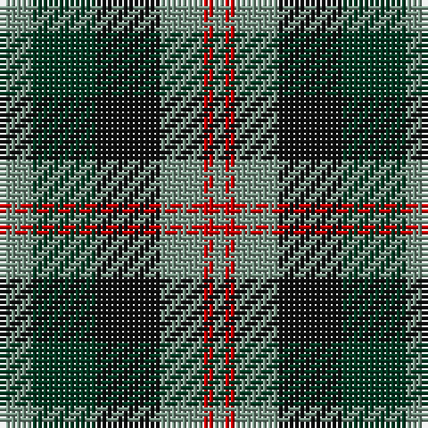

In pattern [GGKGRG](/patterns/ggkgrg/).

This was sourced from register-of-tartans.  It is a [6 stripes tartan](/stripes/stripes6/).

Original link https://www.tartanregister.gov.uk/tartanDetails.aspx?ref=4499

## Thread count
LG/6 DG12 K12 LG8 R2 LG/2

## Palette
Each colour and its ΔE from the base-6 reference it is a variant of.

| Colour | Shade | Base | ΔE (OKLab) |
|---|---|---|---|
| DG | <code style="background-color:#003820;">#003820</code> `#003820` | G <code style="background-color:#006100;">#006100</code> | 0.15 |
| K | <code style="background-color:#101010;">#101010</code> `#101010` | K <code style="background-color:#000000;">#000000</code> | 0.17 |
| LG | <code style="background-color:#789484;">#789484</code> `#789484` | G <code style="background-color:#006100;">#006100</code> | 0.24 |
| R | <code style="background-color:#C80000;">#C80000</code> `#C80000` | R <code style="background-color:#CC0000;">#CC0000</code> | 0.01 |

# Sample pattern

## Nearest tartans

The nearest existing variants by ΔTartan distance.

1. [Wellington or Waterloo Commemorative Tartan Tartan Number: 154. Earliest known date: pre 2003 Name derived from Wilson letters 1821 and 1824 See products available Copyright © Blair Urquhart, Comrie, 2015](/setts/s6/b6g12k12b8r2b2-b5c8ca8-g006818-k101010-rc80000/) — ΔT 0.49
1. [Wellington or Waterloo](/setts/s6/b6g24k28b22r6b6-b3c82af-g005020-k101010-rdc0000/) — ΔT 0.75
1. [Melville](/setts/s6/k8w4g26k26b24k4-b608c9c-g408060-k101010-wfcfcfc/) — ΔT 0.77
1. [Fletcher of Dunans](/setts/s7/b20k6b20k28r4g28r10-b1870a4-g006818-k101010-rc80000/) — ΔT 0.79
1. [Morrison Society](/setts/s6/k6g28k28g4b28r6-b1474b4-g006818-k101010-rc80000/) — ΔT 0.85
1. [Lennie Family Tartan Tartan Number: 725. Earliest known date: 1819 Wilson's No 231. See products available Copyright © Blair Urquhart, Comrie, 2015](/setts/s6/g4b16k18ba4g20k4-b780078-ba5c8ca8-g006818-k101010/) — ΔT 0.85
1. [Gunn - 1810 (Clan)](/setts/s6/r8g24k24g4b24g6-b1c0070-g006818-k101010-rc80000/) — ΔT 0.89
1. [Timespan](/setts/s5/g36r6k36r6ra36-g006818-k101010-rc80000-ra888888/) — ΔT 0.91
1. [Wellington, or Waterloo](/setts/s6/b6g12k12b8r2b2-b5480b0-g008000-k000000-rc00000/) — ΔT 1.02
1. [Hudson Valley Reg. Police P & D (Cor](/setts/s6/y10g32k32b32k4b4-b202060-g006818-k101010-ye8c000/) — ΔT 1.04

## Neighbour map

Every grey dot is one of 15726 variants placed by the first two principal components of the ΔTartan feature space (44% of its variance). Red is this tartan; blue dots are its nearest — click one to open its page.

<svg viewBox="0 0 640 380" role="img" style="max-width:100%;height:auto;border:1px solid #e0e0e0;border-radius:4px;display:block" xmlns="http://www.w3.org/2000/svg"><image href="/nn/cloud.v1.png" width="640" height="380"/><a href="/setts/s6/b6g12k12b8r2b2-b5c8ca8-g006818-k101010-rc80000/"><circle cx="154.5" cy="253.7" r="4" fill="#3465a4"><title>Wellington or Waterloo Commemorative Tartan Tartan Number: 154. Earliest known date: pre 2003 Name derived from Wilson letters 1821 and 1824 See products available Copyright © Blair Urquhart, Comrie, 2015</title></circle></a><a href="/setts/s6/b6g24k28b22r6b6-b3c82af-g005020-k101010-rdc0000/"><circle cx="146.9" cy="261.8" r="4" fill="#3465a4"><title>Wellington or Waterloo</title></circle></a><a href="/setts/s6/k8w4g26k26b24k4-b608c9c-g408060-k101010-wfcfcfc/"><circle cx="164.1" cy="237.3" r="4" fill="#3465a4"><title>Melville</title></circle></a><a href="/setts/s7/b20k6b20k28r4g28r10-b1870a4-g006818-k101010-rc80000/"><circle cx="138.8" cy="247.8" r="4" fill="#3465a4"><title>Fletcher of Dunans</title></circle></a><a href="/setts/s6/k6g28k28g4b28r6-b1474b4-g006818-k101010-rc80000/"><circle cx="159.7" cy="244.3" r="4" fill="#3465a4"><title>Morrison Society</title></circle></a><a href="/setts/s6/g4b16k18ba4g20k4-b780078-ba5c8ca8-g006818-k101010/"><circle cx="163.2" cy="259.2" r="4" fill="#3465a4"><title>Lennie Family Tartan Tartan Number: 725. Earliest known date: 1819 Wilson's No 231. See products available Copyright © Blair Urquhart, Comrie, 2015</title></circle></a><a href="/setts/s6/r8g24k24g4b24g6-b1c0070-g006818-k101010-rc80000/"><circle cx="164.8" cy="260.4" r="4" fill="#3465a4"><title>Gunn - 1810 (Clan)</title></circle></a><a href="/setts/s5/g36r6k36r6ra36-g006818-k101010-rc80000-ra888888/"><circle cx="127.4" cy="254.9" r="4" fill="#3465a4"><title>Timespan</title></circle></a><a href="/setts/s6/b6g12k12b8r2b2-b5480b0-g008000-k000000-rc00000/"><circle cx="126.0" cy="243.8" r="4" fill="#3465a4"><title>Wellington, or Waterloo</title></circle></a><a href="/setts/s6/y10g32k32b32k4b4-b202060-g006818-k101010-ye8c000/"><circle cx="147.9" cy="236.1" r="4" fill="#3465a4"><title>Hudson Valley Reg. Police P &amp; D (Cor</title></circle></a><circle cx="155.3" cy="252.6" r="5" fill="#c00000"/></svg>

ID: /setts/s6/g6ga12k12g8r2g2-g789484-ga003820-k101010-rc80000/
