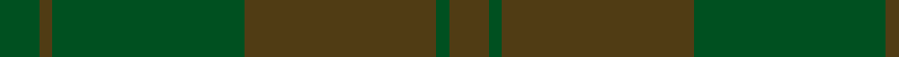

In pattern [GGGGGG](/patterns/gggggg/).

This was sourced from register-of-tartans.  It is a [6 stripes tartan](/stripes/stripes6/).

Original link https://www.tartanregister.gov.uk/tartanDetails.aspx?ref=1604

## Register references

External register numbers recorded for this tartan.

- Scottish Register of Tartans: [1604](https://www.tartanregister.gov.uk/tartanDetails.aspx?ref=1604)
- Scottish Tartans World Register: 911

## Thread count
G/12 T4 G58 T58 G4 T/12

## Palette
Each colour and its ΔE from the base-6 reference it is a variant of.

| Colour | Shade | Base | ΔE (OKLab) |
|---|---|---|---|
| G | <code style="background-color:#005020;">#005020</code> `#005020` | G <code style="background-color:#006100;">#006100</code> | 0.07 |
| T | <code style="background-color:#503C14;">#503C14</code> `#503C14` | G <code style="background-color:#006100;">#006100</code> | 0.14 |

# Sample pattern

## Nearest tartans

The nearest existing variants by ΔTartan distance.

1. [Harmony, 12](/setts/s6/g6r2g29r29g2r6~g808080-r806050~x2/) — ΔT 2.18
1. [Black Spirit Fashion Tartan Tartan Number: 10119. Earliest known date: ACS Tartan See products available Copyright © Blair Urquhart, Comrie, 2015](/setts/s7/k17ka4k13ka4k3ka45k3~k010204-ka121617~x2/) — ΔT 2.82
1. [Bouncing Blackie (Personal)](/setts/s6/b13ba13g21b34ba55bb3~b14143c-ba1c1c1c-bb441800-g003820/) — ΔT 3.10
1. [Wicklow Irish County Tartan Tartan Number: 2265. Earliest known date: 1995 One of a series of Irish District tartans designed by Polly Wittering of the House of Edgar, with colours reminiscent of the Country with soft warm colours dominating. See products available Copyright © Blair Urquhart, Comrie, 2015](/setts/s10/g2b2ga2b24ba2ga6b3g12b4ga2~b646c84-ba0070a4-g3c6060-ga644c40~x2/) — ΔT 3.14
1. [Bute Heather, Ancient Wth'd (Fashion](/setts/s11/y5b2g8b1g8b4g4b6g18ya1y5~b5c5c5c-g707070-ya08858-yaa0a0a0~x2/) — ΔT 3.21
1. [Loch Garth](/setts/s4/r12ra6r2y1~r806050-ra906030-yf0c000~x4/) — ΔT 3.21
1. [Harmony 13](/setts/s6/b10g1b1g10b18g5~b3c82af-g808080~x2/) — ΔT 3.24
1. [Dark Island](/setts/s16/k4b2k43b20k4b2k2b4k2b2k4b20k43b2k4b2~b282828-k101010~x2/) — ΔT 3.37
1. [Harmony, No 13](/setts/s6/b10g1b1g10b18g5~b5480b0-g808080~x2/) — ΔT 3.45
1. [MacKinnon Htg (Clan)](/setts/s7/g1ga8g8ga1g8ga8g1~g604000-ga006818~x4/) — ΔT 3.53

## Neighbour map

Every grey dot is one of 15726 variants placed by the first two principal components of the ΔTartan feature space (44% of its variance). Red is this tartan; blue dots are its nearest — click one to open its page.

<svg viewBox="0 0 640 380" role="img" style="max-width:100%;height:auto;border:1px solid #e0e0e0;border-radius:4px;display:block" xmlns="http://www.w3.org/2000/svg"><image href="/nn/cloud.v1.png" width="640" height="380"/><a href="/setts/s6/g6r2g29r29g2r6~g808080-r806050~x2/"><circle cx="626.0" cy="330.9" r="4" fill="#3465a4"><title>Harmony, 12</title></circle></a><a href="/setts/s7/k17ka4k13ka4k3ka45k3~k010204-ka121617~x2/"><circle cx="626.0" cy="325.9" r="4" fill="#3465a4"><title>Black Spirit Fashion Tartan Tartan Number: 10119. Earliest known date: ACS Tartan See products available Copyright © Blair Urquhart, Comrie, 2015</title></circle></a><a href="/setts/s6/b13ba13g21b34ba55bb3~b14143c-ba1c1c1c-bb441800-g003820/"><circle cx="529.2" cy="320.3" r="4" fill="#3465a4"><title>Bouncing Blackie (Personal)</title></circle></a><a href="/setts/s10/g2b2ga2b24ba2ga6b3g12b4ga2~b646c84-ba0070a4-g3c6060-ga644c40~x2/"><circle cx="552.7" cy="268.1" r="4" fill="#3465a4"><title>Wicklow Irish County Tartan Tartan Number: 2265. Earliest known date: 1995 One of a series of Irish District tartans designed by Polly Wittering of the House of Edgar, with colours reminiscent of the Country with soft warm colours dominating. See products available Copyright © Blair Urquhart, Comrie, 2015</title></circle></a><a href="/setts/s11/y5b2g8b1g8b4g4b6g18ya1y5~b5c5c5c-g707070-ya08858-yaa0a0a0~x2/"><circle cx="561.4" cy="265.0" r="4" fill="#3465a4"><title>Bute Heather, Ancient Wth'd (Fashion</title></circle></a><a href="/setts/s4/r12ra6r2y1~r806050-ra906030-yf0c000~x4/"><circle cx="622.6" cy="332.6" r="4" fill="#3465a4"><title>Loch Garth</title></circle></a><a href="/setts/s6/b10g1b1g10b18g5~b3c82af-g808080~x2/"><circle cx="626.0" cy="341.5" r="4" fill="#3465a4"><title>Harmony 13</title></circle></a><a href="/setts/s16/k4b2k43b20k4b2k2b4k2b2k4b20k43b2k4b2~b282828-k101010~x2/"><circle cx="626.0" cy="270.7" r="4" fill="#3465a4"><title>Dark Island</title></circle></a><a href="/setts/s6/b10g1b1g10b18g5~b5480b0-g808080~x2/"><circle cx="626.0" cy="350.7" r="4" fill="#3465a4"><title>Harmony, No 13</title></circle></a><a href="/setts/s7/g1ga8g8ga1g8ga8g1~g604000-ga006818~x4/"><circle cx="445.5" cy="312.4" r="4" fill="#3465a4"><title>MacKinnon Htg (Clan)</title></circle></a><circle cx="623.0" cy="342.6" r="5" fill="#c00000"/></svg>

ID: /setts/s6/g6ga2g29ga29g2ga6~g005020-ga503c14~x2/
