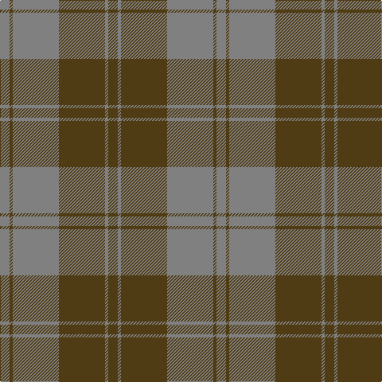

In pattern [GGGGGG](/patterns/gggggg/).

This was sourced from register-of-tartans.  It is a [6 stripes tartan](/stripes/stripes6/).

Original link https://www.tartanregister.gov.uk/tartanDetails.aspx?ref=1606

## Register references

External register numbers recorded for this tartan.

- Scottish Register of Tartans: [1606](https://www.tartanregister.gov.uk/tartanDetails.aspx?ref=1606)
- Scottish Tartans World Register: 1305

## Thread count
N/12 T4 N58 T58 N4 T/12

## Palette
Each colour and its ΔE from the base-6 reference it is a variant of.

| Colour | Shade | Base | ΔE (OKLab) |
|---|---|---|---|
| N | <code style="background-color:#808080;">#808080</code> `#808080` | G <code style="background-color:#006100;">#006100</code> | 0.23 |
| T | <code style="background-color:#503C14;">#503C14</code> `#503C14` | G <code style="background-color:#006100;">#006100</code> | 0.14 |

# Sample pattern

## Nearest tartans

The nearest existing variants by ΔTartan distance.

1. [Grey Spirit Fashion Tartan Tartan Number: 6594. Earliest known date: 01/03/2005 A fashion tartan from ACS Clothing of Glasgow for use in their kilt hire business. Woven by Lochcarron. The grey is actually a grey/black marl (mixture) which can't be shown graphically. See products available Copyright © Blair Urquhart, Comrie, 2015](/setts/s6/b6k16b6k16b45k4~b5f5f5f-k1e1a10~x2/) — ΔT 1.55
1. [Keepers of the Quaich](/setts/s6/y3g33b24g2b2g2~b2c2c80-g604000-yd09800~x2/) — ΔT 1.63
1. [Donachie of Brockloch (Clan)](/setts/s10/r24g2r2g20r25g2r2g2r2g20~g005834-r940000~x2/) — ΔT 1.64
1. [Rob Roy (Film) (Corporate)](/setts/s6/b3g1b10g4ga10b2~b708490-g003820-ga604000~x4/) — ΔT 1.79
1. [Lister (Name)](/setts/s7/g8r29g8y3g8r8y3~g604000-r888888-ye8c000~x2/) — ΔT 1.79
1. [Scottish Piping Soc. of London (Corp](/setts/s7/r30g3b5g21r3g21b2~b202060-g5c6428-rc8002c~x2/) — ΔT 1.87
1. [Keeper of the Quaich](/setts/s6/g3b3g3b27g40ga3~b304080-g402000-ga908000/) — ΔT 1.94
1. [Granite City (Silver Granite) Fashion Tartan Tartan Number: 7459. Earliest known date: pre 2007 Produced for Mike King of Philip King Tailoring Ltd, Aberdeen. Previously recorded by the STA as 'Granite City'. Thought to have been produced for Mike King of Aberdeen. . It is believed that Lochcarron of Scotland have now (Jan 2008) trademarked the word ‘Granite’ when used in connection with tartans. See products available Copyright © Blair Urquhart, Comrie, 2015](/setts/s7/k3g3k3g21ga21k3g1~g716d61-ga413c2e-k1e1a10~x2/) — ΔT 1.95
1. [Glen Trool (Fashion)](/setts/s5/g42r10g3ra10r3~g004428-ra07c58-ra880000~x2/) — ΔT 1.96
1. [Glen Trool District Tartan Tartan Number: 914. Earliest known date: pre 1945 Glen Trool is in the Galloway Uplands in the Southwest of Scotland. The tartan began life as a trade sett - a colourful fashion fabric - and was given a name merely to identify it. It proved very popular and is now recognised as a District Tartan. See products available Copyright © Blair Urquhart, Comrie, 2015](/setts/s5/g37ga9g3r9ga3~g003820-ga604000-rc80000~x2/) — ΔT 2.01

## Neighbour map

Every grey dot is one of 15726 variants placed by the first two principal components of the ΔTartan feature space (44% of its variance). Red is this tartan; blue dots are its nearest — click one to open its page.

<svg viewBox="0 0 640 380" role="img" style="max-width:100%;height:auto;border:1px solid #e0e0e0;border-radius:4px;display:block" xmlns="http://www.w3.org/2000/svg"><image href="/nn/cloud.v1.png" width="640" height="380"/><a href="/setts/s6/b6k16b6k16b45k4~b5f5f5f-k1e1a10~x2/"><circle cx="459.2" cy="266.0" r="4" fill="#3465a4"><title>Grey Spirit Fashion Tartan Tartan Number: 6594. Earliest known date: 01/03/2005 A fashion tartan from ACS Clothing of Glasgow for use in their kilt hire business. Woven by Lochcarron. The grey is actually a grey/black marl (mixture) which can't be shown graphically. See products available Copyright © Blair Urquhart, Comrie, 2015</title></circle></a><a href="/setts/s6/y3g33b24g2b2g2~b2c2c80-g604000-yd09800~x2/"><circle cx="439.7" cy="216.7" r="4" fill="#3465a4"><title>Keepers of the Quaich</title></circle></a><a href="/setts/s10/r24g2r2g20r25g2r2g2r2g20~g005834-r940000~x2/"><circle cx="449.9" cy="231.2" r="4" fill="#3465a4"><title>Donachie of Brockloch (Clan)</title></circle></a><a href="/setts/s6/b3g1b10g4ga10b2~b708490-g003820-ga604000~x4/"><circle cx="333.0" cy="260.1" r="4" fill="#3465a4"><title>Rob Roy (Film) (Corporate)</title></circle></a><a href="/setts/s7/g8r29g8y3g8r8y3~g604000-r888888-ye8c000~x2/"><circle cx="361.3" cy="231.9" r="4" fill="#3465a4"><title>Lister (Name)</title></circle></a><a href="/setts/s7/r30g3b5g21r3g21b2~b202060-g5c6428-rc8002c~x2/"><circle cx="390.4" cy="217.1" r="4" fill="#3465a4"><title>Scottish Piping Soc. of London (Corp</title></circle></a><a href="/setts/s6/g3b3g3b27g40ga3~b304080-g402000-ga908000/"><circle cx="471.2" cy="240.5" r="4" fill="#3465a4"><title>Keeper of the Quaich</title></circle></a><a href="/setts/s7/k3g3k3g21ga21k3g1~g716d61-ga413c2e-k1e1a10~x2/"><circle cx="395.0" cy="214.7" r="4" fill="#3465a4"><title>Granite City (Silver Granite) Fashion Tartan Tartan Number: 7459. Earliest known date: pre 2007 Produced for Mike King of Philip King Tailoring Ltd, Aberdeen. Previously recorded by the STA as 'Granite City'. Thought to have been produced for Mike King of Aberdeen. . It is believed that Lochcarron of Scotland have now (Jan 2008) trademarked the word ‘Granite’ when used in connection with tartans. See products available Copyright © Blair Urquhart, Comrie, 2015</title></circle></a><a href="/setts/s5/g42r10g3ra10r3~g004428-ra07c58-ra880000~x2/"><circle cx="466.1" cy="237.8" r="4" fill="#3465a4"><title>Glen Trool (Fashion)</title></circle></a><a href="/setts/s5/g37ga9g3r9ga3~g003820-ga604000-rc80000~x2/"><circle cx="476.1" cy="253.3" r="4" fill="#3465a4"><title>Glen Trool District Tartan Tartan Number: 914. Earliest known date: pre 1945 Glen Trool is in the Galloway Uplands in the Southwest of Scotland. The tartan began life as a trade sett - a colourful fashion fabric - and was given a name merely to identify it. It proved very popular and is now recognised as a District Tartan. See products available Copyright © Blair Urquhart, Comrie, 2015</title></circle></a><circle cx="441.5" cy="251.2" r="5" fill="#c00000"/></svg>

ID: /setts/s6/g6ga2g29ga29g2ga6~g503c14-ga808080~x2/
