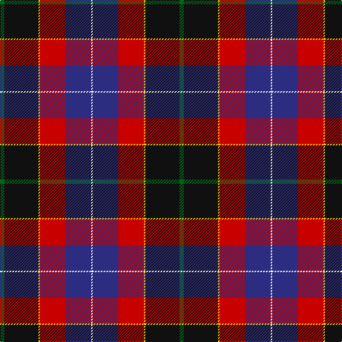

In pattern [GKYRBW](/patterns/gkyrbw/).

This was sourced from tartans-authority.  It is a [6 stripes tartan](/stripes/stripes6/).

Original link http://www.tartansauthority.com/tartan-ferret/display/11213/

## Thread count
G/6 K48 Y2 R36 DB36 W/2

## Palette
Each colour and its ΔE from the base-6 reference it is a variant of.

| Colour | Shade | Base | ΔE (OKLab) |
|---|---|---|---|
| DB | <code style="background-color:#2C2C80;">#2C2C80</code> `#2C2C80` | B <code style="background-color:#2C4084;">#2C4084</code> | 0.05 |
| G | <code style="background-color:#006818;">#006818</code> `#006818` | G <code style="background-color:#006400;">#006400</code> | 0.02 |
| K | <code style="background-color:#101010;">#101010</code> `#101010` | K <code style="background-color:#000000;">#000000</code> | 0.17 |
| R | <code style="background-color:#C80000;">#C80000</code> `#C80000` | R <code style="background-color:#C80000;">#C80000</code> | 0.00 |
| W | <code style="background-color:#FCFCFC;">#FCFCFC</code> `#FCFCFC` | W <code style="background-color:#F4F4F0;">#F4F4F0</code> | 0.03 |
| Y | <code style="background-color:#FCCC00;">#FCCC00</code> `#FCCC00` | Y <code style="background-color:#E8C000;">#E8C000</code> | 0.04 |

# Sample pattern

## Nearest tartans

The nearest existing variants by ΔTartan distance.

1. [Hegarty, Philip David (Personal)](/setts/s6/g6k48y2r36b36w2-b202060-g003c14-k1c1714-rc8002c-wf8f8f8-ye0a126/) — ΔT 0.55
1. [McKnight (Personal)](/setts/s7/b8y2r56ba50k20b10k6-b2c4084-ba141e46-k101010-rdc0000-ye8c000/) — ΔT 1.11
1. [G P Bathija (Shikarpur, Sindh)](/setts/s7/y8g36b8r16b16ra42w2-b000080-g003c14-ra32d18-ra960000-wf9f5ef-yfccc00/) — ΔT 1.13
1. [Regent Trade Tartan Tartan Number: 341. Earliest known date: 1819 See MacLaren See products available Copyright © Blair Urquhart, Comrie, 2015](/setts/s7/b36k14g10r8g14k2y4-b780078-g006818-k101010-rc80000-ye8c000/) — ΔT 1.15
1. [Loch Etive](/setts/s8/w6g4r42k52b36k4b6y6-b2c2c80-g289c18-k101010-rc80000-wc0c0c0-yfccc00/) — ΔT 1.19
1. [Regent](/setts/s7/b36k14g10r8g14k2y4-b480048-g006818-k101010-rc80000-ye8c000/) — ΔT 1.24
1. [Wishart Dress (Clan)](/setts/s7/k14b8r62ba6y4ba54w8-b2c2c80-ba202060-k000000-rc80000-wc8c8c8-ye8c000/) — ΔT 1.24
1. [Loch Etive](/setts/s8/w6g4r42k52b36k4b6y6-b2c4084-g00643c-k101010-rdc0000-we0e0e0-yfccc00/) — ΔT 1.28
1. [Regent](/setts/s7/b36k14g10r8g14k2y4-b800080-g008000-k000000-rc00000-yf0c000/) — ΔT 1.29
1. [Palazzo Bloise (Personal)](/setts/s6/b74g54r44w2ba12y10-b2c2c80-ba780078-g006818-r880000-we0e0e0-yfccc00/) — ΔT 1.33

## Neighbour map

Every grey dot is one of 15726 variants placed by the first two principal components of the ΔTartan feature space (44% of its variance). Red is this tartan; blue dots are its nearest — click one to open its page.

<svg viewBox="0 0 640 380" role="img" style="max-width:100%;height:auto;border:1px solid #e0e0e0;border-radius:4px;display:block" xmlns="http://www.w3.org/2000/svg"><image href="/nn/cloud.v1.png" width="640" height="380"/><a href="/setts/s6/g6k48y2r36b36w2-b202060-g003c14-k1c1714-rc8002c-wf8f8f8-ye0a126/"><circle cx="208.3" cy="145.7" r="4" fill="#3465a4"><title>Hegarty, Philip David (Personal)</title></circle></a><a href="/setts/s7/b8y2r56ba50k20b10k6-b2c4084-ba141e46-k101010-rdc0000-ye8c000/"><circle cx="222.1" cy="134.2" r="4" fill="#3465a4"><title>McKnight (Personal)</title></circle></a><a href="/setts/s7/y8g36b8r16b16ra42w2-b000080-g003c14-ra32d18-ra960000-wf9f5ef-yfccc00/"><circle cx="145.8" cy="144.2" r="4" fill="#3465a4"><title>G P Bathija (Shikarpur, Sindh)</title></circle></a><a href="/setts/s7/b36k14g10r8g14k2y4-b780078-g006818-k101010-rc80000-ye8c000/"><circle cx="208.1" cy="160.8" r="4" fill="#3465a4"><title>Regent Trade Tartan Tartan Number: 341. Earliest known date: 1819 See MacLaren See products available Copyright © Blair Urquhart, Comrie, 2015</title></circle></a><a href="/setts/s8/w6g4r42k52b36k4b6y6-b2c2c80-g289c18-k101010-rc80000-wc0c0c0-yfccc00/"><circle cx="154.3" cy="135.3" r="4" fill="#3465a4"><title>Loch Etive</title></circle></a><a href="/setts/s7/b36k14g10r8g14k2y4-b480048-g006818-k101010-rc80000-ye8c000/"><circle cx="211.9" cy="167.5" r="4" fill="#3465a4"><title>Regent</title></circle></a><a href="/setts/s7/k14b8r62ba6y4ba54w8-b2c2c80-ba202060-k000000-rc80000-wc8c8c8-ye8c000/"><circle cx="196.9" cy="127.0" r="4" fill="#3465a4"><title>Wishart Dress (Clan)</title></circle></a><a href="/setts/s8/w6g4r42k52b36k4b6y6-b2c4084-g00643c-k101010-rdc0000-we0e0e0-yfccc00/"><circle cx="149.5" cy="132.1" r="4" fill="#3465a4"><title>Loch Etive</title></circle></a><a href="/setts/s7/b36k14g10r8g14k2y4-b800080-g008000-k000000-rc00000-yf0c000/"><circle cx="183.1" cy="150.5" r="4" fill="#3465a4"><title>Regent</title></circle></a><a href="/setts/s6/b74g54r44w2ba12y10-b2c2c80-ba780078-g006818-r880000-we0e0e0-yfccc00/"><circle cx="208.2" cy="136.0" r="4" fill="#3465a4"><title>Palazzo Bloise (Personal)</title></circle></a><circle cx="192.9" cy="139.1" r="5" fill="#c00000"/></svg>

ID: /setts/s6/g6k48y2r36b36w2-b2c2c80-g006818-k101010-rc80000-wfcfcfc-yfccc00/
