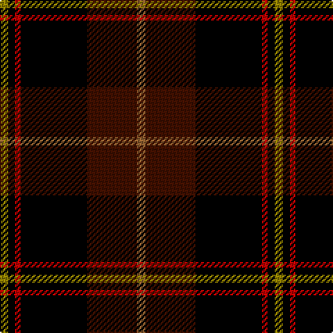

In pattern [GKRKBR](/patterns/gkrkbr/).

This was sourced from weddslist.  It is a [6 stripes tartan](/stripes/stripes6/).

Original link http://www.weddslist.com/cgi-bin/tartans/pg.pl?source=sts

## Thread count
LG/6 K5 R4 K48 DR36 LT/6

## Palette
Each colour and its ΔE from the base-6 reference it is a variant of.

| Colour | Shade | Base | ΔE (OKLab) |
|---|---|---|---|
| DR | <code style="background-color:#401000;">#401000</code> `#401000` | B <code style="background-color:#2A418A;">#2A418A</code> | 0.24 |
| K | <code style="background-color:#000000;">#000000</code> `#000000` | K <code style="background-color:#000000;">#000000</code> | 0.00 |
| LG | <code style="background-color:#908000;">#908000</code> `#908000` | G <code style="background-color:#006100;">#006100</code> | 0.20 |
| LT | <code style="background-color:#906030;">#906030</code> `#906030` | R <code style="background-color:#CC0000;">#CC0000</code> | 0.15 |
| R | <code style="background-color:#C00000;">#C00000</code> `#C00000` | R <code style="background-color:#CC0000;">#CC0000</code> | 0.03 |

# Sample pattern

## Nearest tartans

The nearest existing variants by ΔTartan distance.

1. [Drambuie](/setts/s6/w6r36k48ra4k5y6-k000000-r800000-ra906030-we0e0e0-yf0c000/) — ΔT 1.35
1. [Drambuie Hunting](/setts/s6/y6g36k48r4k5ya6-g68381c-k101010-rc80000-ya08858-yabc8c00/) — ΔT 1.44
1. [Black Raven](/setts/s7/k124b30ba30r40y10b10k30-b070552-ba46306e-k101010-rad6d14-yfbc684/) — ΔT 1.49
1. [Drambuie Dress](/setts/s6/w6g36k48r4k5y6-g604000-k101010-rc80000-we0e0e0-ye8c000/) — ΔT 1.53
1. [MacDonald, Sir John A](/setts/s11/r20k6g4w4k44b8k44r8g8r28w6-b00008c-g004c00-k000000-r8c0000-wc8c8c8/) — ΔT 1.57
1. [Royal Marines Condor](/setts/s7/k10r6k54ka74r10g4y4-g008000-k000000-ka000030-rc00000-yf0c000/) — ΔT 1.60
1. [Joe Strummer Commemorative](/setts/s7/k12g12ga24k48gb4gc8g8-g572700-ga794400-gb675223-gc524e26-k00011f/) — ΔT 1.61
1. [Drambuie](/setts/s6/w6r36k48y4k5ya6-k101010-r880000-we0e0e0-ya08858-yae8c000/) — ΔT 1.61
1. [York Region Pipe Band](/setts/s11/r20k6g4w4k44b8k44r8g8r28w6-b00008c-g007800-k000000-r8c0000-wc8c8c8/) — ΔT 1.62
1. [MacShimsi Personal Tartan Tartan Number: 7318. Earliest known date: 2007 Designed for the MacShimsi Clan in Dundee See products available Copyright © Blair Urquhart, Comrie, 2015](/setts/s5/r22b10g10k80y6-b601830-g285828-k101010-r882c4c-ydcd00c/) — ΔT 1.63

## Neighbour map

Every grey dot is one of 15726 variants placed by the first two principal components of the ΔTartan feature space (44% of its variance). Red is this tartan; blue dots are its nearest — click one to open its page.

<svg viewBox="0 0 640 380" role="img" style="max-width:100%;height:auto;border:1px solid #e0e0e0;border-radius:4px;display:block" xmlns="http://www.w3.org/2000/svg"><image href="/nn/cloud.v1.png" width="640" height="380"/><a href="/setts/s6/w6r36k48ra4k5y6-k000000-r800000-ra906030-we0e0e0-yf0c000/"><circle cx="250.7" cy="165.2" r="4" fill="#3465a4"><title>Drambuie</title></circle></a><a href="/setts/s6/y6g36k48r4k5ya6-g68381c-k101010-rc80000-ya08858-yabc8c00/"><circle cx="298.3" cy="186.9" r="4" fill="#3465a4"><title>Drambuie Hunting</title></circle></a><a href="/setts/s7/k124b30ba30r40y10b10k30-b070552-ba46306e-k101010-rad6d14-yfbc684/"><circle cx="286.8" cy="183.1" r="4" fill="#3465a4"><title>Black Raven</title></circle></a><a href="/setts/s6/w6g36k48r4k5y6-g604000-k101010-rc80000-we0e0e0-ye8c000/"><circle cx="264.4" cy="173.2" r="4" fill="#3465a4"><title>Drambuie Dress</title></circle></a><a href="/setts/s11/r20k6g4w4k44b8k44r8g8r28w6-b00008c-g004c00-k000000-r8c0000-wc8c8c8/"><circle cx="241.1" cy="158.4" r="4" fill="#3465a4"><title>MacDonald, Sir John A</title></circle></a><a href="/setts/s7/k10r6k54ka74r10g4y4-g008000-k000000-ka000030-rc00000-yf0c000/"><circle cx="281.4" cy="160.2" r="4" fill="#3465a4"><title>Royal Marines Condor</title></circle></a><a href="/setts/s7/k12g12ga24k48gb4gc8g8-g572700-ga794400-gb675223-gc524e26-k00011f/"><circle cx="281.5" cy="201.3" r="4" fill="#3465a4"><title>Joe Strummer Commemorative</title></circle></a><a href="/setts/s6/w6r36k48y4k5ya6-k101010-r880000-we0e0e0-ya08858-yae8c000/"><circle cx="264.5" cy="167.1" r="4" fill="#3465a4"><title>Drambuie</title></circle></a><a href="/setts/s11/r20k6g4w4k44b8k44r8g8r28w6-b00008c-g007800-k000000-r8c0000-wc8c8c8/"><circle cx="237.7" cy="156.9" r="4" fill="#3465a4"><title>York Region Pipe Band</title></circle></a><a href="/setts/s5/r22b10g10k80y6-b601830-g285828-k101010-r882c4c-ydcd00c/"><circle cx="364.2" cy="188.7" r="4" fill="#3465a4"><title>MacShimsi Personal Tartan Tartan Number: 7318. Earliest known date: 2007 Designed for the MacShimsi Clan in Dundee See products available Copyright © Blair Urquhart, Comrie, 2015</title></circle></a><circle cx="283.1" cy="185.8" r="5" fill="#c00000"/></svg>

ID: /setts/s6/g6k5r4k48b36ra6-b401000-g908000-k000000-rc00000-ra906030/
