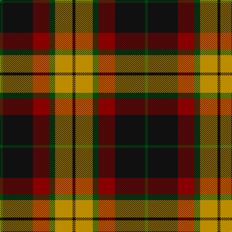

In pattern [GKRGYK](/patterns/gkrgyk/).

This was sourced from tartans-authority.  It is a [6 stripes tartan](/stripes/stripes6/).

Original link http://www.tartansauthority.com/tartan-ferret/display/2581/

## Attestations

This cloth appears in 2 source records; the oldest owns this page.

- pre 2002 — MacMillan - 2002 (Black - Unofficial (tartans-authority, [record](http://www.tartansauthority.com/tartan-ferret/display/2581/))
- undated — MacMillan Black Fashion Tartan Tartan Number: 2581. Earliest known date: pre 2002 This unauthorised and symmetrical version of the traditional asymmetrical MacMillan clan tartan is produced by Marton Mills of Yorkshire. Although not recognised as a MacMillan tartan by the Chief (Jan. 2008), it seems to have gained some popularity in the USA. Originally brought to light by a Graeme Ross of Aberdeen, there may be a sample in the Scottish Tartans Society archives. See products available Copyright © Blair Urquhart, Comrie, 2015 (house-of-tartan, [record](http://www.house-of-tartan.scotland.net/house/TartanViewjs.asp?colr=Def&tnam=2581))

## Thread count
DG/6 K62 DR34 DG12 DY36 K/6

## Palette
Each colour and its ΔE from the base-6 reference it is a variant of.

| Colour | Shade | Base | ΔE (OKLab) |
|---|---|---|---|
| DG | <code style="background-color:#004810;">#004810</code> `#004810` | G <code style="background-color:#006100;">#006100</code> | 0.09 |
| DR | <code style="background-color:#880000;">#880000</code> `#880000` | R <code style="background-color:#CC0000;">#CC0000</code> | 0.15 |
| DY | <code style="background-color:#BC8C00;">#BC8C00</code> `#BC8C00` | Y <code style="background-color:#F2BF00;">#F2BF00</code> | 0.16 |
| K | <code style="background-color:#101010;">#101010</code> `#101010` | K <code style="background-color:#000000;">#000000</code> | 0.17 |

# Sample pattern

## Nearest tartans

The nearest existing variants by ΔTartan distance.

1. [Portrait, The](/setts/s6/b8r44b8k44b64w8-b441800-k101010-ra07c58-we8ccb8/) — ΔT 0.67
1. [Thompson Black (Fashion)](/setts/s6/g12k60r32g8ra32k8-g006818-k101010-rc80000-ra888888/) — ΔT 0.74
1. [Lindsay Htg (Clan?)](/setts/s6/g12k60r32g8ra32k8-g006818-k101010-r880000-ra888888/) — ΔT 0.85
1. [Manson Family Tartan Tartan Number: 987. Earliest known date: 1983 The official recording of the sett shows the letter G for the dark green stripe. In heraldic terms this means 'Gules' - red. The designer, Hugh Kirkwood Rankine, clearly intended dark green and this is reproduced here. See products available Copyright © Blair Urquhart, Comrie, 2015](/setts/s8/g2r18g6k6g6r2k18w2-g006818-k101010-rc80000-we0e0e0/) — ΔT 0.85
1. [Wcwm 1062](/setts/s7/g6r40g32k44y12k6g4-g006818-k101010-rc80000-yd09800/) — ΔT 0.88
1. [Celtic Combat](/setts/s6/k4r40k16g36r6w4-g005010-k101010-rc04c04-we0e0e0/) — ΔT 0.91
1. [Strathspey, Check](/setts/s6/g6r44b10g20k20g4-b5480b0-g008000-k000000-rc00000/) — ΔT 0.91
1. [Logan - 1797 (Dark)](/setts/s7/k36y16k4y16g60r16k4-g003820-k101010-rc80000-ye08070/) — ΔT 0.91
1. [Dickie](/setts/s8/g16r4g24k12g6b12r48k8-b00008c-g146400-k000000-rc82800/) — ΔT 0.92
1. [Blackstock Hunting](/setts/s7/k8r28k24g48y4g4k8-g006818-k101010-rc80000-ye8c000/) — ΔT 0.92

## Neighbour map

Every grey dot is one of 15726 variants placed by the first two principal components of the ΔTartan feature space (44% of its variance). Red is this tartan; blue dots are its nearest — click one to open its page.

<svg viewBox="0 0 640 380" role="img" style="max-width:100%;height:auto;border:1px solid #e0e0e0;border-radius:4px;display:block" xmlns="http://www.w3.org/2000/svg"><image href="/nn/cloud.v1.png" width="640" height="380"/><a href="/setts/s6/b8r44b8k44b64w8-b441800-k101010-ra07c58-we8ccb8/"><circle cx="231.5" cy="224.8" r="4" fill="#3465a4"><title>Portrait, The</title></circle></a><a href="/setts/s6/g12k60r32g8ra32k8-g006818-k101010-rc80000-ra888888/"><circle cx="199.7" cy="222.8" r="4" fill="#3465a4"><title>Thompson Black (Fashion)</title></circle></a><a href="/setts/s6/g12k60r32g8ra32k8-g006818-k101010-r880000-ra888888/"><circle cx="210.8" cy="230.7" r="4" fill="#3465a4"><title>Lindsay Htg (Clan?)</title></circle></a><a href="/setts/s8/g2r18g6k6g6r2k18w2-g006818-k101010-rc80000-we0e0e0/"><circle cx="201.4" cy="192.4" r="4" fill="#3465a4"><title>Manson Family Tartan Tartan Number: 987. Earliest known date: 1983 The official recording of the sett shows the letter G for the dark green stripe. In heraldic terms this means 'Gules' - red. The designer, Hugh Kirkwood Rankine, clearly intended dark green and this is reproduced here. See products available Copyright © Blair Urquhart, Comrie, 2015</title></circle></a><a href="/setts/s7/g6r40g32k44y12k6g4-g006818-k101010-rc80000-yd09800/"><circle cx="177.5" cy="196.4" r="4" fill="#3465a4"><title>Wcwm 1062</title></circle></a><a href="/setts/s6/k4r40k16g36r6w4-g005010-k101010-rc04c04-we0e0e0/"><circle cx="236.1" cy="203.9" r="4" fill="#3465a4"><title>Celtic Combat</title></circle></a><a href="/setts/s6/g6r44b10g20k20g4-b5480b0-g008000-k000000-rc00000/"><circle cx="196.8" cy="194.8" r="4" fill="#3465a4"><title>Strathspey, Check</title></circle></a><a href="/setts/s7/k36y16k4y16g60r16k4-g003820-k101010-rc80000-ye08070/"><circle cx="212.4" cy="184.0" r="4" fill="#3465a4"><title>Logan - 1797 (Dark)</title></circle></a><a href="/setts/s8/g16r4g24k12g6b12r48k8-b00008c-g146400-k000000-rc82800/"><circle cx="198.6" cy="180.8" r="4" fill="#3465a4"><title>Dickie</title></circle></a><a href="/setts/s7/k8r28k24g48y4g4k8-g006818-k101010-rc80000-ye8c000/"><circle cx="227.1" cy="193.9" r="4" fill="#3465a4"><title>Blackstock Hunting</title></circle></a><circle cx="216.4" cy="209.9" r="5" fill="#c00000"/></svg>

ID: /setts/s6/g6k62r34g12y36k6-g004810-k101010-r880000-ybc8c00/
