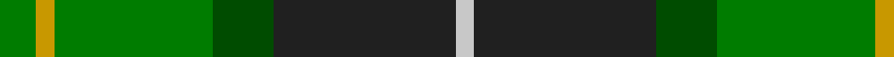

**Bands:** [GYGGBW](/stripes/gyggbw/) · **Stripes:** [G LY G DG DT LB](/stripes/stripes6/) G LY G DG DT LB

This was sourced from register-of-tartans.  It is a [6 band tartan](/bands/bands6/).

Original link https://www.tartanregister.gov.uk/tartanDetails.aspx?ref=4543

## Register references

External register numbers recorded for this tartan.

- Scottish Register of Tartans: [4543](https://www.tartanregister.gov.uk/tartanDetails.aspx?ref=4543)
- Scottish Tartans Authority (ITI): 4288

## Thread count
Ga/12 DY6 Ga52 G20 K60 N/6

## Palette
Each colour and its ΔE from the base-6 reference it is a variant of.

| Colour | Shade | Base | ΔE (OKLab) |
|---|---|---|---|
| DY | <code style="background-color:#C89800;">#C89800</code> `#C89800` | Y <code style="background-color:#F2BF00;">#F2BF00</code> | 0.12 |
| G | <code style="background-color:#004C00;">#004C00</code> `#004C00` | G <code style="background-color:#006100;">#006100</code> | 0.07 |
| Ga | <code style="background-color:#007C00;">#007C00</code> `#007C00` | G <code style="background-color:#006100;">#006100</code> | 0.09 |
| K | <code style="background-color:#202020;">#202020</code> `#202020` | B <code style="background-color:#2A418A;">#2A418A</code> | 0.20 |
| N | <code style="background-color:#C8C8C8;">#C8C8C8</code> `#C8C8C8` | W <code style="background-color:#F7F7F7;">#F7F7F7</code> | 0.14 |

# Sample pattern

## Nearest tartans

The nearest existing variants by ΔTartan distance.

1. [New Mexico](/setts/s7/g10db42r5dg42g42ly5g10/) — ΔT 0.75
1. [MacSween Hunting (Lochs, Isle of Lew](/setts/s7/g3r3g31dg18g4k22ly3/) — ΔT 0.80
1. [Leahy (Australia) (Personal)](/setts/s6/db2k6g2k6g12ly1~x4/) — ΔT 0.89
1. [Simple Technology (Corporate)](/setts/s5/r3g28db9dg18w3~x2/) — ΔT 0.96
1. [MPS Emerald Society NCLEES 2012](/setts/s6/ly4dg30g15db5t10ly4~x2/) — ΔT 1.15
1. [MPS Emerald Society](/setts/s6/ly4dg30g15db5b10ly4~x2/) — ΔT 1.15
1. [Valley, of the Green. (The )](/setts/s7/t4dg26g8t8g8g3t2~x2/) — ΔT 1.18
1. [Gorman, George (Personal)](/setts/s6/g9g1p2g1db4r1~x12/) — ΔT 1.25
1. [Cultoquhey Hotel](/setts/s5/r3db22k11g32ly3~x2/) — ΔT 1.26
1. [New Mexico (Fashion)](/setts/s7/g10dp42r5g42g42ly5g6/) — ΔT 1.26

## Neighbour map

Every grey dot is one of 14299 variants placed by the first two principal components of the ΔTartan feature space (44% of its variance). Red is this tartan; blue dots are its nearest — click one to open its page.

<svg viewBox="0 0 640 380" role="img" style="max-width:100%;height:auto;border:1px solid #e0e0e0;border-radius:4px;display:block" xmlns="http://www.w3.org/2000/svg"><image href="/nn/cloud.v1.png" width="640" height="380"/><a href="/setts/s7/g10db42r5dg42g42ly5g10/"><circle cx="187.9" cy="218.1" r="4" fill="#3465a4"><title>New Mexico</title></circle></a><a href="/setts/s7/g3r3g31dg18g4k22ly3/"><circle cx="240.1" cy="207.8" r="4" fill="#3465a4"><title>MacSween Hunting (Lochs, Isle of Lew</title></circle></a><a href="/setts/s6/db2k6g2k6g12ly1~x4/"><circle cx="217.2" cy="208.1" r="4" fill="#3465a4"><title>Leahy (Australia) (Personal)</title></circle></a><a href="/setts/s5/r3g28db9dg18w3~x2/"><circle cx="234.8" cy="231.6" r="4" fill="#3465a4"><title>Simple Technology (Corporate)</title></circle></a><a href="/setts/s6/ly4dg30g15db5t10ly4~x2/"><circle cx="174.7" cy="212.8" r="4" fill="#3465a4"><title>MPS Emerald Society NCLEES 2012</title></circle></a><a href="/setts/s6/ly4dg30g15db5b10ly4~x2/"><circle cx="178.5" cy="213.8" r="4" fill="#3465a4"><title>MPS Emerald Society</title></circle></a><a href="/setts/s7/t4dg26g8t8g8g3t2~x2/"><circle cx="252.8" cy="210.6" r="4" fill="#3465a4"><title>Valley, of the Green. (The )</title></circle></a><a href="/setts/s6/g9g1p2g1db4r1~x12/"><circle cx="247.1" cy="202.7" r="4" fill="#3465a4"><title>Gorman, George (Personal)</title></circle></a><a href="/setts/s5/r3db22k11g32ly3~x2/"><circle cx="226.5" cy="217.8" r="4" fill="#3465a4"><title>Cultoquhey Hotel</title></circle></a><a href="/setts/s7/g10dp42r5g42g42ly5g6/"><circle cx="171.8" cy="197.9" r="4" fill="#3465a4"><title>New Mexico (Fashion)</title></circle></a><circle cx="216.4" cy="211.9" r="5" fill="#c00000"/></svg>

ID: /setts/s6/g6ly3g26dg10dt30lb3~x2/
