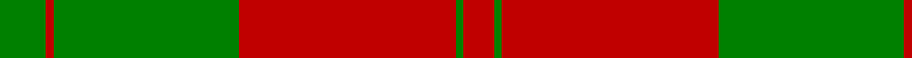
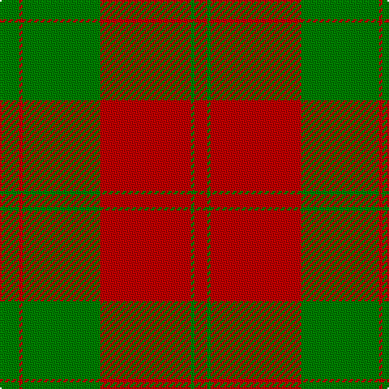

In pattern [GRGRGR](/patterns/grgrgr/).

This was sourced from weddslist.  It is a [6 stripes tartan](/stripes/stripes6/).

Original link http://www.weddslist.com/cgi-bin/tartans/pg.pl?source=sts

## Thread count
G/12 R2 G48 R56 G2 R/8

## Palette
Each colour and its ΔE from the base-6 reference it is a variant of.

| Colour | Shade | Base | ΔE (OKLab) |
|---|---|---|---|
| G | <code style="background-color:#008000;">#008000</code> `#008000` | G <code style="background-color:#006100;">#006100</code> | 0.10 |
| R | <code style="background-color:#C00000;">#C00000</code> `#C00000` | R <code style="background-color:#CC0000;">#CC0000</code> | 0.03 |

# Sample pattern

## Nearest tartans

The nearest existing variants by ΔTartan distance.

1. [Erskine (Green & Red) Clan Tartan Tartan Number: 891. Earliest known date: 1842 The Erskine clan or family originated in Renfrewshire. The first published version of the tartan appeared in the Vestiarium Scoticum, a romantic history of Scottish dress produced in 1842 by the Sobieski brothers. Cunningham tartan, published in the same work, differs only in the addition of a white stripe between the narrow green lines. Cunningham was one of the names adopted by the MacGregors, and this provides a tenuous connection which might explain the origin of the design. See products available Copyright © Blair Urquhart, Comrie, 2015](/setts/s6/g6r1g24r28g1r4x2~g006818-rc80000/) — ΔT 0.47
1. [Erskine](/setts/s6/g6r1g24r28g1r4x2~g004c00-rc80000/) — ΔT 0.83
1. [Erskine (Vestiarium Scoticum)](/setts/s6/g6r1g24r28g1r4x2~g00643c-rc80000/) — ΔT 0.93
1. [Yellow Pencil (Corporate)](/setts/s8/g48y9g6y9g12y4g2y16x2~g604000-ydc943c/) — ΔT 1.24
1. [Donachie](/setts/s10/r24g2r2g40r25g2r2g2r2g20x2~g008440-rc80000/) — ΔT 1.29
1. [MacGregor of Glen Strae](/setts/s5/g8r2g9r16g1x2~g008000-rc00000/) — ΔT 1.30
1. [MacGregor of Glen Straye Htg Clan Tartan Tartan Number: 866. Earliest known date: 1842 This sett appears in the text of the Vestiarium but is not illustrated. Glen Straye (Glenstrae) lies in the heart of Campbell country and was the scene of a noteable period in the history of Clan Gregor which led to the prosciption of the name. See products available Copyright © Blair Urquhart, Comrie, 2015](/setts/s5/g8r2g9r16g1x2~g006818-rc80000/) — ΔT 1.36
1. [Unidentified Cant #09](/setts/s8/r44b2g26r3b2r3g26b2~b2c2c80-g006818-rc80000/) — ΔT 1.38
1. [Spice Apple](/setts/s7/g4y1r22g12y4g4r4x4~g006818-rc80000-yd09800/) — ΔT 1.39
1. [MacQuarrie #5](/setts/s6/r16g1r1g1r4g12x4~g006818-rc80000/) — ΔT 1.43

## Neighbour map

Every grey dot is one of 15726 variants placed by the first two principal components of the ΔTartan feature space (44% of its variance). Red is this tartan; blue dots are its nearest — click one to open its page.

<svg viewBox="0 0 640 380" role="img" style="max-width:100%;height:auto;border:1px solid #e0e0e0;border-radius:4px;display:block" xmlns="http://www.w3.org/2000/svg"><image href="/nn/cloud.v1.png" width="640" height="380"/><a href="/setts/s6/g6r1g24r28g1r4x2~g006818-rc80000/"><circle cx="438.3" cy="199.4" r="4" fill="#3465a4"><title>Erskine (Green &amp; Red) Clan Tartan Tartan Number: 891. Earliest known date: 1842 The Erskine clan or family originated in Renfrewshire. The first published version of the tartan appeared in the Vestiarium Scoticum, a romantic history of Scottish dress produced in 1842 by the Sobieski brothers. Cunningham tartan, published in the same work, differs only in the addition of a white stripe between the narrow green lines. Cunningham was one of the names adopted by the MacGregors, and this provides a tenuous connection which might explain the origin of the design. See products available Copyright © Blair Urquhart, Comrie, 2015</title></circle></a><a href="/setts/s6/g6r1g24r28g1r4x2~g004c00-rc80000/"><circle cx="434.1" cy="198.2" r="4" fill="#3465a4"><title>Erskine</title></circle></a><a href="/setts/s6/g6r1g24r28g1r4x2~g00643c-rc80000/"><circle cx="444.5" cy="201.3" r="4" fill="#3465a4"><title>Erskine (Vestiarium Scoticum)</title></circle></a><a href="/setts/s8/g48y9g6y9g12y4g2y16x2~g604000-ydc943c/"><circle cx="476.6" cy="192.4" r="4" fill="#3465a4"><title>Yellow Pencil (Corporate)</title></circle></a><a href="/setts/s10/r24g2r2g40r25g2r2g2r2g20x2~g008440-rc80000/"><circle cx="424.0" cy="185.1" r="4" fill="#3465a4"><title>Donachie</title></circle></a><a href="/setts/s5/g8r2g9r16g1x2~g008000-rc00000/"><circle cx="386.5" cy="247.4" r="4" fill="#3465a4"><title>MacGregor of Glen Strae</title></circle></a><a href="/setts/s5/g8r2g9r16g1x2~g006818-rc80000/"><circle cx="393.8" cy="249.6" r="4" fill="#3465a4"><title>MacGregor of Glen Straye Htg Clan Tartan Tartan Number: 866. Earliest known date: 1842 This sett appears in the text of the Vestiarium but is not illustrated. Glen Straye (Glenstrae) lies in the heart of Campbell country and was the scene of a noteable period in the history of Clan Gregor which led to the prosciption of the name. See products available Copyright © Blair Urquhart, Comrie, 2015</title></circle></a><a href="/setts/s8/r44b2g26r3b2r3g26b2~b2c2c80-g006818-rc80000/"><circle cx="375.9" cy="171.0" r="4" fill="#3465a4"><title>Unidentified Cant #09</title></circle></a><a href="/setts/s7/g4y1r22g12y4g4r4x4~g006818-rc80000-yd09800/"><circle cx="368.7" cy="185.6" r="4" fill="#3465a4"><title>Spice Apple</title></circle></a><a href="/setts/s6/r16g1r1g1r4g12x4~g006818-rc80000/"><circle cx="457.2" cy="218.6" r="4" fill="#3465a4"><title>MacQuarrie #5</title></circle></a><circle cx="431.1" cy="197.3" r="5" fill="#c00000"/></svg>

ID: /setts/s6/g6r1g24r28g1r4x2~g008000-rc00000/
