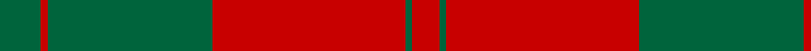
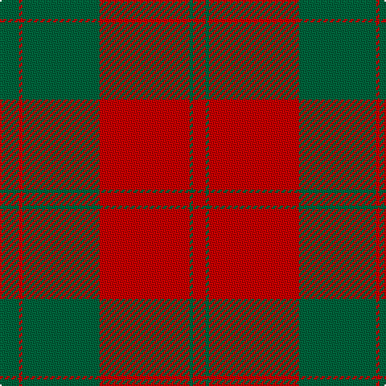

This page is one **sett** — a single exact thread-count. It belongs to the [tartan](/tartans/g6r1g24r28g1r4/)
(the same proportion at any scale), whose colour order is pattern [GRGRGR](/stripes/grgrgr/).

Sourced from register-of-tartans.  It is a [6 stripe tartan](/stripes/stripes6/).

Original link https://www.tartanregister.gov.uk/tartanDetails.aspx?ref=1119

4 attestations — the source records this cloth was collapsed from (oldest owns this page)

<ul>
<li>01/01/1842 — Erskine (Vestiarium Scoticum) (register-of-tartans, <a href="https://www.tartanregister.gov.uk/tartanDetails.aspx?ref=1119">record</a>)</li>
<li>1842 — Erskine (Clan) (tartans-authority, <a href="http://www.tartansauthority.com/tartan-ferret/display/891/">record</a>)</li>
<li>undated — Erskine (weddslist, <a href="http://www.weddslist.com/cgi-bin/tartans/pg.pl?source=sts">record</a>)</li>
<li>undated — Erskine (Green & Red) Clan Tartan Tartan Number: 891. Earliest known date: 1842 The Erskine clan or family originated in Renfrewshire. The first published version of the tartan appeared in the Vestiarium Scoticum, a romantic history of Scottish dress produced in 1842 by the Sobieski brothers. Cunningham tartan, published in the same work, differs only in the addition of a white stripe between the narrow green lines. Cunningham was one of the names adopted by the MacGregors, and this provides a tenuous connection which might explain the origin of the design. See products available Copyright © Blair Urquhart, Comrie, 2015 (house-of-tartan, <a href="http://www.house-of-tartan.scotland.net/house/TartanViewjs.asp?colr=Def&tnam=891">record</a>)</li>
</ul>

## Register references

External register numbers recorded for this tartan.

- Scottish Register of Tartans: [1119](https://www.tartanregister.gov.uk/tartanDetails.aspx?ref=1119)
- Scottish Tartans Authority (ITI): 891
- Scottish Tartans World Register: 891

## Thread count
G/12 R2 G48 R56 G2 R/8

## Palette

Palette: <strong>Tartan Register</strong>
<table><thead><tr><th>Colour</th><th>Threads</th><th>Shade</th><th>Base</th><th>OKLCh</th></tr></thead><tbody><tr><td>G/</td><td style="text-align:right;font-variant-numeric:tabular-nums">12</td><td><code style="background-color:#00643C;">#00643C</code> <small style="color:#888">#00643C</small></td><td>G <code style="background-color:#006100;">#006100</code></td><td><small style="color:#888">oklch(44.3% 0.104 157.7)</small></td></tr><tr><td>R</td><td style="text-align:right;font-variant-numeric:tabular-nums">2</td><td><code style="background-color:#C80000;">#C80000</code> <small style="color:#888">#C80000</small></td><td>R <code style="background-color:#CC0000;">#CC0000</code></td><td><small style="color:#888">oklch(52.3% 0.215 29.2)</small></td></tr><tr><td>G</td><td style="text-align:right;font-variant-numeric:tabular-nums">48</td><td><code style="background-color:#00643C;">#00643C</code> <small style="color:#888">#00643C</small></td><td>G <code style="background-color:#006100;">#006100</code></td><td><small style="color:#888">oklch(44.3% 0.104 157.7)</small></td></tr><tr><td>R</td><td style="text-align:right;font-variant-numeric:tabular-nums">56</td><td><code style="background-color:#C80000;">#C80000</code> <small style="color:#888">#C80000</small></td><td>R <code style="background-color:#CC0000;">#CC0000</code></td><td><small style="color:#888">oklch(52.3% 0.215 29.2)</small></td></tr><tr><td>G</td><td style="text-align:right;font-variant-numeric:tabular-nums">2</td><td><code style="background-color:#00643C;">#00643C</code> <small style="color:#888">#00643C</small></td><td>G <code style="background-color:#006100;">#006100</code></td><td><small style="color:#888">oklch(44.3% 0.104 157.7)</small></td></tr><tr><td>R/</td><td style="text-align:right;font-variant-numeric:tabular-nums">8</td><td><code style="background-color:#C80000;">#C80000</code> <small style="color:#888">#C80000</small></td><td>R <code style="background-color:#CC0000;">#CC0000</code></td><td><small style="color:#888">oklch(52.3% 0.215 29.2)</small></td></tr></tbody></table>

# Sample pattern

## Nearest tartans

The nearest existing variants by ΔTartan distance, with this tartan at the top so the swatches line up against it.

ΔTartan

Tartan

Sett

—

<a href="/ttd/edit/#slug=g6r1g24r28g1r4~x2">Erskine (Vestiarium Scoticum)</a> <a class="nn-out" href="/setts/s6/g6r1g24r28g1r4~x2/" title="open its dictionary page">↗</a>

0.65

<a href="/ttd/edit/#slug=dg6r1dg24r28dg1r4~x2">Erskine</a> <a class="nn-out" href="/setts/s6/dg6r1dg24r28dg1r4~x2/" title="open its dictionary page">↗</a>

1.24

<a href="/ttd/edit/#slug=r16g1r1g1r4g12~x4">MacQuarrie #5</a> <a class="nn-out" href="/setts/s6/r16g1r1g1r4g12~x4/" title="open its dictionary page">↗</a>

1.34

<a href="/ttd/edit/#slug=r16dg1r1dg1r4dg12">MacQuarrie</a> <a class="nn-out" href="/setts/s6/r16dg1r1dg1r4dg12/" title="open its dictionary page">↗</a>

1.35

<a href="/ttd/edit/#slug=r16dg1r1dg1r4dg12~x2">MacQuarrie 7</a> <a class="nn-out" href="/setts/s6/r16dg1r1dg1r4dg12~x2/" title="open its dictionary page">↗</a>

1.36

<a href="/setts/s8/r44db2g26r3db2/">Unidentified Cant #09</a>

1.39

<a href="/ttd/edit/#slug=r1g10r1db4r18g1~x4">Robertson 6</a> <a class="nn-out" href="/setts/s6/r1g10r1db4r18g1~x4/" title="open its dictionary page">↗</a>

1.42

<a href="/ttd/edit/#slug=r4g4lo4g12r22lo1g4~x4">Spice Apple</a> <a class="nn-out" href="/setts/s7/r4g4lo4g12r22lo1g4~x4/" title="open its dictionary page">↗</a>

1.42

<a href="/ttd/edit/#slug=r22db5r2g11r3db1~x2">MacKintosh 1</a> <a class="nn-out" href="/setts/s6/r22db5r2g11r3db1~x2/" title="open its dictionary page">↗</a>

1.44

<a href="/ttd/edit/#slug=dy48lo9dy6lo9dy12lo4dy2lo16~x2">Yellow Pencil (Corporate)</a> <a class="nn-out" href="/setts/s8/dy48lo9dy6lo9dy12lo4dy2lo16~x2/" title="open its dictionary page">↗</a>

1.44

<a href="/ttd/edit/#slug=r68db18r9g34r9db3~x2">MacKintosh 3</a> <a class="nn-out" href="/setts/s6/r68db18r9g34r9db3~x2/" title="open its dictionary page">↗</a>

## Neighbour map

Every grey dot is one of 14299 variants placed by the first two principal components of the ΔTartan feature space (44% of its variance). Red is this tartan; blue dots are its nearest — click one to open its page.

<svg viewBox="0 0 640 380" role="img" style="max-width:100%;height:auto;border:1px solid #e0e0e0;border-radius:4px;display:block" xmlns="http://www.w3.org/2000/svg"><image href="/nn/cloud.v1.png" width="640" height="380"/><a href="/setts/s6/dg6r1dg24r28dg1r4~x2/"><circle cx="434.3" cy="195.1" r="4" fill="#3465a4"><title>Erskine</title></circle></a><a href="/setts/s6/r16g1r1g1r4g12~x4/"><circle cx="456.7" cy="215.1" r="4" fill="#3465a4"><title>MacQuarrie #5</title></circle></a><a href="/setts/s6/r16dg1r1dg1r4dg12/"><circle cx="451.9" cy="212.8" r="4" fill="#3465a4"><title>MacQuarrie</title></circle></a><a href="/setts/s6/r16dg1r1dg1r4dg12~x2/"><circle cx="455.0" cy="215.4" r="4" fill="#3465a4"><title>MacQuarrie 7</title></circle></a><a href="/setts/s8/r44db2g26r3db2/"><circle cx="376.6" cy="170.3" r="4" fill="#3465a4"><title>Unidentified Cant #09</title></circle></a><a href="/setts/s6/r1g10r1db4r18g1~x4/"><circle cx="397.7" cy="186.3" r="4" fill="#3465a4"><title>Robertson 6</title></circle></a><a href="/setts/s7/r4g4lo4g12r22lo1g4~x4/"><circle cx="368.7" cy="184.3" r="4" fill="#3465a4"><title>Spice Apple</title></circle></a><a href="/setts/s6/r22db5r2g11r3db1~x2/"><circle cx="425.0" cy="185.2" r="4" fill="#3465a4"><title>MacKintosh 1</title></circle></a><a href="/setts/s8/dy48lo9dy6lo9dy12lo4dy2lo16~x2/"><circle cx="476.5" cy="188.9" r="4" fill="#3465a4"><title>Yellow Pencil (Corporate)</title></circle></a><a href="/setts/s6/r68db18r9g34r9db3~x2/"><circle cx="419.1" cy="187.8" r="4" fill="#3465a4"><title>MacKintosh 3</title></circle></a><circle cx="444.6" cy="199.6" r="5" fill="#c00000"/></svg>

ID: /setts/s6/g6r1g24r28g1r4~x2/
