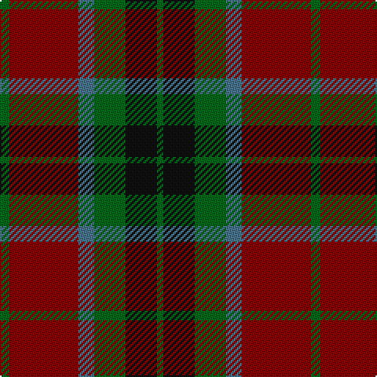

In pattern [GKGBRG](/patterns/gkgbrg/).

This was sourced from tartans-authority.  It is a [6 stripes tartan](/stripes/stripes6/).

Original link http://www.tartansauthority.com/tartan-ferret/display/777/

## Thread count
G/6 DR44 B10 G20 K20 G/4

## Palette
Each colour and its ΔE from the base-6 reference it is a variant of.

| Colour | Shade | Base | ΔE (OKLab) |
|---|---|---|---|
| B | <code style="background-color:#48748C;">#48748C</code> `#48748C` | B <code style="background-color:#2A418A;">#2A418A</code> | 0.16 |
| DR | <code style="background-color:#880000;">#880000</code> `#880000` | R <code style="background-color:#CC0000;">#CC0000</code> | 0.15 |
| G | <code style="background-color:#006818;">#006818</code> `#006818` | G <code style="background-color:#006100;">#006100</code> | 0.02 |
| K | <code style="background-color:#101010;">#101010</code> `#101010` | K <code style="background-color:#000000;">#000000</code> | 0.17 |

# Sample pattern

## Nearest tartans

The nearest existing variants by ΔTartan distance.

1. [Canadian Autumn](/setts/s6/g8r56b12g20k20g6-b1c0070-g006818-k101010-r880000/) — ΔT 0.58
1. [(2) Cook](/setts/s7/g24b12g12r30k2r2k4-b006090-g004c00-k000000-r800000/) — ΔT 0.83
1. [Fraser Green](/setts/s6/w8b48g24b4ba24b4-b4c0000-ba5c5c5c-g447438-wc0c0c0/) — ΔT 0.89
1. [Loch Rannoch Trade Tartan Tartan Number: 1735. Earliest known date: 1975 Nothing See products available Copyright © Blair Urquhart, Comrie, 2015](/setts/s8/b48g4b10y28g4y10ga34b4-b441800-g006818-ga604000-ya08858/) — ΔT 0.94
1. [Eyre (Personal)](/setts/s6/r6b24r8g36r12k4-b202060-g006818-k101010-rc80000/) — ΔT 0.96
1. [MacTavish Hunting](/setts/s6/b8g56ga12b24k24b6-b5c8ca8-g603800-ga006818-k101010/) — ΔT 0.97
1. [McInery (Personal)](/setts/s8/r16g4r24k12r6b6g48k4-b1c0070-g006818-k101010-r880000/) — ΔT 1.01
1. [McCarthy, Old](/setts/s5/b14r52b14g48y4-b202060-g003820-r880000-ye8c000/) — ΔT 1.04
1. [Cook (Name)](/setts/s7/g24ga12g12r30k2r2k4-g003820-ga048888-k101010-rc80000/) — ΔT 1.05
1. [Thompson Hunting Family Tartan Tartan Number: 2093. Earliest known date: 1958 Designed for Lord Thomson of Fleet in 1958 based on a sample in the Moy Hall collection dating from the mid 19th century. The tartan is also suitable for MacTavishs and Thompsons, who claim descent from the Clan MacIntosh. See products available Copyright © Blair Urquhart, Comrie, 2015](/setts/s6/b8g56ga12b24k24b6-b5c8ca8-g604000-ga006818-k101010/) — ΔT 1.06

## Neighbour map

Every grey dot is one of 15726 variants placed by the first two principal components of the ΔTartan feature space (44% of its variance). Red is this tartan; blue dots are its nearest — click one to open its page.

<svg viewBox="0 0 640 380" role="img" style="max-width:100%;height:auto;border:1px solid #e0e0e0;border-radius:4px;display:block" xmlns="http://www.w3.org/2000/svg"><image href="/nn/cloud.v1.png" width="640" height="380"/><a href="/setts/s6/g8r56b12g20k20g6-b1c0070-g006818-k101010-r880000/"><circle cx="266.2" cy="223.4" r="4" fill="#3465a4"><title>Canadian Autumn</title></circle></a><a href="/setts/s7/g24b12g12r30k2r2k4-b006090-g004c00-k000000-r800000/"><circle cx="272.3" cy="206.2" r="4" fill="#3465a4"><title>(2) Cook</title></circle></a><a href="/setts/s6/w8b48g24b4ba24b4-b4c0000-ba5c5c5c-g447438-wc0c0c0/"><circle cx="287.0" cy="209.8" r="4" fill="#3465a4"><title>Fraser Green</title></circle></a><a href="/setts/s8/b48g4b10y28g4y10ga34b4-b441800-g006818-ga604000-ya08858/"><circle cx="275.4" cy="202.0" r="4" fill="#3465a4"><title>Loch Rannoch Trade Tartan Tartan Number: 1735. Earliest known date: 1975 Nothing See products available Copyright © Blair Urquhart, Comrie, 2015</title></circle></a><a href="/setts/s6/r6b24r8g36r12k4-b202060-g006818-k101010-rc80000/"><circle cx="213.7" cy="221.9" r="4" fill="#3465a4"><title>Eyre (Personal)</title></circle></a><a href="/setts/s6/b8g56ga12b24k24b6-b5c8ca8-g603800-ga006818-k101010/"><circle cx="235.5" cy="227.2" r="4" fill="#3465a4"><title>MacTavish Hunting</title></circle></a><a href="/setts/s8/r16g4r24k12r6b6g48k4-b1c0070-g006818-k101010-r880000/"><circle cx="278.8" cy="197.4" r="4" fill="#3465a4"><title>McInery (Personal)</title></circle></a><a href="/setts/s5/b14r52b14g48y4-b202060-g003820-r880000-ye8c000/"><circle cx="272.1" cy="236.0" r="4" fill="#3465a4"><title>McCarthy, Old</title></circle></a><a href="/setts/s7/g24ga12g12r30k2r2k4-g003820-ga048888-k101010-rc80000/"><circle cx="251.2" cy="189.4" r="4" fill="#3465a4"><title>Cook (Name)</title></circle></a><a href="/setts/s6/b8g56ga12b24k24b6-b5c8ca8-g604000-ga006818-k101010/"><circle cx="236.5" cy="228.4" r="4" fill="#3465a4"><title>Thompson Hunting Family Tartan Tartan Number: 2093. Earliest known date: 1958 Designed for Lord Thomson of Fleet in 1958 based on a sample in the Moy Hall collection dating from the mid 19th century. The tartan is also suitable for MacTavishs and Thompsons, who claim descent from the Clan MacIntosh. See products available Copyright © Blair Urquhart, Comrie, 2015</title></circle></a><circle cx="250.0" cy="222.5" r="5" fill="#c00000"/></svg>

ID: /setts/s6/g6r44b10g20k20g4-b48748c-g006818-k101010-r880000/
