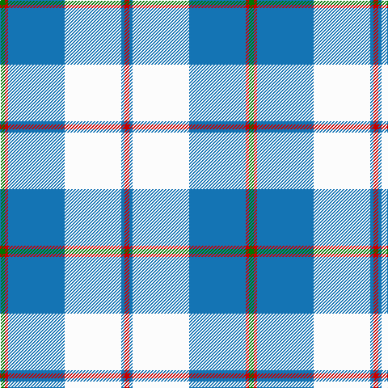

In pattern [GRBWBR](/patterns/grbwbr/).

This was sourced from tartans-authority.  It is a [6 stripes tartan](/stripes/stripes6/).

Original link http://www.tartansauthority.com/tartan-ferret/display/4953/

## Thread count
G/6 R4 B70 W70 B4 R/6

## Palette
Each colour and its ΔE from the base-6 reference it is a variant of.

| Colour | Shade | Base | ΔE (OKLab) |
|---|---|---|---|
| B | <code style="background-color:#1474B4;">#1474B4</code> `#1474B4` | B <code style="background-color:#2C4084;">#2C4084</code> | 0.15 |
| G | <code style="background-color:#007800;">#007800</code> `#007800` | G <code style="background-color:#006400;">#006400</code> | 0.06 |
| R | <code style="background-color:#C80000;">#C80000</code> `#C80000` | R <code style="background-color:#C80000;">#C80000</code> | 0.00 |
| W | <code style="background-color:#FCFCFC;">#FCFCFC</code> `#FCFCFC` | W <code style="background-color:#F4F4F0;">#F4F4F0</code> | 0.03 |

# Sample pattern

## Nearest tartans

The nearest existing variants by ΔTartan distance.

1. [Torridon, Royal Blue (Dance)](/setts/s7/b6ba4w4ba60w60r4w6-b003c64-ba0c5488-rc80000-wf0e0c8/) — ΔT 0.87
1. [St. John's (Corporate)](/setts/s7/w12b6w90ba72w6y18b6-b1c0070-ba2888c4-we0e0e0-ye8c000/) — ΔT 0.95
1. [MacPherson Turquoise Dress Tartan Tartan Number: 8183. Earliest known date: Threadcount and colours aren't 100% original. Generated manually. See products available Copyright © Blair Urquhart, Comrie, 2015](/setts/s7/w8k4w52b46w6b16ba6-b2888c4-ba8c008c-k101010-we0e0e0/) — ΔT 1.06
1. [Galloway (Dance)](/setts/s10/g6r4b70w70b4r6b4w70b70r4-b1474b4-g007800-rc80000-wfcfcfc/) — ΔT 1.13
1. [Lennox Turquoise Dress District Tartan Tartan Number: 8190. Earliest known date: pre 2003 Families with the surname 'Lennox' are usually considered related to Clans Stewart or MacFarlane. Some of this surname also choose to wear the distinctive and ancient 'Lennox' tartan. D W Stewart reproduced the sett from a 'lost' portrait of the Countess of Lennox dating from the 16th century./Threadcount and colours aren't 100% original. Generated manually./ See products available Copyright © Blair Urquhart, Comrie, 2015](/setts/s7/b16ba4b48ba10w52k4w16-b5c8ca8-ba2c2c80-k101010-we0e0e0/) — ΔT 1.18
1. [Longniddry, dress (Turquoise)](/setts/s8/b84k4w4k4b10ba24w64b8-b5480b0-ba606080-k000000-we0e0e0/) — ΔT 1.18
1. [Galicia](/setts/s6/b106k4w106k4r8y14-b788cb4-k000000-r9c0000-wfcfcfc-yc89800/) — ΔT 1.34
1. [Cunningham, Dress Blue (Dance) Fashion Tartan Tartan Number: 4642. Earliest known date: 01/01/2002 Like so many of the invented 'Dance' tartans this one is not known by the relevant Clan Cunningham Association (USA). /Threadcount and colours aren't 100% original. Generated manually./ See products available Copyright © Blair Urquhart, Comrie, 2015](/setts/s7/b8ba4k4ba80w80ba4w8-b2888c4-ba2c2c80-k101010-we0e0e0/) — ΔT 1.38
1. [Children's Wish Foundation of Canada](/setts/s8/y10k4w32k10ya58k4y4k4-k101010-wfcfcfc-yfccc00-ya48a4c0/) — ΔT 1.42
1. [Bonnie Royal](/setts/s6/w10b64g24b4w60k8-b2c2c80-g289c18-k101010-wfcfcfc/) — ΔT 1.45

## Neighbour map

Every grey dot is one of 15726 variants placed by the first two principal components of the ΔTartan feature space (44% of its variance). Red is this tartan; blue dots are its nearest — click one to open its page.

<svg viewBox="0 0 640 380" role="img" style="max-width:100%;height:auto;border:1px solid #e0e0e0;border-radius:4px;display:block" xmlns="http://www.w3.org/2000/svg"><image href="/nn/cloud.v1.png" width="640" height="380"/><a href="/setts/s7/b6ba4w4ba60w60r4w6-b003c64-ba0c5488-rc80000-wf0e0c8/"><circle cx="282.6" cy="143.2" r="4" fill="#3465a4"><title>Torridon, Royal Blue (Dance)</title></circle></a><a href="/setts/s7/w12b6w90ba72w6y18b6-b1c0070-ba2888c4-we0e0e0-ye8c000/"><circle cx="284.9" cy="154.0" r="4" fill="#3465a4"><title>St. John's (Corporate)</title></circle></a><a href="/setts/s7/w8k4w52b46w6b16ba6-b2888c4-ba8c008c-k101010-we0e0e0/"><circle cx="276.2" cy="172.3" r="4" fill="#3465a4"><title>MacPherson Turquoise Dress Tartan Tartan Number: 8183. Earliest known date: Threadcount and colours aren't 100% original. Generated manually. See products available Copyright © Blair Urquhart, Comrie, 2015</title></circle></a><a href="/setts/s10/g6r4b70w70b4r6b4w70b70r4-b1474b4-g007800-rc80000-wfcfcfc/"><circle cx="268.3" cy="132.3" r="4" fill="#3465a4"><title>Galloway (Dance)</title></circle></a><a href="/setts/s7/b16ba4b48ba10w52k4w16-b5c8ca8-ba2c2c80-k101010-we0e0e0/"><circle cx="247.5" cy="177.1" r="4" fill="#3465a4"><title>Lennox Turquoise Dress District Tartan Tartan Number: 8190. Earliest known date: pre 2003 Families with the surname 'Lennox' are usually considered related to Clans Stewart or MacFarlane. Some of this surname also choose to wear the distinctive and ancient 'Lennox' tartan. D W Stewart reproduced the sett from a 'lost' portrait of the Countess of Lennox dating from the 16th century./Threadcount and colours aren't 100% original. Generated manually./ See products available Copyright © Blair Urquhart, Comrie, 2015</title></circle></a><a href="/setts/s8/b84k4w4k4b10ba24w64b8-b5480b0-ba606080-k000000-we0e0e0/"><circle cx="293.9" cy="137.0" r="4" fill="#3465a4"><title>Longniddry, dress (Turquoise)</title></circle></a><a href="/setts/s6/b106k4w106k4r8y14-b788cb4-k000000-r9c0000-wfcfcfc-yc89800/"><circle cx="258.4" cy="111.7" r="4" fill="#3465a4"><title>Galicia</title></circle></a><a href="/setts/s7/b8ba4k4ba80w80ba4w8-b2888c4-ba2c2c80-k101010-we0e0e0/"><circle cx="286.0" cy="130.0" r="4" fill="#3465a4"><title>Cunningham, Dress Blue (Dance) Fashion Tartan Tartan Number: 4642. Earliest known date: 01/01/2002 Like so many of the invented 'Dance' tartans this one is not known by the relevant Clan Cunningham Association (USA). /Threadcount and colours aren't 100% original. Generated manually./ See products available Copyright © Blair Urquhart, Comrie, 2015</title></circle></a><a href="/setts/s8/y10k4w32k10ya58k4y4k4-k101010-wfcfcfc-yfccc00-ya48a4c0/"><circle cx="212.8" cy="135.7" r="4" fill="#3465a4"><title>Children's Wish Foundation of Canada</title></circle></a><a href="/setts/s6/w10b64g24b4w60k8-b2c2c80-g289c18-k101010-wfcfcfc/"><circle cx="195.1" cy="163.9" r="4" fill="#3465a4"><title>Bonnie Royal</title></circle></a><circle cx="268.8" cy="145.4" r="5" fill="#c00000"/></svg>

ID: /setts/s6/g6r4b70w70b4r6-b1474b4-g007800-rc80000-wfcfcfc/
