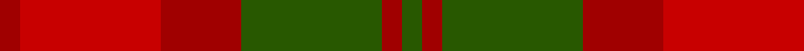
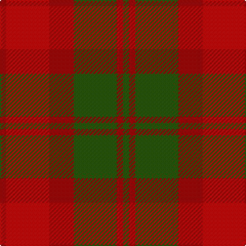

In pattern [GRGRRR](/patterns/grgrrr/).

This was sourced from tartans-authority.  It is a [6 stripes tartan](/stripes/stripes6/).

Original link http://www.tartansauthority.com/tartan-ferret/display/3400/

## Thread count
DR/6 R42 DR24 G42 DR6 G/6

## Palette
Each colour and its ΔE from the base-6 reference it is a variant of.

| Colour | Shade | Base | ΔE (OKLab) |
|---|---|---|---|
| DR | <code style="background-color:#A00000;">#A00000</code> `#A00000` | R <code style="background-color:#CC0000;">#CC0000</code> | 0.09 |
| G | <code style="background-color:#285800;">#285800</code> `#285800` | G <code style="background-color:#006100;">#006100</code> | 0.03 |
| R | <code style="background-color:#C80000;">#C80000</code> `#C80000` | R <code style="background-color:#CC0000;">#CC0000</code> | 0.01 |

# Sample pattern

## Nearest tartans

The nearest existing variants by ΔTartan distance.

1. [MacNab #2](/setts/s6/g4r4g28r16ra28r4-g006818-ra00048-rac80000/) — ΔT 0.96
1. [MacNab, Variant](/setts/s6/g4r4g28r16ra28r4-g008000-r900030-rac00000/) — ΔT 1.21
1. [Wcwm 1155](/setts/s10/b28ba8b8ba8b8ba24r56ba8r8ba8-b4c3428-ba441800-rc80000/) — ΔT 1.47
1. [Dewar](/setts/s10/g4ga4g28ga16r28ga4r28ga16g28ga4-g006818-ga604000-rc80000/) — ΔT 1.52
1. [Harmony 8](/setts/s5/b8g40r60b40g8-b401000-g808080-r906030/) — ΔT 1.56
1. [Cetoloni](/setts/s6/b4r44g22ga4g22b4-b304080-g604000-ga908000-rc00020/) — ΔT 1.59
1. [Glen Esk (1993)](/setts/s7/g8r4g32r20ga20r4ga8-g005020-ga5c6428-rdc0000/) — ΔT 1.61
1. [Callum (Buchan) (Name)](/setts/s5/b56r8ba48r64y8-b5c5c5c-ba344054-rc80000-ya0a0a0/) — ΔT 1.66
1. [MacNab](/setts/s13/g16r2g2r2g2r12ra16r2ra16r12g14r2g2-g004c00-rc80000-rab00000/) — ΔT 1.67
1. [Cetoloni Family Tartan Tartan Number: 2049. Earliest known date: November 1991 The Cetoloni tartan was designed with the colours of the Border Hills, 'the sky at its best, the rooftop skyline of Siena and the golden sun of Tuscany'. Franco Cetoloni of Liddlevale was born in Badia Roti Bucine in Arezzo, Italy. Jayne was a designer at Pringle's knitwear in Hawick. Red is Sienna red. See products available Copyright © Blair Urquhart, Comrie, 2015](/setts/s6/b4r44g22y4g22b4-b2c2c80-g604000-ra03400-ye8c000/) — ΔT 1.70

## Neighbour map

Every grey dot is one of 15726 variants placed by the first two principal components of the ΔTartan feature space (44% of its variance). Red is this tartan; blue dots are its nearest — click one to open its page.

<svg viewBox="0 0 640 380" role="img" style="max-width:100%;height:auto;border:1px solid #e0e0e0;border-radius:4px;display:block" xmlns="http://www.w3.org/2000/svg"><image href="/nn/cloud.v1.png" width="640" height="380"/><a href="/setts/s6/g4r4g28r16ra28r4-g006818-ra00048-rac80000/"><circle cx="261.7" cy="249.2" r="4" fill="#3465a4"><title>MacNab #2</title></circle></a><a href="/setts/s6/g4r4g28r16ra28r4-g008000-r900030-rac00000/"><circle cx="252.0" cy="246.6" r="4" fill="#3465a4"><title>MacNab, Variant</title></circle></a><a href="/setts/s10/b28ba8b8ba8b8ba24r56ba8r8ba8-b4c3428-ba441800-rc80000/"><circle cx="298.2" cy="229.1" r="4" fill="#3465a4"><title>Wcwm 1155</title></circle></a><a href="/setts/s10/g4ga4g28ga16r28ga4r28ga16g28ga4-g006818-ga604000-rc80000/"><circle cx="252.0" cy="249.8" r="4" fill="#3465a4"><title>Dewar</title></circle></a><a href="/setts/s5/b8g40r60b40g8-b401000-g808080-r906030/"><circle cx="256.7" cy="273.3" r="4" fill="#3465a4"><title>Harmony 8</title></circle></a><a href="/setts/s6/b4r44g22ga4g22b4-b304080-g604000-ga908000-rc00020/"><circle cx="354.0" cy="227.8" r="4" fill="#3465a4"><title>Cetoloni</title></circle></a><a href="/setts/s7/g8r4g32r20ga20r4ga8-g005020-ga5c6428-rdc0000/"><circle cx="270.3" cy="253.9" r="4" fill="#3465a4"><title>Glen Esk (1993)</title></circle></a><a href="/setts/s5/b56r8ba48r64y8-b5c5c5c-ba344054-rc80000-ya0a0a0/"><circle cx="258.0" cy="258.4" r="4" fill="#3465a4"><title>Callum (Buchan) (Name)</title></circle></a><a href="/setts/s13/g16r2g2r2g2r12ra16r2ra16r12g14r2g2-g004c00-rc80000-rab00000/"><circle cx="257.3" cy="212.5" r="4" fill="#3465a4"><title>MacNab</title></circle></a><a href="/setts/s6/b4r44g22y4g22b4-b2c2c80-g604000-ra03400-ye8c000/"><circle cx="356.9" cy="236.0" r="4" fill="#3465a4"><title>Cetoloni Family Tartan Tartan Number: 2049. Earliest known date: November 1991 The Cetoloni tartan was designed with the colours of the Border Hills, 'the sky at its best, the rooftop skyline of Siena and the golden sun of Tuscany'. Franco Cetoloni of Liddlevale was born in Badia Roti Bucine in Arezzo, Italy. Jayne was a designer at Pringle's knitwear in Hawick. Red is Sienna red. See products available Copyright © Blair Urquhart, Comrie, 2015</title></circle></a><circle cx="285.8" cy="259.7" r="5" fill="#c00000"/></svg>

ID: /setts/s6/g6r6g42r24ra42r6-g285800-ra00000-rac80000/
