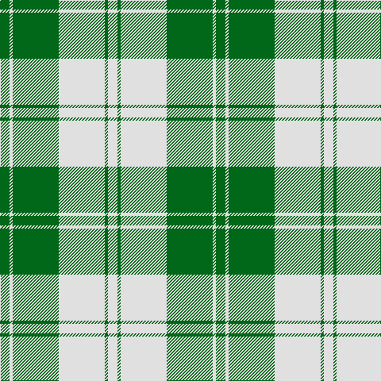

In pattern [GWGWGW](/patterns/gwgwgw/).

This was sourced from house-of-tartan.  It is a [6 stripes tartan](/stripes/stripes6/).

Original link http://www.house-of-tartan.scotland.net/house/TartanViewjs.asp?colr=Def&tnam=941

## Thread count
G/12 LN4 G58 LN58 G4 LN/12

## Palette
Each colour and its ΔE from the base-6 reference it is a variant of.

| Colour | Shade | Base | ΔE (OKLab) |
|---|---|---|---|
| G | <code style="background-color:#006818;">#006818</code> `#006818` | G <code style="background-color:#006100;">#006100</code> | 0.02 |
| LN | <code style="background-color:#E0E0E0;">#E0E0E0</code> `#E0E0E0` | W <code style="background-color:#F7F7F7;">#F7F7F7</code> | 0.07 |

# Sample pattern

## Nearest tartans

The nearest existing variants by ΔTartan distance.

1. [Erskine, Green (Dance)](/setts/s6/g6w2g29w29g2w6x2~g006818-wfcfcfc/) — ΔT 0.53
1. [Erskine Green](/setts/s6/g6w2g29w29g2w6x2~g005020-we0e0e0/) — ΔT 0.59
1. [Erskine, Green](/setts/s6/g6w2g29w29g2w6x2~g008000-we0e0e0/) — ΔT 0.60
1. [Wallace Green Dress Fashion Tartan Tartan Number: 2212. Earliest known date: pre 2004 A dancers tartan based on the Wallace See products available Copyright © Blair Urquhart, Comrie, 2015](/setts/s6/w12g12w1g12w12y1x4~g006818-we0e0e0-ya08858/) — ΔT 1.53
1. [Bundy, Dress Black Personal)](/setts/s8/g1g1w1g15w15g1w1g1x4~g006818-wf8f8f8/) — ΔT 1.54
1. [Lewis, Green (Dance)](/setts/s4/g4w35ga31w4x2~g003820-ga006818-wf0e0c8/) — ΔT 1.63
1. [Burns (Fashion)](/setts/s6/w15b6w1b3r3w1x4~b3c3c3c-rb0781c-wf8f4d0/) — ΔT 1.79
1. [Erskine, Grey](/setts/s6/b6w2b25w25b2w6x2~b505050-wc0c0c0/) — ΔT 1.80
1. [MacMugen](/setts/s6/b3w16b4w3b12w2x3~b003c64-wfcf0c8/) — ΔT 1.82
1. [O'Neill Pipe Band 1970 (Corporate)](/setts/s8/g1w4ga12w3ga6w12g1w1x4~g289c18-ga604000-wc0c0c0/) — ΔT 1.88

## Neighbour map

Every grey dot is one of 15726 variants placed by the first two principal components of the ΔTartan feature space (44% of its variance). Red is this tartan; blue dots are its nearest — click one to open its page.

<svg viewBox="0 0 640 380" role="img" style="max-width:100%;height:auto;border:1px solid #e0e0e0;border-radius:4px;display:block" xmlns="http://www.w3.org/2000/svg"><image href="/nn/cloud.v1.png" width="640" height="380"/><a href="/setts/s6/g6w2g29w29g2w6x2~g006818-wfcfcfc/"><circle cx="317.7" cy="201.7" r="4" fill="#3465a4"><title>Erskine, Green (Dance)</title></circle></a><a href="/setts/s6/g6w2g29w29g2w6x2~g005020-we0e0e0/"><circle cx="324.6" cy="206.2" r="4" fill="#3465a4"><title>Erskine Green</title></circle></a><a href="/setts/s6/g6w2g29w29g2w6x2~g008000-we0e0e0/"><circle cx="338.6" cy="211.1" r="4" fill="#3465a4"><title>Erskine, Green</title></circle></a><a href="/setts/s6/w12g12w1g12w12y1x4~g006818-we0e0e0-ya08858/"><circle cx="271.2" cy="228.4" r="4" fill="#3465a4"><title>Wallace Green Dress Fashion Tartan Tartan Number: 2212. Earliest known date: pre 2004 A dancers tartan based on the Wallace See products available Copyright © Blair Urquhart, Comrie, 2015</title></circle></a><a href="/setts/s8/g1g1w1g15w15g1w1g1x4~g006818-wf8f8f8/"><circle cx="293.2" cy="148.7" r="4" fill="#3465a4"><title>Bundy, Dress Black Personal)</title></circle></a><a href="/setts/s4/g4w35ga31w4x2~g003820-ga006818-wf0e0c8/"><circle cx="279.9" cy="236.9" r="4" fill="#3465a4"><title>Lewis, Green (Dance)</title></circle></a><a href="/setts/s6/w15b6w1b3r3w1x4~b3c3c3c-rb0781c-wf8f4d0/"><circle cx="321.7" cy="173.7" r="4" fill="#3465a4"><title>Burns (Fashion)</title></circle></a><a href="/setts/s6/b6w2b25w25b2w6x2~b505050-wc0c0c0/"><circle cx="355.1" cy="225.3" r="4" fill="#3465a4"><title>Erskine, Grey</title></circle></a><a href="/setts/s6/b3w16b4w3b12w2x3~b003c64-wfcf0c8/"><circle cx="291.9" cy="234.2" r="4" fill="#3465a4"><title>MacMugen</title></circle></a><a href="/setts/s8/g1w4ga12w3ga6w12g1w1x4~g289c18-ga604000-wc0c0c0/"><circle cx="302.8" cy="195.1" r="4" fill="#3465a4"><title>O'Neill Pipe Band 1970 (Corporate)</title></circle></a><circle cx="330.7" cy="208.3" r="5" fill="#c00000"/></svg>

ID: /setts/s6/g6w2g29w29g2w6x2~g006818-we0e0e0/
