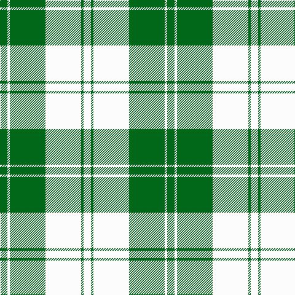

In pattern [GWGWGW](/stripes/gwgwgw/).

This was sourced from tartans-authority.  It is a [6 stripe tartan](/stripes/stripes6/).

Original link http://www.tartansauthority.com/tartan-ferret/display/941/

## Also known as

This cloth is also recorded under:

- Erskine, Green

## Attestations

This cloth appears in 3 source records; the oldest owns this page.

- 1980 — Erskine, Green (Dance) (tartans-authority, [record](http://www.tartansauthority.com/tartan-ferret/display/941/))
- undated — Erskine, Green (weddslist, [record](http://www.weddslist.com/cgi-bin/tartans/pg.pl?source=sts))
- undated — Erskine Green Clan Tartan Tartan Number: 941. Earliest known date: pre 2003 A sample of this tartan was recorded by the Scottish Tartans Society during the period 1970 to 1990. See products available Copyright © Blair Urquhart, Comrie, 2015 (house-of-tartan, [record](http://www.house-of-tartan.scotland.net/house/TartanViewjs.asp?colr=Def&tnam=941))

## Thread count
G/12 W4 G58 W58 G4 W/12

## Palette
Each colour and the base-6 reference it is a variant of.

| Colour | Shade | Base |
|---|---|---|
| G | <code style="background-color:#006818;">#006818</code> `oklch(45.0% 0.142 145.0)` <small>#006818</small> | G <code style="background-color:#006100;">#006100</code> |
| W | <code style="background-color:#FCFCFC;">#FCFCFC</code> `oklch(99.1% 0.000 89.9)` <small>#FCFCFC</small> | W <code style="background-color:#F7F7F7;">#F7F7F7</code> |

# Sample pattern

## Nearest tartans

The nearest existing variants by ΔTartan distance, with this tartan at the top so the swatches line up against it.

ΔTartan

Tartan

Sett

—

<a href="/ttd/edit/#slug=g6w2g29w29g2w6~x2">Erskine, Green (Dance)</a> <a class="nn-out" href="/setts/s6/g6w2g29w29g2w6~x2/" title="open its dictionary page">↗</a>

0.78

<a href="/ttd/edit/#slug=dg6w2dg29w29dg2w6~x2">Erskine Green</a> <a class="nn-out" href="/setts/s6/dg6w2dg29w29dg2w6~x2/" title="open its dictionary page">↗</a>

1.51

<a href="/ttd/edit/#slug=g1g1w1g15w15g1w1g1~x4">Bundy, Dress Black Personal)</a> <a class="nn-out" href="/setts/s8/g1g1w1g15w15g1w1g1~x4/" title="open its dictionary page">↗</a>

1.62

<a href="/ttd/edit/#slug=w12g12w1g12w12lo1~x4">Wallace Green Dress Fashion Tartan Tartan Number: 2212. Earliest known date: pre 2004 A dancers tartan based on the Wallace See products available Copyright © Blair Urquhart, Comrie, 2015</a> <a class="nn-out" href="/setts/s6/w12g12w1g12w12lo1~x4/" title="open its dictionary page">↗</a>

1.67

<a href="/ttd/edit/#slug=dg4w35g31w4~x2">Lewis, Green (Dance)</a> <a class="nn-out" href="/setts/s4/dg4w35g31w4~x2/" title="open its dictionary page">↗</a>

1.69

<a href="/ttd/edit/#slug=w15do6w1do3o3w1~x4">Burns (Fashion)</a> <a class="nn-out" href="/setts/s6/w15do6w1do3o3w1~x4/" title="open its dictionary page">↗</a>

1.70

<a href="/ttd/edit/#slug=db4ly9w4db9ly18w1~x2">WVU Mountaineer Tartan</a> <a class="nn-out" href="/setts/s6/db4ly9w4db9ly18w1~x2/" title="open its dictionary page">↗</a>

1.79

<a href="/ttd/edit/#slug=dt3w16dt4w3dt12w2~x3">MacMugen</a> <a class="nn-out" href="/setts/s6/dt3w16dt4w3dt12w2~x3/" title="open its dictionary page">↗</a>

1.97

<a href="/ttd/edit/#slug=dt4ly9w4dt9ly18w1~x2">WVU Mountaineer (Corporate)</a> <a class="nn-out" href="/setts/s6/dt4ly9w4dt9ly18w1~x2/" title="open its dictionary page">↗</a>

2.07

<a href="/ttd/edit/#slug=w2o1w2g6w10o6w2g1w2~x2">O'Neill</a> <a class="nn-out" href="/setts/s9/w2o1w2g6w10o6w2g1w2~x2/" title="open its dictionary page">↗</a>

2.12

<a href="/ttd/edit/#slug=w5r3w26g20w3g8ly3~x2">MacPherson Dress Green (Dance)</a> <a class="nn-out" href="/setts/s7/w5r3w26g20w3g8ly3~x2/" title="open its dictionary page">↗</a>

## Neighbour map

Every grey dot is one of 14299 variants placed by the first two principal components of the ΔTartan feature space (44% of its variance). Red is this tartan; blue dots are its nearest — click one to open its page.

<svg viewBox="0 0 640 380" role="img" style="max-width:100%;height:auto;border:1px solid #e0e0e0;border-radius:4px;display:block" xmlns="http://www.w3.org/2000/svg"><image href="/nn/cloud.v1.png" width="640" height="380"/><a href="/setts/s6/dg6w2dg29w29dg2w6~x2/"><circle cx="327.0" cy="199.6" r="4" fill="#3465a4"><title>Erskine Green</title></circle></a><a href="/setts/s8/g1g1w1g15w15g1w1g1~x4/"><circle cx="295.8" cy="143.7" r="4" fill="#3465a4"><title>Bundy, Dress Black Personal)</title></circle></a><a href="/setts/s6/w12g12w1g12w12lo1~x4/"><circle cx="273.4" cy="223.5" r="4" fill="#3465a4"><title>Wallace Green Dress Fashion Tartan Tartan Number: 2212. Earliest known date: pre 2004 A dancers tartan based on the Wallace See products available Copyright © Blair Urquhart, Comrie, 2015</title></circle></a><a href="/setts/s4/dg4w35g31w4~x2/"><circle cx="281.9" cy="230.7" r="4" fill="#3465a4"><title>Lewis, Green (Dance)</title></circle></a><a href="/setts/s6/w15do6w1do3o3w1~x4/"><circle cx="323.0" cy="166.0" r="4" fill="#3465a4"><title>Burns (Fashion)</title></circle></a><a href="/setts/s6/db4ly9w4db9ly18w1~x2/"><circle cx="300.7" cy="179.2" r="4" fill="#3465a4"><title>WVU Mountaineer Tartan</title></circle></a><a href="/setts/s6/dt3w16dt4w3dt12w2~x3/"><circle cx="294.2" cy="226.2" r="4" fill="#3465a4"><title>MacMugen</title></circle></a><a href="/setts/s6/dt4ly9w4dt9ly18w1~x2/"><circle cx="316.0" cy="182.8" r="4" fill="#3465a4"><title>WVU Mountaineer (Corporate)</title></circle></a><a href="/setts/s9/w2o1w2g6w10o6w2g1w2~x2/"><circle cx="286.4" cy="191.7" r="4" fill="#3465a4"><title>O'Neill</title></circle></a><a href="/setts/s7/w5r3w26g20w3g8ly3~x2/"><circle cx="245.8" cy="183.0" r="4" fill="#3465a4"><title>MacPherson Dress Green (Dance)</title></circle></a><circle cx="320.0" cy="194.6" r="5" fill="#c00000"/></svg>

ID: /setts/s6/g6w2g29w29g2w6~x2/
