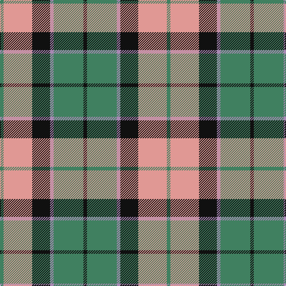

In pattern [GYKRGK](/patterns/gykrgk/).

This was sourced from register-of-tartans.  It is a [6 stripes tartan](/stripes/stripes6/).

Original link https://www.tartanregister.gov.uk/tartanDetails.aspx?ref=4409

## Thread count
G/6 LR48 K30 N6 G50 K/6

## Palette
Each colour and its ΔE from the base-6 reference it is a variant of.

| Colour | Shade | Base | ΔE (OKLab) |
|---|---|---|---|
| G | <code style="background-color:#408060;">#408060</code> `#408060` | G <code style="background-color:#006400;">#006400</code> | 0.13 |
| K | <code style="background-color:#101010;">#101010</code> `#101010` | K <code style="background-color:#000000;">#000000</code> | 0.17 |
| LR | <code style="background-color:#E09894;">#E09894</code> `#E09894` | Y <code style="background-color:#E8C000;">#E8C000</code> | 0.18 |
| N | <code style="background-color:#A888B4;">#A888B4</code> `#A888B4` | R <code style="background-color:#C80000;">#C80000</code> | 0.25 |

# Sample pattern

ID: /setts/s6/g6y48k30r6g50k6-g408060-k101010-ra888b4-ye09894/
