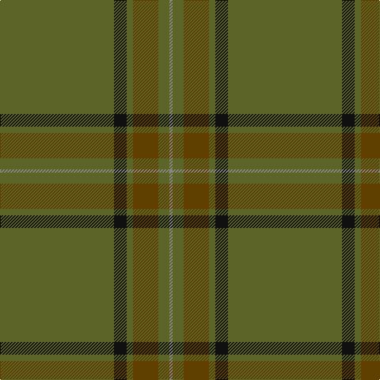

In pattern [GKGGGR](/patterns/gkgggr/).

This was sourced from tartans-authority.  It is a [6 stripes tartan](/stripes/stripes6/).

Original link http://www.tartansauthority.com/tartan-ferret/display/7609/

## Thread count
G/144 K16 G8 T32 G14 N/4

## Palette
Each colour and its ΔE from the base-6 reference it is a variant of.

| Colour | Shade | Base | ΔE (OKLab) |
|---|---|---|---|
| G | <code style="background-color:#5C6428;">#5C6428</code> `#5C6428` | G <code style="background-color:#006100;">#006100</code> | 0.10 |
| K | <code style="background-color:#101010;">#101010</code> `#101010` | K <code style="background-color:#000000;">#000000</code> | 0.17 |
| N | <code style="background-color:#888888;">#888888</code> `#888888` | R <code style="background-color:#CC0000;">#CC0000</code> | 0.24 |
| T | <code style="background-color:#604000;">#604000</code> `#604000` | G <code style="background-color:#006100;">#006100</code> | 0.14 |

# Sample pattern

## Nearest tartans

The nearest existing variants by ΔTartan distance.

1. [13, Irish Regiment](/setts/s4/g100r26ga3b2~b600030-g908000-ga003000-r806050/) — ΔT 1.80
1. [Heslop, William D (Name)](/setts/s4/b44g12ba1r6x2~b5c5c5c-ba003c64-g003820-ra00000/) — ΔT 1.96
1. [Welsh Stanley–Gpa (Personal)](/setts/s9/g2ga3g2ga45y3g4r2g2r2x2~g386818-ga604000-rc80000-ye8c000/) — ΔT 2.14
1. [Huntsman](/setts/s8/g3ga3g4k4gb14k3g41gc2x2~g5c6428-ga604000-gb603800-gc408060-k101010/) — ΔT 2.14
1. [Unidentified Plaid #2](/setts/s10/g32ga2g2ga2g2ga12g22w1g1w3x2~g005020-ga503c14-we0e0e0/) — ΔT 2.36
1. [Glenlivet Corporate Tartan Tartan Number: 193. Earliest known date: 1989 Designed for Glenlivet Distilleries Ltd, Strathspey. See products available Copyright © Blair Urquhart, Comrie, 2015](/setts/s8/g18r6g75b6g13ga35g12b6~b2c2c80-g006818-ga604000-rc80000/) — ΔT 2.40
1. [Unnamed Green (Teddy Bear)](/setts/s11/r1g3ga2g3r1ga24r1g3ga2g3r1x2~g503c14-ga005020-rdc0000/) — ΔT 2.40
1. [Green Rover, The](/setts/s7/g10k2ga5k2gb46y2k2x2~g683c10-ga4c6840-gb003820-k101010-yc49c00/) — ΔT 2.40
1. [Heslop Lurdenlaw by Kelso](/setts/s4/b44g12ga1r6x2~b1e2025-g23321b-ga43a5a0-ra32d18/) — ΔT 2.51
1. [Gayre Bodyguard](/setts/s8/g18r6g75b6g13ga35g12b6~b2c4084-g005020-ga503c14-rdc0000/) — ΔT 2.52

## Neighbour map

Every grey dot is one of 15726 variants placed by the first two principal components of the ΔTartan feature space (44% of its variance). Red is this tartan; blue dots are its nearest — click one to open its page.

<svg viewBox="0 0 640 380" role="img" style="max-width:100%;height:auto;border:1px solid #e0e0e0;border-radius:4px;display:block" xmlns="http://www.w3.org/2000/svg"><image href="/nn/cloud.v1.png" width="640" height="380"/><a href="/setts/s4/g100r26ga3b2~b600030-g908000-ga003000-r806050/"><circle cx="626.0" cy="211.8" r="4" fill="#3465a4"><title>13, Irish Regiment</title></circle></a><a href="/setts/s4/b44g12ba1r6x2~b5c5c5c-ba003c64-g003820-ra00000/"><circle cx="586.1" cy="216.5" r="4" fill="#3465a4"><title>Heslop, William D (Name)</title></circle></a><a href="/setts/s9/g2ga3g2ga45y3g4r2g2r2x2~g386818-ga604000-rc80000-ye8c000/"><circle cx="586.9" cy="155.7" r="4" fill="#3465a4"><title>Welsh Stanley–Gpa (Personal)</title></circle></a><a href="/setts/s8/g3ga3g4k4gb14k3g41gc2x2~g5c6428-ga604000-gb603800-gc408060-k101010/"><circle cx="499.8" cy="179.7" r="4" fill="#3465a4"><title>Huntsman</title></circle></a><a href="/setts/s10/g32ga2g2ga2g2ga12g22w1g1w3x2~g005020-ga503c14-we0e0e0/"><circle cx="580.8" cy="186.9" r="4" fill="#3465a4"><title>Unidentified Plaid #2</title></circle></a><a href="/setts/s8/g18r6g75b6g13ga35g12b6~b2c2c80-g006818-ga604000-rc80000/"><circle cx="497.5" cy="233.4" r="4" fill="#3465a4"><title>Glenlivet Corporate Tartan Tartan Number: 193. Earliest known date: 1989 Designed for Glenlivet Distilleries Ltd, Strathspey. See products available Copyright © Blair Urquhart, Comrie, 2015</title></circle></a><a href="/setts/s11/r1g3ga2g3r1ga24r1g3ga2g3r1x2~g503c14-ga005020-rdc0000/"><circle cx="544.6" cy="186.0" r="4" fill="#3465a4"><title>Unnamed Green (Teddy Bear)</title></circle></a><a href="/setts/s7/g10k2ga5k2gb46y2k2x2~g683c10-ga4c6840-gb003820-k101010-yc49c00/"><circle cx="508.2" cy="175.8" r="4" fill="#3465a4"><title>Green Rover, The</title></circle></a><a href="/setts/s4/b44g12ga1r6x2~b1e2025-g23321b-ga43a5a0-ra32d18/"><circle cx="596.0" cy="229.1" r="4" fill="#3465a4"><title>Heslop Lurdenlaw by Kelso</title></circle></a><a href="/setts/s8/g18r6g75b6g13ga35g12b6~b2c4084-g005020-ga503c14-rdc0000/"><circle cx="540.9" cy="253.8" r="4" fill="#3465a4"><title>Gayre Bodyguard</title></circle></a><circle cx="626.0" cy="198.2" r="5" fill="#c00000"/></svg>

ID: /setts/s6/g72k8g4ga16g7r2x2~g5c6428-ga604000-k101010-r888888/
