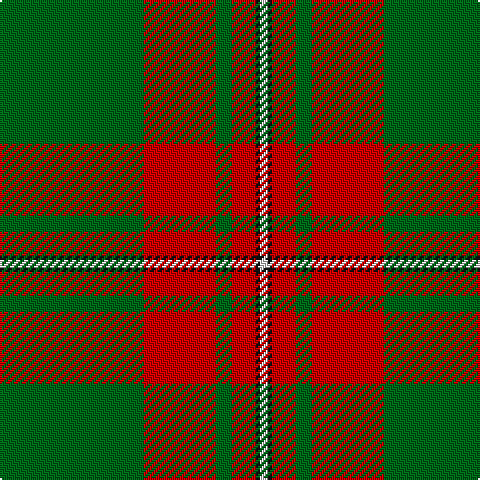

In pattern [GRGRKW](/patterns/grgrkw/).

This was sourced from house-of-tartan.  It is a [6 stripes tartan](/stripes/stripes6/).

Original link http://www.house-of-tartan.scotland.net/house/TartanViewjs.asp?colr=Def&tnam=986

## Thread count
G/72 R36 G8 R12 K2 LN/4

## Palette
Each colour and its ΔE from the base-6 reference it is a variant of.

| Colour | Shade | Base | ΔE (OKLab) |
|---|---|---|---|
| G | <code style="background-color:#006818;">#006818</code> `#006818` | G <code style="background-color:#006400;">#006400</code> | 0.02 |
| K | <code style="background-color:#101010;">#101010</code> `#101010` | K <code style="background-color:#000000;">#000000</code> | 0.17 |
| LN | <code style="background-color:#E0E0E0;">#E0E0E0</code> `#E0E0E0` | W <code style="background-color:#F4F4F0;">#F4F4F0</code> | 0.06 |
| R | <code style="background-color:#C80000;">#C80000</code> `#C80000` | R <code style="background-color:#C80000;">#C80000</code> | 0.00 |

# Sample pattern

## Nearest tartans

The nearest existing variants by ΔTartan distance.

1. [Masai Shuka 10 (Artefact)](/setts/s6/g106w2r40k2w4r14-g006818-k101010-rc80000-we0e0e0/) — ΔT 0.81
1. [Maxwell Hunting Clan Tartan Tartan Number: 865. Earliest known date: 0 Tartans of the Lowland families were not named until the publication the 'Vestiarium Scoticum' in 1842. The authors, the Sobieski Stuart brothers, enjoyed a popular following amongst the Scottish gentry in the early Victorian era, and in the spirit of the times, added mystery, romance and some spurious historical documentation to the subject of tartans. The Maxwells have, nevertheless, a tartan of at least 150 years antiquity, probably designed by persons of great imagination and flair. The Maxwells come from Glasgow and the S.W. of Scotland. See products available Copyright © Blair Urquhart, Comrie, 2015](/setts/s7/g6r32g8k12g56r2g6-g006818-k101010-rc80000/) — ΔT 1.16
1. [Pollock Clan Tartan Tartan Number: 867. Earliest known date: 1980 Based on the Maxwell sett which in turn comes from the Vestiarium Scoticum (1842). Details of the Clan Society's design came from Rhys A Pollock in America. Pollocks were feudal dependents of the Maxwells who lived in the Scottish Lowlands. See products available Copyright © Blair Urquhart, Comrie, 2015](/setts/s7/g6r32w8k12g56r2g6-g006818-k101010-rc80000-we0e0e0/) — ΔT 1.21
1. [Colchester & District P&D (Corporate](/setts/s6/g10r4g46r69k2w6-g009020-k101010-rc80000-we0e0e0/) — ΔT 1.29
1. [MacGregor](/setts/s6/r72g36r8g12k2w4-g008000-k000000-rc00000-we0e0e0/) — ΔT 1.37
1. [MacFie](/setts/s9/y4r24g4r2g64r2g4r24ya4-g11450d-raa0000-yaaaa00-yaaaaaaa/) — ΔT 1.45
1. [Abadia Da Cova (Corporate)](/setts/s6/g60ga2g6r60k2y6-g006818-ga289c18-k101010-r880000-ye8c000/) — ΔT 1.50
1. [MacMillan/Isetan](/setts/s6/g136r48g16y36g6y36-g00643c-rc8002c-ye0a126/) — ΔT 1.50
1. [Strang (Personal)](/setts/s8/r72g36r8g12k2w4k2g4-g146400-k000000-rb00000-wc8c8c8/) — ΔT 1.50
1. [MacGregor, Glengyle](/setts/s6/r96g42r16g17k4ga6-g008000-ga808080-k000000-r900030/) — ΔT 1.52

## Neighbour map

Every grey dot is one of 15726 variants placed by the first two principal components of the ΔTartan feature space (44% of its variance). Red is this tartan; blue dots are its nearest — click one to open its page.

<svg viewBox="0 0 640 380" role="img" style="max-width:100%;height:auto;border:1px solid #e0e0e0;border-radius:4px;display:block" xmlns="http://www.w3.org/2000/svg"><image href="/nn/cloud.v1.png" width="640" height="380"/><a href="/setts/s6/g106w2r40k2w4r14-g006818-k101010-rc80000-we0e0e0/"><circle cx="460.4" cy="128.3" r="4" fill="#3465a4"><title>Masai Shuka 10 (Artefact)</title></circle></a><a href="/setts/s7/g6r32g8k12g56r2g6-g006818-k101010-rc80000/"><circle cx="428.2" cy="178.7" r="4" fill="#3465a4"><title>Maxwell Hunting Clan Tartan Tartan Number: 865. Earliest known date: 0 Tartans of the Lowland families were not named until the publication the 'Vestiarium Scoticum' in 1842. The authors, the Sobieski Stuart brothers, enjoyed a popular following amongst the Scottish gentry in the early Victorian era, and in the spirit of the times, added mystery, romance and some spurious historical documentation to the subject of tartans. The Maxwells have, nevertheless, a tartan of at least 150 years antiquity, probably designed by persons of great imagination and flair. The Maxwells come from Glasgow and the S.W. of Scotland. See products available Copyright © Blair Urquhart, Comrie, 2015</title></circle></a><a href="/setts/s7/g6r32w8k12g56r2g6-g006818-k101010-rc80000-we0e0e0/"><circle cx="339.5" cy="148.9" r="4" fill="#3465a4"><title>Pollock Clan Tartan Tartan Number: 867. Earliest known date: 1980 Based on the Maxwell sett which in turn comes from the Vestiarium Scoticum (1842). Details of the Clan Society's design came from Rhys A Pollock in America. Pollocks were feudal dependents of the Maxwells who lived in the Scottish Lowlands. See products available Copyright © Blair Urquhart, Comrie, 2015</title></circle></a><a href="/setts/s6/g10r4g46r69k2w6-g009020-k101010-rc80000-we0e0e0/"><circle cx="379.5" cy="137.5" r="4" fill="#3465a4"><title>Colchester &amp; District P&amp;D (Corporate</title></circle></a><a href="/setts/s6/r72g36r8g12k2w4-g008000-k000000-rc00000-we0e0e0/"><circle cx="422.3" cy="139.3" r="4" fill="#3465a4"><title>MacGregor</title></circle></a><a href="/setts/s9/y4r24g4r2g64r2g4r24ya4-g11450d-raa0000-yaaaa00-yaaaaaaa/"><circle cx="410.8" cy="133.2" r="4" fill="#3465a4"><title>MacFie</title></circle></a><a href="/setts/s6/g60ga2g6r60k2y6-g006818-ga289c18-k101010-r880000-ye8c000/"><circle cx="359.9" cy="145.2" r="4" fill="#3465a4"><title>Abadia Da Cova (Corporate)</title></circle></a><a href="/setts/s6/g136r48g16y36g6y36-g00643c-rc8002c-ye0a126/"><circle cx="367.2" cy="191.3" r="4" fill="#3465a4"><title>MacMillan/Isetan</title></circle></a><a href="/setts/s8/r72g36r8g12k2w4k2g4-g146400-k000000-rb00000-wc8c8c8/"><circle cx="421.7" cy="122.2" r="4" fill="#3465a4"><title>Strang (Personal)</title></circle></a><a href="/setts/s6/r96g42r16g17k4ga6-g008000-ga808080-k000000-r900030/"><circle cx="422.3" cy="166.6" r="4" fill="#3465a4"><title>MacGregor, Glengyle</title></circle></a><circle cx="420.8" cy="150.7" r="5" fill="#c00000"/></svg>

ID: /setts/s6/g72r36g8r12k2w4-g006818-k101010-rc80000-we0e0e0/
