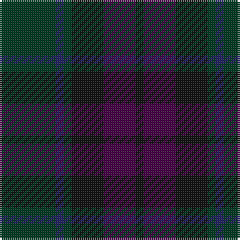

In pattern [GBGKBK](/patterns/gbgkbk/).

This was sourced from register-of-tartans.  It is a [6 stripes tartan](/stripes/stripes6/).

Original link https://www.tartanregister.gov.uk/tartanDetails.aspx?ref=2281

## Register references

External register numbers recorded for this tartan.

- Scottish Register of Tartans: [2281](https://www.tartanregister.gov.uk/tartanDetails.aspx?ref=2281)
- Scottish Tartans Authority (ITI): 700
- Scottish Tartans World Register: 700

## Thread count
DG/28 DB4 DG4 K16 DP16 K/4

## Palette
Each colour and its ΔE from the base-6 reference it is a variant of.

| Colour | Shade | Base | ΔE (OKLab) |
|---|---|---|---|
| DB | <code style="background-color:#202060;">#202060</code> `#202060` | B <code style="background-color:#2A418A;">#2A418A</code> | 0.11 |
| DG | <code style="background-color:#003820;">#003820</code> `#003820` | G <code style="background-color:#006100;">#006100</code> | 0.15 |
| DP | <code style="background-color:#440044;">#440044</code> `#440044` | B <code style="background-color:#2A418A;">#2A418A</code> | 0.18 |
| K | <code style="background-color:#101010;">#101010</code> `#101010` | K <code style="background-color:#000000;">#000000</code> | 0.17 |

# Sample pattern

## Nearest tartans

The nearest existing variants by ΔTartan distance.

1. [Inneryne (Personal)](/setts/s7/b4k4b16k14g14r3g3~b141e46-g003c14-k101010-r781c38~x2/) — ΔT 1.13
1. [Amazing Union (Personal)](/setts/s9/r2b15g12b2ba12b2g12b15ra2~b441800-ba101034-g003820-ra47800-raa80020~x4/) — ΔT 1.52
1. [Williamson/Smart](/setts/s8/b10g3b10r3k21ga20k15r3~b1a2b47-g75786c-ga052f14-k120a01-r89051b~x2/) — ΔT 1.64
1. [MacRae, Special Hunting](/setts/s8/g18b2g5r2g5k21ka20k5~b2c4084-g002814-k101010-ka000028-rdc0000~x2/) — ΔT 1.67
1. [Calais (Fashion)](/setts/s7/g11b4g6ga11b1k1ga4~b306084-g085454-ga604000-k000000~x4/) — ΔT 1.70
1. [Dempster Family Tartan Tartan Number: 2219. Earliest known date: 2001 Designed by Claire Donaldson of the House of Edgar. See products available Copyright © Blair Urquhart, Comrie, 2015](/setts/s7/b4g2ba16ba10g10b32bb3~b14283c-ba4c0000-bb5c5c5c-g285800~x2/) — ΔT 1.76
1. [McWilliams (2014)](/setts/s12/b3k2b13k9ba3k2ba14k2ba3k9b15k3~b003c64-ba4c3428-k101010~x2/) — ΔT 1.77
1. [St. Mirren (Corporate)](/setts/s12/b10k4ba16k4ba10k16ba8k24ba28r3b4r3~b404040-ba343434-k101010-r880000/) — ΔT 1.78
1. [Lochinvar Marine Harvest Corporate Tartan Tartan Number: 2102. Earliest known date: 1989 Colours represents the Scottish hills, the water, and the heather. See products available Copyright © Blair Urquhart, Comrie, 2015](/setts/s13/g10k2g2k2g2k7b8ba2b8k7g8k2g2~b202060-ba780078-g003820-k101010~x2/) — ΔT 1.80
1. [MacAndreis](/setts/s10/k3g4b25k16g3k3g3k3g6r3~b383c60-g28442c-k101010-r883834~x2/) — ΔT 1.83

## Neighbour map

Every grey dot is one of 15726 variants placed by the first two principal components of the ΔTartan feature space (44% of its variance). Red is this tartan; blue dots are its nearest — click one to open its page.

<svg viewBox="0 0 640 380" role="img" style="max-width:100%;height:auto;border:1px solid #e0e0e0;border-radius:4px;display:block" xmlns="http://www.w3.org/2000/svg"><image href="/nn/cloud.v1.png" width="640" height="380"/><a href="/setts/s7/b4k4b16k14g14r3g3~b141e46-g003c14-k101010-r781c38~x2/"><circle cx="290.5" cy="310.8" r="4" fill="#3465a4"><title>Inneryne (Personal)</title></circle></a><a href="/setts/s9/r2b15g12b2ba12b2g12b15ra2~b441800-ba101034-g003820-ra47800-raa80020~x4/"><circle cx="320.9" cy="260.0" r="4" fill="#3465a4"><title>Amazing Union (Personal)</title></circle></a><a href="/setts/s8/b10g3b10r3k21ga20k15r3~b1a2b47-g75786c-ga052f14-k120a01-r89051b~x2/"><circle cx="263.7" cy="262.8" r="4" fill="#3465a4"><title>Williamson/Smart</title></circle></a><a href="/setts/s8/g18b2g5r2g5k21ka20k5~b2c4084-g002814-k101010-ka000028-rdc0000~x2/"><circle cx="302.3" cy="253.1" r="4" fill="#3465a4"><title>MacRae, Special Hunting</title></circle></a><a href="/setts/s7/g11b4g6ga11b1k1ga4~b306084-g085454-ga604000-k000000~x4/"><circle cx="368.7" cy="274.8" r="4" fill="#3465a4"><title>Calais (Fashion)</title></circle></a><a href="/setts/s7/b4g2ba16ba10g10b32bb3~b14283c-ba4c0000-bb5c5c5c-g285800~x2/"><circle cx="382.8" cy="237.2" r="4" fill="#3465a4"><title>Dempster Family Tartan Tartan Number: 2219. Earliest known date: 2001 Designed by Claire Donaldson of the House of Edgar. See products available Copyright © Blair Urquhart, Comrie, 2015</title></circle></a><a href="/setts/s12/b3k2b13k9ba3k2ba14k2ba3k9b15k3~b003c64-ba4c3428-k101010~x2/"><circle cx="331.5" cy="274.7" r="4" fill="#3465a4"><title>McWilliams (2014)</title></circle></a><a href="/setts/s12/b10k4ba16k4ba10k16ba8k24ba28r3b4r3~b404040-ba343434-k101010-r880000/"><circle cx="389.5" cy="264.3" r="4" fill="#3465a4"><title>St. Mirren (Corporate)</title></circle></a><a href="/setts/s13/g10k2g2k2g2k7b8ba2b8k7g8k2g2~b202060-ba780078-g003820-k101010~x2/"><circle cx="281.6" cy="285.6" r="4" fill="#3465a4"><title>Lochinvar Marine Harvest Corporate Tartan Tartan Number: 2102. Earliest known date: 1989 Colours represents the Scottish hills, the water, and the heather. See products available Copyright © Blair Urquhart, Comrie, 2015</title></circle></a><a href="/setts/s10/k3g4b25k16g3k3g3k3g6r3~b383c60-g28442c-k101010-r883834~x2/"><circle cx="307.0" cy="232.0" r="4" fill="#3465a4"><title>MacAndreis</title></circle></a><circle cx="343.8" cy="296.6" r="5" fill="#c00000"/></svg>

ID: /setts/s6/g7b1g1k4ba4k1~b202060-ba440044-g003820-k101010~x4/
