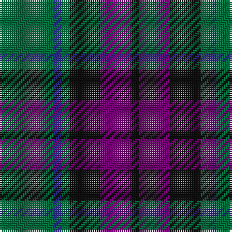

This page is one **sett** — a single exact thread-count. It belongs to the [tartan](/tartans/g7db1g1k4p4k1/)
(the same proportion at any scale), whose colour order is pattern [GBGKBK](/stripes/gbgkbk/).

Sourced from tartans-authority.  It is a [6 stripe tartan](/stripes/stripes6/).

Original link http://www.tartansauthority.com/tartan-ferret/display/700/

## Thread count
G/28 DB4 G4 K16 P16 K/4

## Palette
Each colour and the base-6 reference it is a variant of.

| Colour | Shade | Base |
|---|---|---|
| DB | <code style="background-color:#28287C;">#28287C</code> `oklch(33.6% 0.138 276.0)` <small>#28287C</small> | B <code style="background-color:#2A418A;">#2A418A</code> |
| G | <code style="background-color:#006C3C;">#006C3C</code> `oklch(46.7% 0.115 155.1)` <small>#006C3C</small> | G <code style="background-color:#006100;">#006100</code> |
| K | <code style="background-color:#101010;">#101010</code> `oklch(17.3% 0.000 89.9)` <small>#101010</small> | K <code style="background-color:#000000;">#000000</code> |
| P | <code style="background-color:#700070;">#700070</code> `oklch(38.3% 0.176 328.4)` <small>#700070</small> | B <code style="background-color:#2A418A;">#2A418A</code> |

# Sample pattern

## Nearest tartans

The nearest existing variants by ΔTartan distance, with this tartan at the top so the swatches line up against it.

ΔTartan

Tartan

Sett

—

<a href="/ttd/edit/#slug=g7db1g1k4dp4k1~x4">MacArthur of Milton (Clan)</a> <a class="nn-out" href="/setts/s6/g7db1g1k4dp4k1~x4/" title="open its dictionary page">↗</a>

0.33

<a href="/ttd/edit/#slug=g14db2g2k8dp9k2~x2">MacArthur of Milton Hunting Clan Tartan Tartan Number: 700. Earliest known date: 1823 This is the older of the two MacArthur setts, which links the clan with the Campbells. See products available Copyright © Blair Urquhart, Comrie, 2015</a> <a class="nn-out" href="/setts/s6/g14db2g2k8dp9k2~x2/" title="open its dictionary page">↗</a>

0.63

<a href="/ttd/edit/#slug=k3db14r2k14g14k3~x2">Gallamore</a> <a class="nn-out" href="/setts/s6/k3db14r2k14g14k3~x2/" title="open its dictionary page">↗</a>

0.72

<a href="/ttd/edit/#slug=g1db6k6g6r1g1~x6">Callum Beg (Fashion)</a> <a class="nn-out" href="/setts/s6/g1db6k6g6r1g1~x6/" title="open its dictionary page">↗</a>

0.79

<a href="/ttd/edit/#slug=dg1db5dg1k5dg6ly1~x2">MacKay (Bonner)</a> <a class="nn-out" href="/setts/s6/dg1db5dg1k5dg6ly1~x2/" title="open its dictionary page">↗</a>

0.79

<a href="/ttd/edit/#slug=g18t2g4k14dp12k3~x2">Coburg</a> <a class="nn-out" href="/setts/s6/g18t2g4k14dp12k3~x2/" title="open its dictionary page">↗</a>

0.83

<a href="/ttd/edit/#slug=g8t1g1k6db6k1~x4">Graham of Menteith (Clan)</a> <a class="nn-out" href="/setts/s6/g8t1g1k6db6k1~x4/" title="open its dictionary page">↗</a>

0.87

<a href="/ttd/edit/#slug=g8b1g1k6db6k1~x4">Graham of Menteith</a> <a class="nn-out" href="/setts/s6/g8b1g1k6db6k1~x4/" title="open its dictionary page">↗</a>

0.87

<a href="/ttd/edit/#slug=r3g6db2db2db11g9db2r3~x2">Daks (Navy)</a> <a class="nn-out" href="/setts/s8/r3g6db2db2db11g9db2r3~x2/" title="open its dictionary page">↗</a>

0.88

<a href="/ttd/edit/#slug=g52lb7g9k35db35k7">Redland</a> <a class="nn-out" href="/setts/s6/g52lb7g9k35db35k7/" title="open its dictionary page">↗</a>

0.89

<a href="/ttd/edit/#slug=g24db6t3k6db12k15g4~x2">Blaylock Annandale (Name)</a> <a class="nn-out" href="/setts/s7/g24db6t3k6db12k15g4~x2/" title="open its dictionary page">↗</a>

## Neighbour map

Every grey dot is one of 14299 variants placed by the first two principal components of the ΔTartan feature space (44% of its variance). Red is this tartan; blue dots are its nearest — click one to open its page.

<svg viewBox="0 0 640 380" role="img" style="max-width:100%;height:auto;border:1px solid #e0e0e0;border-radius:4px;display:block" xmlns="http://www.w3.org/2000/svg"><image href="/nn/cloud.v1.png" width="640" height="380"/><a href="/setts/s6/g14db2g2k8dp9k2~x2/"><circle cx="221.3" cy="245.2" r="4" fill="#3465a4"><title>MacArthur of Milton Hunting Clan Tartan Tartan Number: 700. Earliest known date: 1823 This is the older of the two MacArthur setts, which links the clan with the Campbells. See products available Copyright © Blair Urquhart, Comrie, 2015</title></circle></a><a href="/setts/s6/k3db14r2k14g14k3~x2/"><circle cx="214.2" cy="260.7" r="4" fill="#3465a4"><title>Gallamore</title></circle></a><a href="/setts/s6/g1db6k6g6r1g1~x6/"><circle cx="197.7" cy="260.1" r="4" fill="#3465a4"><title>Callum Beg (Fashion)</title></circle></a><a href="/setts/s6/dg1db5dg1k5dg6ly1~x2/"><circle cx="212.9" cy="265.6" r="4" fill="#3465a4"><title>MacKay (Bonner)</title></circle></a><a href="/setts/s6/g18t2g4k14dp12k3~x2/"><circle cx="229.5" cy="248.4" r="4" fill="#3465a4"><title>Coburg</title></circle></a><a href="/setts/s6/g8t1g1k6db6k1~x4/"><circle cx="218.0" cy="248.8" r="4" fill="#3465a4"><title>Graham of Menteith (Clan)</title></circle></a><a href="/setts/s6/g8b1g1k6db6k1~x4/"><circle cx="220.4" cy="250.2" r="4" fill="#3465a4"><title>Graham of Menteith</title></circle></a><a href="/setts/s8/r3g6db2db2db11g9db2r3~x2/"><circle cx="200.7" cy="247.1" r="4" fill="#3465a4"><title>Daks (Navy)</title></circle></a><a href="/setts/s6/g52lb7g9k35db35k7/"><circle cx="207.6" cy="246.5" r="4" fill="#3465a4"><title>Redland</title></circle></a><a href="/setts/s7/g24db6t3k6db12k15g4~x2/"><circle cx="212.8" cy="248.1" r="4" fill="#3465a4"><title>Blaylock Annandale (Name)</title></circle></a><circle cx="233.3" cy="248.6" r="5" fill="#c00000"/></svg>

ID: /setts/s6/g7db1g1k4dp4k1~x4/
