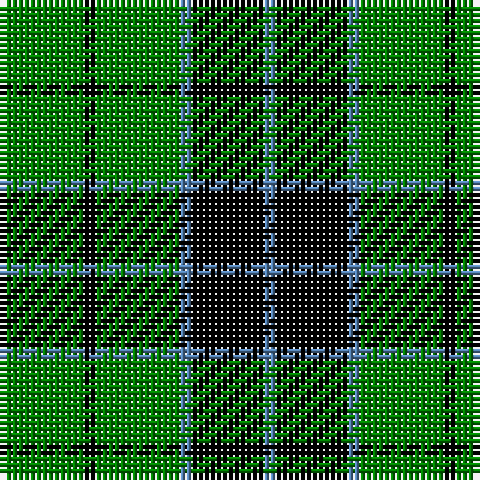

In pattern [BKBGKG](/stripes/bkbgkg/).

This was sourced from weddslist.  It is a [6 stripe tartan](/stripes/stripes6/).

Original link http://www.weddslist.com/cgi-bin/tartans/pg.pl?source=sts

## Also known as

This cloth is also recorded under:

- Innes, Georgina

## Thread count
G/14 K2 G14 B2 K12 B/2

## Palette
Each colour and the base-6 reference it is a variant of.

| Colour | Shade | Base |
|---|---|---|
| B | <code style="background-color:#5480B0;">#5480B0</code> `oklch(58.8% 0.089 251.5)` <small>#5480B0</small> | B <code style="background-color:#2A418A;">#2A418A</code> |
| G | <code style="background-color:#008000;">#008000</code> `oklch(52.0% 0.177 142.5)` <small>#008000</small> | G <code style="background-color:#006100;">#006100</code> |
| K | <code style="background-color:#000000;">#000000</code> `oklch(0.0% 0.000 0.0)` <small>#000000</small> | K <code style="background-color:#000000;">#000000</code> |

# Sample pattern

## Nearest tartans

The nearest existing variants by ΔTartan distance, with this tartan at the top so the swatches line up against it.

ΔTartan

Tartan

Sett

—

<a href="/ttd/edit/#slug=g7k1g7t1k6t1~x2">Innes</a> <a class="nn-out" href="/setts/s6/g7k1g7t1k6t1~x2/" title="open its dictionary page">↗</a>

0.62

<a href="/ttd/edit/#slug=g7k1g7t1k6t1~x4">Innes, Georgina (Portrait)</a> <a class="nn-out" href="/setts/s6/g7k1g7t1k6t1~x4/" title="open its dictionary page">↗</a>

1.09

<a href="/ttd/edit/#slug=k19g8k10g31r3">MacArthur-Fox</a> <a class="nn-out" href="/setts/s5/k19g8k10g31r3/" title="open its dictionary page">↗</a>

1.38

<a href="/ttd/edit/#slug=r3g24k28g19ly3g3ly3~x2">Paton</a> <a class="nn-out" href="/setts/s7/r3g24k28g19ly3g3ly3~x2/" title="open its dictionary page">↗</a>

1.38

<a href="/ttd/edit/#slug=g30k12g6k6db2k5~x2">Fife, Duchess of..</a> <a class="nn-out" href="/setts/s6/g30k12g6k6db2k5~x2/" title="open its dictionary page">↗</a>

1.43

<a href="/ttd/edit/#slug=k9g3k3g12ly2~x4">MacArthur</a> <a class="nn-out" href="/setts/s5/k9g3k3g12ly2~x4/" title="open its dictionary page">↗</a>

1.46

<a href="/ttd/edit/#slug=r1k6g6ly1g6ly1~x6">Moore Caledonian (Personal)</a> <a class="nn-out" href="/setts/s6/r1k6g6ly1g6ly1~x6/" title="open its dictionary page">↗</a>

1.47

<a href="/ttd/edit/#slug=dg40k4dg12k21dg17w4~x2">Granger</a> <a class="nn-out" href="/setts/s6/dg40k4dg12k21dg17w4~x2/" title="open its dictionary page">↗</a>

1.49

<a href="/ttd/edit/#slug=k32g6k12g30ly3">MacArthur</a> <a class="nn-out" href="/setts/s5/k32g6k12g30ly3/" title="open its dictionary page">↗</a>

1.51

<a href="/ttd/edit/#slug=g40k10r7k10r7">Romsdal</a> <a class="nn-out" href="/setts/s5/g40k10r7k10r7/" title="open its dictionary page">↗</a>

1.56

<a href="/ttd/edit/#slug=w3g27k5g5k32g5k5g27ly3~x2">MacIver hunting</a> <a class="nn-out" href="/setts/s9/w3g27k5g5k32g5k5g27ly3~x2/" title="open its dictionary page">↗</a>

## Neighbour map

Every grey dot is one of 14299 variants placed by the first two principal components of the ΔTartan feature space (44% of its variance). Red is this tartan; blue dots are its nearest — click one to open its page.

<svg viewBox="0 0 640 380" role="img" style="max-width:100%;height:auto;border:1px solid #e0e0e0;border-radius:4px;display:block" xmlns="http://www.w3.org/2000/svg"><image href="/nn/cloud.v1.png" width="640" height="380"/><a href="/setts/s6/g7k1g7t1k6t1~x4/"><circle cx="310.9" cy="255.7" r="4" fill="#3465a4"><title>Innes, Georgina (Portrait)</title></circle></a><a href="/setts/s5/k19g8k10g31r3/"><circle cx="294.6" cy="248.4" r="4" fill="#3465a4"><title>MacArthur-Fox</title></circle></a><a href="/setts/s7/r3g24k28g19ly3g3ly3~x2/"><circle cx="263.1" cy="198.7" r="4" fill="#3465a4"><title>Paton</title></circle></a><a href="/setts/s6/g30k12g6k6db2k5~x2/"><circle cx="344.2" cy="210.9" r="4" fill="#3465a4"><title>Fife, Duchess of..</title></circle></a><a href="/setts/s5/k9g3k3g12ly2~x4/"><circle cx="282.5" cy="278.4" r="4" fill="#3465a4"><title>MacArthur</title></circle></a><a href="/setts/s6/r1k6g6ly1g6ly1~x6/"><circle cx="262.6" cy="243.2" r="4" fill="#3465a4"><title>Moore Caledonian (Personal)</title></circle></a><a href="/setts/s6/dg40k4dg12k21dg17w4~x2/"><circle cx="391.4" cy="245.5" r="4" fill="#3465a4"><title>Granger</title></circle></a><a href="/setts/s5/k32g6k12g30ly3/"><circle cx="292.6" cy="244.9" r="4" fill="#3465a4"><title>MacArthur</title></circle></a><a href="/setts/s5/g40k10r7k10r7/"><circle cx="261.8" cy="244.9" r="4" fill="#3465a4"><title>Romsdal</title></circle></a><a href="/setts/s9/w3g27k5g5k32g5k5g27ly3~x2/"><circle cx="286.7" cy="184.6" r="4" fill="#3465a4"><title>MacIver hunting</title></circle></a><circle cx="298.4" cy="249.9" r="5" fill="#c00000"/></svg>

ID: /setts/s6/g7k1g7t1k6t1~x2/
