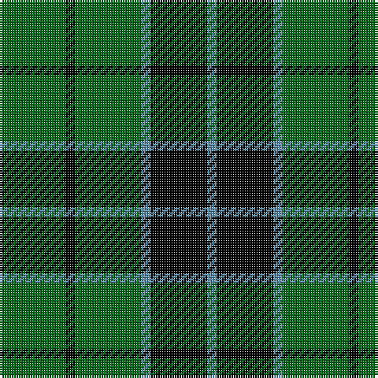

In pattern [BKBGKG](/stripes/bkbgkg/).

This was sourced from tartans-authority.  It is a [6 stripe tartan](/stripes/stripes6/).

Original link http://www.tartansauthority.com/tartan-ferret/display/235/

## Also known as

This cloth is also recorded under:

- Innes, Georgina

## Thread count
G/28 K4 G28 B4 K24 B/4

## Palette
Each colour and its ΔE from the base-6 reference it is a variant of.

| Colour | Shade | Base | ΔE (OKLab) |
|---|---|---|---|
| B | <code style="background-color:#5C8CA8;">#5C8CA8</code> `#5C8CA8` | B <code style="background-color:#2A418A;">#2A418A</code> | 0.23 |
| G | <code style="background-color:#006818;">#006818</code> `#006818` | G <code style="background-color:#006100;">#006100</code> | 0.02 |
| K | <code style="background-color:#000000;">#000000</code> `#000000` | K <code style="background-color:#000000;">#000000</code> | 0.00 |

# Sample pattern

## Nearest tartans

The nearest existing variants by ΔTartan distance.

1. [Innes](/setts/s6/g7k1g7t1k6t1~x2/) — ΔT 0.62
1. [MacArthur-Fox](/setts/s5/k19g8k10g31r3/) — ΔT 1.06
1. [MacArthur](/setts/s5/k9g3k3g12ly2~x4/) — ΔT 1.18
1. [Scotch Tape 2 (Corporate)](/setts/s4/k3g15k20ly3~x2/) — ΔT 1.23
1. [Granger](/setts/s6/dg40k4dg12k21dg17w4~x2/) — ΔT 1.28
1. [MacArthur](/setts/s5/k32g6k12g30ly3/) — ΔT 1.31
1. [MacLean of Duart Hunting](/setts/s8/g3k6w2k6g2k2g16k2~x2/) — ΔT 1.36
1. [Bumbee #1 (Fashion)](/setts/s4/g10k2dp5g1~x8/) — ΔT 1.40
1. [Fife, Duchess of..](/setts/s6/g30k12g6k6db2k5~x2/) — ΔT 1.42
1. [Wallace Hunting](/setts/s6/g8k8ly1k8g8k1~x4/) — ΔT 1.43

## Neighbour map

Every grey dot is one of 14299 variants placed by the first two principal components of the ΔTartan feature space (44% of its variance). Red is this tartan; blue dots are its nearest — click one to open its page.

<svg viewBox="0 0 640 380" role="img" style="max-width:100%;height:auto;border:1px solid #e0e0e0;border-radius:4px;display:block" xmlns="http://www.w3.org/2000/svg"><image href="/nn/cloud.v1.png" width="640" height="380"/><a href="/setts/s6/g7k1g7t1k6t1~x2/"><circle cx="298.4" cy="249.9" r="4" fill="#3465a4"><title>Innes</title></circle></a><a href="/setts/s5/k19g8k10g31r3/"><circle cx="294.6" cy="248.4" r="4" fill="#3465a4"><title>MacArthur-Fox</title></circle></a><a href="/setts/s5/k9g3k3g12ly2~x4/"><circle cx="282.5" cy="278.4" r="4" fill="#3465a4"><title>MacArthur</title></circle></a><a href="/setts/s4/k3g15k20ly3~x2/"><circle cx="311.9" cy="278.6" r="4" fill="#3465a4"><title>Scotch Tape 2 (Corporate)</title></circle></a><a href="/setts/s6/dg40k4dg12k21dg17w4~x2/"><circle cx="391.4" cy="245.5" r="4" fill="#3465a4"><title>Granger</title></circle></a><a href="/setts/s5/k32g6k12g30ly3/"><circle cx="292.6" cy="244.9" r="4" fill="#3465a4"><title>MacArthur</title></circle></a><a href="/setts/s8/g3k6w2k6g2k2g16k2~x2/"><circle cx="321.0" cy="231.1" r="4" fill="#3465a4"><title>MacLean of Duart Hunting</title></circle></a><a href="/setts/s4/g10k2dp5g1~x8/"><circle cx="355.8" cy="263.8" r="4" fill="#3465a4"><title>Bumbee #1 (Fashion)</title></circle></a><a href="/setts/s6/g30k12g6k6db2k5~x2/"><circle cx="344.2" cy="210.9" r="4" fill="#3465a4"><title>Fife, Duchess of..</title></circle></a><a href="/setts/s6/g8k8ly1k8g8k1~x4/"><circle cx="265.3" cy="268.1" r="4" fill="#3465a4"><title>Wallace Hunting</title></circle></a><circle cx="310.9" cy="255.7" r="5" fill="#c00000"/></svg>

ID: /setts/s6/g7k1g7t1k6t1~x4/
