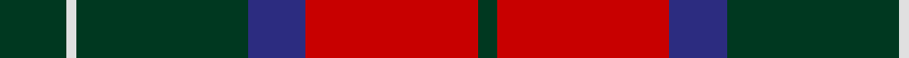
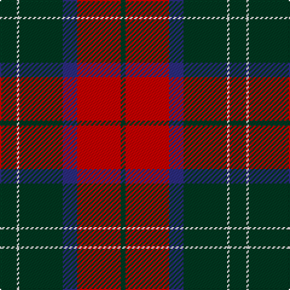

In pattern [GRBGWG](/patterns/grbgwg/).

This was sourced from register-of-tartans.  It is a [6 stripes tartan](/stripes/stripes6/).

Original link https://www.tartanregister.gov.uk/tartanDetails.aspx?ref=1183

## Attestations

This cloth appears in 2 source records; the oldest owns this page.

- 01/01/1999 — Finlaggan (register-of-tartans, [record](https://www.tartanregister.gov.uk/tartanDetails.aspx?ref=1183))
- 1999 — Finlaggan (District) (tartans-authority, [record](http://www.tartansauthority.com/tartan-ferret/display/2564/))

## Thread count
DG/14 LN2 DG36 DB12 R36 DG/4

## Palette
Each colour and its ΔE from the base-6 reference it is a variant of.

| Colour | Shade | Base | ΔE (OKLab) |
|---|---|---|---|
| DB | <code style="background-color:#2C2C80;">#2C2C80</code> `#2C2C80` | B <code style="background-color:#2A418A;">#2A418A</code> | 0.06 |
| DG | <code style="background-color:#003820;">#003820</code> `#003820` | G <code style="background-color:#006100;">#006100</code> | 0.15 |
| LN | <code style="background-color:#E0E0E0;">#E0E0E0</code> `#E0E0E0` | W <code style="background-color:#F7F7F7;">#F7F7F7</code> | 0.07 |
| R | <code style="background-color:#C80000;">#C80000</code> `#C80000` | R <code style="background-color:#CC0000;">#CC0000</code> | 0.01 |

# Sample pattern

## Nearest tartans

The nearest existing variants by ΔTartan distance.

1. [Finnlaggan](/setts/s6/g7w1g18b6r18g2~b304080-g003000-rc00000-we0e0e0~x2/) — ΔT 0.43
1. [Swedish Para Whisky Club (Corporate](/setts/s6/b2g14w3b13y1b2~b680028-g003820-w98c8e8-yc4bc68~x4/) — ΔT 0.78
1. [MacQuarrie LO](/setts/s7/r6g16r4b12r16ba1r2~b000052-ba4367ae-g11450d-raa0000~x2/) — ΔT 0.82
1. [MacQuarrie LO](/setts/s7/r6g16r4b12r16ba1r2~b000052-ba4367ae-g11450d-raa0000/) — ΔT 0.82
1. [Christmas](/setts/s5/y2g17ga4r15g1~g0e3923-ga207449-rbb001a-ye3b235~x2/) — ΔT 0.91
1. [Fraser Green](/setts/s6/w2b12g6b1ba6b1~b4c0000-ba5c5c5c-g447438-wc0c0c0~x4/) — ΔT 0.98
1. [MacQuarrie LO](/setts/s7/r6g16r4b12r16w1r2~b000064-g004c00-rc80000-wd0d0d0~x2/) — ΔT 1.03
1. [Fraser VS](/setts/s6/r1b6r1g6r12y1~b000052-g11450d-raa0000-yaaaaaa~x2/) — ΔT 1.04
1. [MacAulay](/setts/s6/k2r16g6r3g8y1~g11450d-k000000-raa0000-yaaaaaa~x2/) — ΔT 1.06
1. [MacAulay](/setts/s6/k2r16g6r3g8y1~g11450d-k000000-raa0000-yaaaaaa/) — ΔT 1.06

## Neighbour map

Every grey dot is one of 15726 variants placed by the first two principal components of the ΔTartan feature space (44% of its variance). Red is this tartan; blue dots are its nearest — click one to open its page.

<svg viewBox="0 0 640 380" role="img" style="max-width:100%;height:auto;border:1px solid #e0e0e0;border-radius:4px;display:block" xmlns="http://www.w3.org/2000/svg"><image href="/nn/cloud.v1.png" width="640" height="380"/><a href="/setts/s6/g7w1g18b6r18g2~b304080-g003000-rc00000-we0e0e0~x2/"><circle cx="314.6" cy="198.4" r="4" fill="#3465a4"><title>Finnlaggan</title></circle></a><a href="/setts/s6/b2g14w3b13y1b2~b680028-g003820-w98c8e8-yc4bc68~x4/"><circle cx="311.1" cy="198.8" r="4" fill="#3465a4"><title>Swedish Para Whisky Club (Corporate</title></circle></a><a href="/setts/s7/r6g16r4b12r16ba1r2~b000052-ba4367ae-g11450d-raa0000~x2/"><circle cx="288.6" cy="200.4" r="4" fill="#3465a4"><title>MacQuarrie LO</title></circle></a><a href="/setts/s7/r6g16r4b12r16ba1r2~b000052-ba4367ae-g11450d-raa0000/"><circle cx="288.6" cy="200.4" r="4" fill="#3465a4"><title>MacQuarrie LO</title></circle></a><a href="/setts/s5/y2g17ga4r15g1~g0e3923-ga207449-rbb001a-ye3b235~x2/"><circle cx="300.9" cy="200.2" r="4" fill="#3465a4"><title>Christmas</title></circle></a><a href="/setts/s6/w2b12g6b1ba6b1~b4c0000-ba5c5c5c-g447438-wc0c0c0~x4/"><circle cx="287.1" cy="210.8" r="4" fill="#3465a4"><title>Fraser Green</title></circle></a><a href="/setts/s7/r6g16r4b12r16w1r2~b000064-g004c00-rc80000-wd0d0d0~x2/"><circle cx="267.2" cy="188.7" r="4" fill="#3465a4"><title>MacQuarrie LO</title></circle></a><a href="/setts/s6/r1b6r1g6r12y1~b000052-g11450d-raa0000-yaaaaaa~x2/"><circle cx="297.8" cy="198.4" r="4" fill="#3465a4"><title>Fraser VS</title></circle></a><a href="/setts/s6/k2r16g6r3g8y1~g11450d-k000000-raa0000-yaaaaaa~x2/"><circle cx="342.6" cy="198.8" r="4" fill="#3465a4"><title>MacAulay</title></circle></a><a href="/setts/s6/k2r16g6r3g8y1~g11450d-k000000-raa0000-yaaaaaa/"><circle cx="342.6" cy="198.8" r="4" fill="#3465a4"><title>MacAulay</title></circle></a><circle cx="316.2" cy="197.8" r="5" fill="#c00000"/></svg>

ID: /setts/s6/g7w1g18b6r18g2~b2c2c80-g003820-rc80000-we0e0e0~x2/
