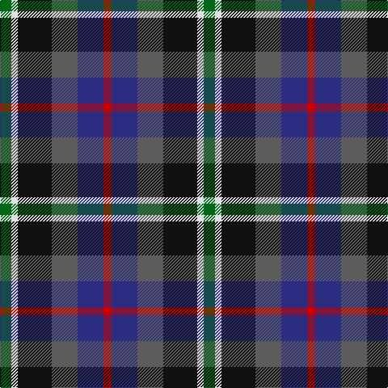

In pattern [GWKBBR](/patterns/gwkbbr/).

This was sourced from tartans-authority.  It is a [6 stripes tartan](/stripes/stripes6/).

Original link http://www.tartansauthority.com/tartan-ferret/display/10470/

## Thread count
G/14 LN8 K42 N32 DB32 R/10

## Palette
Each colour and its ΔE from the base-6 reference it is a variant of.

| Colour | Shade | Base | ΔE (OKLab) |
|---|---|---|---|
| DB | <code style="background-color:#2C2C80;">#2C2C80</code> `#2C2C80` | B <code style="background-color:#2A418A;">#2A418A</code> | 0.06 |
| G | <code style="background-color:#006818;">#006818</code> `#006818` | G <code style="background-color:#006100;">#006100</code> | 0.02 |
| K | <code style="background-color:#101010;">#101010</code> `#101010` | K <code style="background-color:#000000;">#000000</code> | 0.17 |
| LN | <code style="background-color:#E0E0E0;">#E0E0E0</code> `#E0E0E0` | W <code style="background-color:#F7F7F7;">#F7F7F7</code> | 0.07 |
| N | <code style="background-color:#5C5C5C;">#5C5C5C</code> `#5C5C5C` | B <code style="background-color:#2A418A;">#2A418A</code> | 0.15 |
| R | <code style="background-color:#C80000;">#C80000</code> `#C80000` | R <code style="background-color:#CC0000;">#CC0000</code> | 0.01 |

# Sample pattern

## Nearest tartans

The nearest existing variants by ΔTartan distance.

1. [Mekos, The](/setts/s6/b19g23y3ba15r11w5~b441800-ba202060-g005448-r960028-wf8f4d0-yc88c00~x2/) — ΔT 0.88
1. [Devon Companion District Tartan Tartan Number: 1283. Earliest known date: 1984 The Devon Original and Devon Companion owe their origin to the success of the Cornish St Piran sett, which was woven by Coldharbour Mill in the early 1980's. The accreditation certificate was presented to the Mayor of Barnstaple in 1991. In a poem describing the tartan, Miss M. Miles says, "So, in the mind, Devon's beauty is retrieved By contemplating Devon's tartan's weave." See products available Copyright © Blair Urquhart, Comrie, 2015](/setts/s7/r5b4y1b4k4ba4w1~b202060-ba480800-k101010-r888888-we0e0e0-ye8c000~x4/) — ΔT 0.89
1. [Eichelberger Family, Jörg (Personal)](/setts/s7/k10r3y4b12g4r4w2~b1a2b47-g124b24-k010512-r89051b-wddd5af-yef8f06~x4/) — ΔT 0.91
1. [Bro-Menez Are (Corporate)](/setts/s7/b8k25g13r5y5ra5r8~b1474b4-g006818-k101010-r8c2c68-ra880000-ybc8c00~x2/) — ΔT 0.97
1. [Devon Companion](/setts/s7/r5b4y1b4k4g4w1~b2c2c80-g603800-k101010-r888888-wfcfcfc-ye8c000~x4/) — ΔT 0.98
1. [Jamestown Parish Church (Corporate)](/setts/s6/r3y2g12k12b14w3~b2c2c80-g006818-k101010-rc80000-we0e0e0-ye8c000~x2/) — ΔT 0.99
1. [MacCaughan or MacEachain Clan Tartan Tartan Number: 169. Earliest known date: 1972 Nothing See products available Copyright © Blair Urquhart, Comrie, 2015](/setts/s6/r2g6k2b6k1ra2~b2c2c80-g006818-k101010-rb468ac-rac80000~x4/) — ΔT 1.05
1. [Gracey (2013)](/setts/s7/r3b8g20k20ba17k3y3~b780078-ba202060-g006818-k101010-rc80050-y48a4c0~x2/) — ΔT 1.08
1. [Cooke (Personal)](/setts/s7/k6b2ba12g8r5k2g3~b2888c4-ba2c2c80-g006818-k101010-rc8002c~x4/) — ΔT 1.10
1. [MacEachain (Clan)](/setts/s6/r2k1b6k2g6ra2~b1c0070-g006818-k101010-r880000-ra9c68a4~x4/) — ΔT 1.10

## Neighbour map

Every grey dot is one of 15726 variants placed by the first two principal components of the ΔTartan feature space (44% of its variance). Red is this tartan; blue dots are its nearest — click one to open its page.

<svg viewBox="0 0 640 380" role="img" style="max-width:100%;height:auto;border:1px solid #e0e0e0;border-radius:4px;display:block" xmlns="http://www.w3.org/2000/svg"><image href="/nn/cloud.v1.png" width="640" height="380"/><a href="/setts/s6/b19g23y3ba15r11w5~b441800-ba202060-g005448-r960028-wf8f4d0-yc88c00~x2/"><circle cx="84.0" cy="212.4" r="4" fill="#3465a4"><title>Mekos, The</title></circle></a><a href="/setts/s7/r5b4y1b4k4ba4w1~b202060-ba480800-k101010-r888888-we0e0e0-ye8c000~x4/"><circle cx="52.3" cy="229.4" r="4" fill="#3465a4"><title>Devon Companion District Tartan Tartan Number: 1283. Earliest known date: 1984 The Devon Original and Devon Companion owe their origin to the success of the Cornish St Piran sett, which was woven by Coldharbour Mill in the early 1980's. The accreditation certificate was presented to the Mayor of Barnstaple in 1991. In a poem describing the tartan, Miss M. Miles says, &quot;So, in the mind, Devon's beauty is retrieved By contemplating Devon's tartan's weave.&quot; See products available Copyright © Blair Urquhart, Comrie, 2015</title></circle></a><a href="/setts/s7/k10r3y4b12g4r4w2~b1a2b47-g124b24-k010512-r89051b-wddd5af-yef8f06~x4/"><circle cx="64.0" cy="201.5" r="4" fill="#3465a4"><title>Eichelberger Family, Jörg (Personal)</title></circle></a><a href="/setts/s7/b8k25g13r5y5ra5r8~b1474b4-g006818-k101010-r8c2c68-ra880000-ybc8c00~x2/"><circle cx="95.5" cy="208.8" r="4" fill="#3465a4"><title>Bro-Menez Are (Corporate)</title></circle></a><a href="/setts/s7/r5b4y1b4k4g4w1~b2c2c80-g603800-k101010-r888888-wfcfcfc-ye8c000~x4/"><circle cx="50.0" cy="227.7" r="4" fill="#3465a4"><title>Devon Companion</title></circle></a><a href="/setts/s6/r3y2g12k12b14w3~b2c2c80-g006818-k101010-rc80000-we0e0e0-ye8c000~x2/"><circle cx="71.5" cy="200.3" r="4" fill="#3465a4"><title>Jamestown Parish Church (Corporate)</title></circle></a><a href="/setts/s6/r2g6k2b6k1ra2~b2c2c80-g006818-k101010-rb468ac-rac80000~x4/"><circle cx="113.6" cy="231.9" r="4" fill="#3465a4"><title>MacCaughan or MacEachain Clan Tartan Tartan Number: 169. Earliest known date: 1972 Nothing See products available Copyright © Blair Urquhart, Comrie, 2015</title></circle></a><a href="/setts/s7/r3b8g20k20ba17k3y3~b780078-ba202060-g006818-k101010-rc80050-y48a4c0~x2/"><circle cx="108.0" cy="205.9" r="4" fill="#3465a4"><title>Gracey (2013)</title></circle></a><a href="/setts/s7/k6b2ba12g8r5k2g3~b2888c4-ba2c2c80-g006818-k101010-rc8002c~x4/"><circle cx="111.0" cy="230.4" r="4" fill="#3465a4"><title>Cooke (Personal)</title></circle></a><a href="/setts/s6/r2k1b6k2g6ra2~b1c0070-g006818-k101010-r880000-ra9c68a4~x4/"><circle cx="115.1" cy="236.0" r="4" fill="#3465a4"><title>MacEachain (Clan)</title></circle></a><circle cx="61.6" cy="226.1" r="5" fill="#c00000"/></svg>

ID: /setts/s6/g7w4k21b16ba16r5~b5c5c5c-ba2c2c80-g006818-k101010-rc80000-we0e0e0~x2/
